Week 01 - English Auction
=========================

Đây là phiên bản bằng văn bản của [Lecture \#1 -
Dr.Lars](https://youtu.be/CJD8ctJqDw0).

<iframe width="100%" height="100%" src="https://www.youtube.com/embed/CJD8ctJqDw0" frameborder="0" allow="accelerometer; autoplay; clipboard-write; encrypted-media; gyroscope; picture-in-picture fullscreen"></iframe>

Nó bao gồm phần giới thiệu về Plutus, mô hình (E) UTxO (và cách nó so
sánh với các mô hình khác) và kết thúc bằng một ví dụ phiên đấu giá English Auction được quản lý bằng hợp đồng thông minh Plutus chạy trên Plutus
Playground.

Các ghi chú này đã được cập nhật để phản ánh những thay đổi trong lần này chương trình.

Cam kết Plutus được sử dụng trong các ghi chú này là:
ea0ca4e9f9821a9dbfc5255fa0f42b6f2b3887c4.


Mở đầu
-------

Học Plutus không dễ dàng, và có một số lý do cho điều đó.

1.  Plutus sử dụng mô hình (E)UTxO. Điều này khác và ít trực quan hơn
    so với phương pháp của Ethereum để tạo hợp đồng thông minh. Nó có rất
    nhiều lợi thế, nhưng nó đòi hỏi một cách suy nghĩ mới về hợp đồng.
    và đó là trước khi chúng ta bắt đầu với chính ngôn ngữ.
2.  Plutus là mới và vẫn đang được phát triển nhanh chóng.
3.  Dụng cụ vẫn chưa phải là lý tưởng. Vì vậy, các nhà phát triển
    Haskell có kinh nghiệm sẽ lưu ý rằng trải nghiệm với Plutus không dễ
    chịu, vì ví dụ, khi cố gắng truy cập tài liệu hoặc nhận các gợi ý cú
    pháp từ REPL. Nó cũng có thể là một thách thức để xây dựng Plutus
    trong lần đầu tiên ở local. Cách dễ nhất hiện nay là sử dụng Nix.
    Nhóm Plutus là đang làm việc để cung cấp hình ảnh Docker, điều này
    sẽ hữu ích.
4.  Plutus là Haskell, ít nhiều có thể có một học tập khó khăn cho những người đến từ nền tảng lập trình mệnh lệnh.
5.  Plutus là thương hiệu mới và điều này có nghĩa là không có nhiều trợ
    giúp tài nguyên có sẵn, chẳng hạn như các bài đăng trên StackOverflow.

Mô hình (E)UTxO
-----------------

### Giới thiệu

Một trong những điều quan trọng nhất bạn cần hiểu để viết hợp đồng thông
minh Plutus là mô hình EUTxO mà Cardano sử dụng, mô hình Đầu ra Giao
dịch chưa sử dụng (mở rộng).

Mô hình UTxO, không có (E) là mô hình được giới thiệu bởi Bitcoin, nhưng
có những mô hình khác. Ví dụ như Ethereum, sử dụng cái gọi là mô hình
dựa trên tài khoản mô hình kế toán, đó là mô hình bạn đã quen với ngân hàng, nơi mọi
người đều có tài khoản, mỗi tài khoản có số dư và nếu bạn chuyển tiền từ
tài khoản này sang tài khoản khác thì số dư được cập nhật cho phù hợp.

Đó không phải là cách mô hình UTxO hoạt động.

Kết quả đầu ra của giao dịch chưa được sử dụng đúng như tên gọi. Nó là đang kết
quả giao dịch từ các giao dịch trước đó đã xảy ra trên blockchain chưa
được chi tiêu.

Hãy xem một ví dụ mà chúng ta có hai UTxO như vậy. Một chiếc thuộc về
Alice của 100 Ada, và chiếc khác thuộc về Bob của 50 Ada.

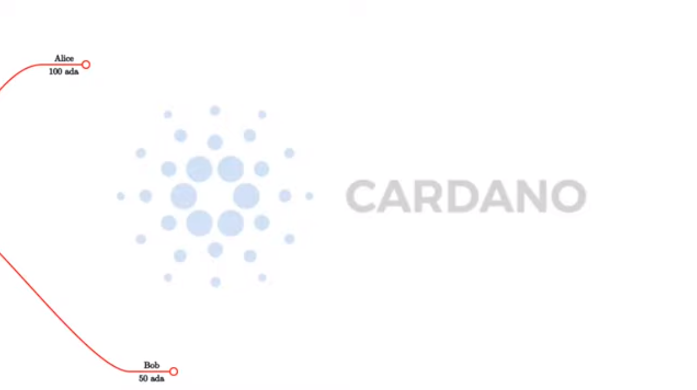

Alice muốn gửi 10 ADA cho Bob, vì vậy cô ấy cần tạo một giao dịch.


Note

- Một giao dịch là một cái gì đó có chứa một số lượng đầu vào tùy ý và một
số lượng đầu ra tùy ý. Tác dụng của một giao dịch là tiêu thụ đầu vào và
sản xuất đầu ra mới.

Điều quan trọng là bạn chỉ có thể sử dụng các UTxO hoàn chỉnh làm đầu
vào. Alice không thể đơn giản chia 100 ADA hiện có của cô ấy thành 90 và
 10, cô ấy phải sử dụng 100 ADA đầy đủ làm đầu vào cho một giao dịch.

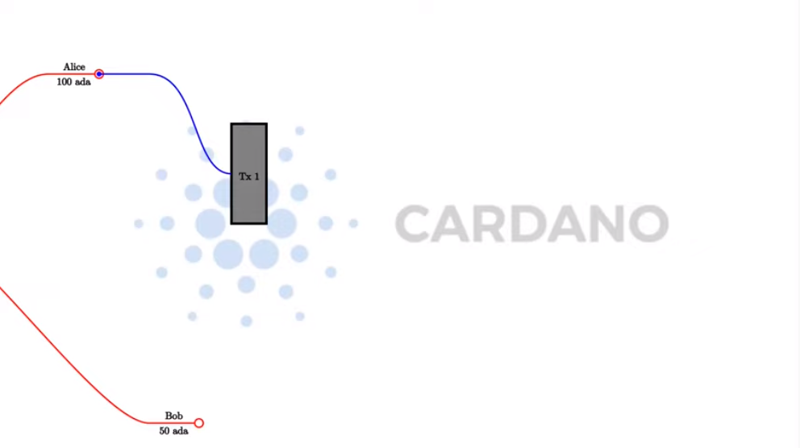

Sau khi được giao dịch sử dụng, đầu vào của Alice không còn là UTxO
(giao dịch chưa sử dụng). Nó sẽ đã được sử dụng làm đầu vào cho Tx1. Vì
vậy, cô ấy cần tạo đầu ra cho giao dịch của mình.

Cô ấy muốn trả 10 ADA cho Bob, vì vậy một đầu ra sẽ là 10 ADA (cho Bob).
Sau đó, cô ấy muốn thay đổi của mình trở lại, vì vậy cô ấy tạo ra kết
quả đầu ra thứ hai là 90 ADA (với chính cô ấy). UTxO đầy đủ của 100 ADA
đã được sử dụng, với Bob nhận một giao dịch mới của 10 ADA và Alice nhận
được thay đổi của 90 ADA.


Trong bất kỳ giao dịch nào, tổng giá trị đầu ra phải khớp với tổng các
giá trị đầu vào. Mặc dù, nói đúng ra thì điều này không đúng. Ở đó là
hai trường hợp ngoại lệ.

1.  

    Phí giao dịch. Trong một chuỗi khối thực, bạn phải trả phí cho mỗi các giao dịch.

2.  

    token gốc. Các giao dịch có thể tạo token mới, hoặc để ghi token, trong trường hợp đó, đầu vào sẽ thấp hơn hoặc cao hơn so với kết quả đầu ra, tùy thuộc vào tình huống.

Hãy xem một ví dụ phức tạp hơn một chút.

Alice và Bob muốn chuyển 55 ADA mỗi người cho Charlie. Alice không có
lựa chọn, vì cô ấy chỉ có một UTxO. Bob cũng không có lựa chọn nào vì
hai UTxO của anh ấy không đủ 55 ADA mà anh ấy muốn gửi tới -
Charlie. Bob sẽ phải sử dụng cả hai UTxO của mình làm đầu vào.

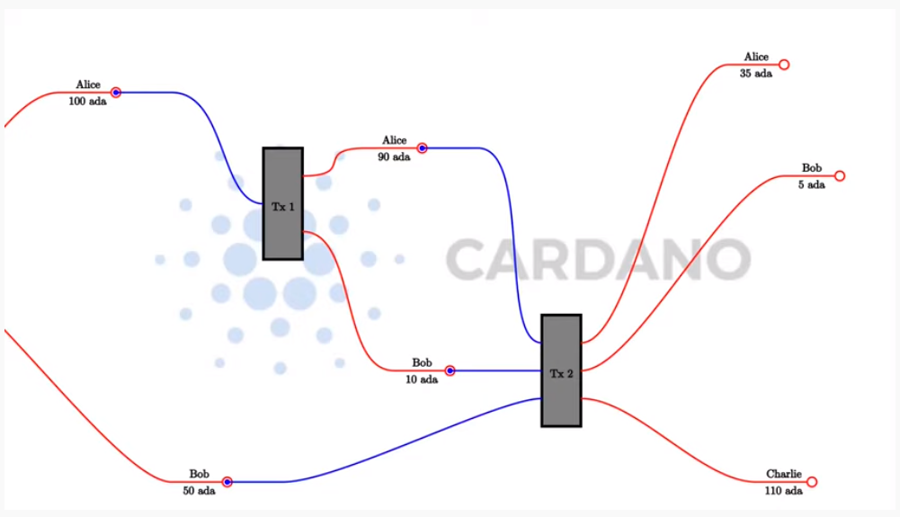

Khi nào thì được phép chi tiêu?
-------------------------------

Rõ ràng sẽ không phải là một ý kiến hay nếu bất kỳ giao dịch nào có thể
chi tiêu UTxO tùy ý. Nếu đúng như vậy thì Bob có thể tiêu tiền của
Alice mà không có sự đồng ý của cô ấy.

Cách thức hoạt động là thêm chữ ký vào các giao dịch.

Trong giao dịch 1, chữ ký của Alice phải được thêm vào giao dịch. Trong
giao dịch 2, cả Alice và Bob đều cần phải ký vào giao dịch. Ngẫu nhiên,
giao dịch thứ hai, phức tạp hơn, không thể được thực hiện trong
Daedalus, vì vậy bạn sẽ cần để sử dụng CLI cho việc này.

Mọi thứ được giải thích cho đến nay chỉ là về mô hình UTxO, không phải
Mô hình(E)UTxO.

Phần mở rộng xuất hiện khi chúng ta nói về hợp đồng thông minh, vì vậy
để hiểu điều đó, chúng ta hãy tập trung vào việc tiêu thụ UTxO của Alice
là 100 ADA.


Trong mô hình UTxO, việc xác thực quyết định liệu giao dịch mà đầu vào
này thuộc về được phép sử dụng UTxO, dựa vào chữ ký điện tử. Trong
trường hợp này, điều đó có nghĩa là Alice phải ký vào giao dịch để việc
sử dụng UTxO hợp lệ.

Ý tưởng của mô hình (E)UTxO là làm cho điều này trở nên tổng quát hơn.

Thay vì chỉ có một điều kiện, cụ thể là chữ ký có trong giao dịch, chúng
tôi thay thế chữ ký này bằng tùy ý Hợp lý.

Đây là nơi mà Plutus đóng vài trò.

Thay vì chỉ có một địa chỉ tương ứng với một khóa công khai có thể được
xác minh bằng chữ ký được thêm vào giao dịch, chúng tôi có các địa chỉ
chung chung hơn, không dựa trên khóa công khai hoặc hàm băm của khóa công
khai, nhưng thay vào đó chứa logic tùy ý quyết định trong điều kiện
nào. Một UTxO cụ thể có thể được chi tiêu bằng một giao dịch cụ thể.

Vì vậy, thay vì một đầu vào được xác thực đơn giản bằng khóa công khai
của nó, đầu vào sẽ biện minh rằng nó được phép sử dụng đầu ra này với
một số phần dữ liệu tùy ý mà chúng tôi gọi là `Redeemer`.


Chúng tôi thay thế địa chỉ khóa công khai (của Alice trong ví dụ của
chúng tôi) bằng một tập lệnh và chúng tôi thay thế chữ ký điện tử bằng
một `Redeemer`.

Nó chính xác nghĩa là gì? Ý chúng tôi là `arbitrary logic` là gì?

Điều quan trọng là phải xem xét context mà kịch bản có. Có một số tùy
chọn.

### Tập lệnh Context

### Phương pháp tiếp cận của Bitcoin

Một tùy chọn là tất cả những gì script thấy là `Redeemer`. Trong trường
hợp này, `Redeemer` chứa tất cả logic cần thiết để xác minh giao dịch.
Tình cờ, đây là những gì Bitcoin làm. Trong Bitcoin, có những hợp đồng,
nhưng chúng không phải là rất thông minh. Chúng được gọi là Bitcoin
Script, hoạt động chính xác như thế này. Có một tập lệnh trên UTxO
và `Redeemer` ở phía đầu vào, và tập lệnh nhận được `Redeemer` và sử
dụng nó để xác định xem có được sử dụng UTxO hay không.

Nhưng đây không phải là lựa chọn duy nhất. Chúng tôi có thể quyết định
cung cấp thêm thông tin vào tập lệnh.

### Phương pháp tiếp cận của Ethereum

Ethereum sử dụng một khái niệm khác. Trong Ethereum, tập lệnh có thể
thấy mọi thứ - toàn bộ chuỗi khối - một thái cực ngược lại với Bitcoin.
Trong Bitcoin, tập lệnh có rất ít `context`, tất cả những gì nó có thể
thấy là `Redeemer`. Trong Ethereum, các tập lệnh `Solidity` có thể
thấy trạng thái hoàn chỉnh của chuỗi khối.

Điều này làm cho các tập lệnh Ethereum mạnh mẽ hơn, nhưng nó cũng đi kèm
với các vấn đề. Bởi vì các tập lệnh rất mạnh nên rất khó để dự đoán
những gì một tập lệnh nhất định sẽ làm và điều đó mở ra cánh cửa cho tất
cả các loại các vấn đề an ninh và nguy hiểm. Rất khó cho các nhà phát
triển của một Hợp đồng thông minh Ethereum để dự đoán mọi thứ có thể xảy
ra.

### Phương pháp tiếp cận của Cardano

Những gì Cardano làm là một cái gì đó ở giữa.

Trong Plutus, tập lệnh không thể nhìn thấy toàn bộ chuỗi khối, nhưng nó
có thể thấy toàn bộ giao dịch đang được xác thực. Ngược lại với Bitcoin,
nó không thể chỉ nhìn thấy `Redeemer` một đầu vào mà còn có thể thấy
tất cả các đầu vào và đầu ra của giao dịch và chính giao dịch đó. Tập
lệnh Plutus có thể sử dụng thông tin này để quyết định xem việc sử dụng
đầu ra có ổn hay không.

Có một thành phần cuối cùng mà các tập lệnh Plutus cần để trở nên mạnh
mẽ và biểu cảm như các tập lệnh Ethereum. Đó là cái gọi là `Datum`. Đó là
một phần dữ liệu có thể được liên kết với UTxO cùng với giá trị UTxO.


Với điều này, có thể chứng minh về mặt toán học rằng Plutus ít nhất là
mạnh mẽ như mô hình Ethereum - bất kỳ logic nào bạn có thể diễn đạt
Ethereum, bạn cũng có thể thể hiện nó bằng cách sử dụng mô hình (E)UTxO.

Nhưng nó cũng có rất nhiều lợi thế so với mô hình Ethereum. Vì ví dụ,
trong Plutus, có thể kiểm tra xem liệu một giao dịch có xác thực trong
ví của bạn, trước khi bạn gửi nó vào chuỗi.

Tuy nhiên, mọi thứ vẫn có thể sai với xác thực ngoài chuỗi. Vì ví dụ
trong tình huống bạn gửi một giao dịch đã được được xác thực trong ví
nhưng bị từ chối khi nó cố gắng sử dụng UTxO đó trên chuỗi đã được
tiêu thụ bởi một giao dịch khác.

Trong trường hợp này, giao dịch của bạn sẽ không thành công mà bạn không
phải trả bất kỳ khoản  lệ phí nào.

Nhưng nếu tất cả các yếu tố đầu vào vẫn ở đó mà giao dịch của bạn mong
đợi, thì bạn có thể chắc chắn rằng giao dịch sẽ xác thực và sẽ có hiệu
quả dự đoán.

Đây không phải là trường hợp của Ethereum. Trong Ethereum, khoảng thời
gian giữa bạn xây dựng một giao dịch và nó được kết hợp vào blockchain,
rất nhiều thứ có thể xảy ra đồng thời và đó là không thể đoán trước và
có thể có những tác động không thể đoán trước về những gì sẽ xảy ra khi
tập lệnh của bạn cuối cùng được thực thi.

Trong Ethereum, luôn có khả năng bạn phải trả phí gas cho một giao dịch
ngay cả khi giao dịch cuối cùng không thành công do lỗi. Và điều đó được
đảm bảo sẽ không bao giờ xảy ra với Cardano.

Ngoài ra, việc phân tích tập lệnh Plutus cũng dễ dàng hơn và kiểm tra
hoặc thậm chí chứng minh rằng nó an toàn, bởi vì bạn không cần phải xem
xét toàn bộ trạng thái của blockchain, điều này không thể biết trước
được. Bạn có thể tập trung vào context chỉ bao gồm chi tiêu giao dịch.
Vì vậy, bạn có một phạm vi hạn chế hơn nhiều và điều đó làm cho nó dễ
dàng hơn nhiều để hiểu những gì một tập lệnh thực sự đang làm và những
gì có thể có thể xảy ra sai sót.

Ai chịu trách nhiệm cung cấp datum, `Redeemer` và trình xác thực? Quy
tắc trong Plutus là giao dịch chi tiêu phải thực hiện điều đó trong khi
giao dịch sản xuất chỉ phải cung cấp hàm băm.

Điều đó có nghĩa là nếu tôi tạo ra một đầu ra nằm tại một địa chỉ tập
lệnh thì giao dịch sản xuất này chỉ phải bao gồm băm của tập lệnh và băm
của dữ liệu thuộc đầu ra. Theo tùy chọn, nó có thể bao gồm cả datum và
script.

Nếu một giao dịch muốn sử dụng đầu ra như vậy thì `giao dịch` đó
phải cung cấp `datum`, `redeemer` và `script`. Có nghĩa là để chi tiêu
đầu vào nhất định, bạn cần biết `datum`, bởi vì chỉ băm được khóa
công khai trên blockchain.

Đây đôi khi là một vấn đề và không phải những gì bạn muốn và đó là lý do
tại sao bạn có tùy chọn bao gồm datum trong giao dịch sản xuất. Nếu
điều này là không thể, chỉ những người biết dữ liệu bằng một số phương
tiện khác ngoài việc nhìn vào chuỗi khối sẽ có thể chi tiêu một đầu ra
như vậy.

Mô hình (E)UTxO không bị ràng buộc với một ngôn ngữ lập trình cụ thể.
Gì chúng tôi có Plutus, là Haskell, nhưng về cơ bản, bạn có thể sử dụng
cùng một mô hình với một ngôn ngữ lập trình hoàn toàn khác và chúng tôi
định viết trình biên dịch cho các ngôn ngữ lập trình khác cho Plutus
Script là ngôn ngữ \"hợp ngữ\" bên dưới Plutus.

Chạy một hợp đồng đấu giá mẫu trên một Sân chơi địa phương
--------------

Hãy bắt đầu theo cách truyền thống, tức là bắt đầu rất đơn giản và
thực hiện một khóa học trên Haskell, tiếp theo là một số hợp đồng
Plutus đơn giản và từ từ thêm những thứ phức tạp hơn, nó sẽ thú vị hơn,
đặc biệt là đối với bài giảng đầu tiên, để giới thiệu một hợp đồng thú
vị hơn và chứng minh những gì Plutus có thể làm. Sau đó, chúng ta có thể
sử dụng nó để xem xét một số khái niệm chi tiết hơn.

### Hợp đồng đấu giá English Auction

Như ví dụ giới thiệu của chúng tôi, chúng tôi sẽ xem xét một cuộc Đấu
giá `English Auction`. Ai đó muốn đấu giá NFT (token không thể thay
thế) - token gốc trên Cardano chỉ tồn tại một lần. NFT có thể đại
diện cho một số nghệ thuật kỹ thuật số hoặc có thể là một số tài sản
trong thế giới thực.

Phiên đấu giá được tham số hóa bởi chủ sở hữu token, chính mã
thông báo, giá thầu tối thiểu và thời hạn.

Vì vậy, giả sử Alice có một NFT và muốn bán đấu giá nó.


Cô ấy tạo UTxO ở đầu ra tập lệnh. Chúng ta sẽ xem xét mã sau, nhưng
trước tiên chúng ta sẽ chỉ xem xét các ý tưởng của mô hình UTxO.

Giá trị của UTxO là NFT và dữ liệu là `Nothing`. Sau này nó sẽ
là người trả giá cao nhất và trả giá cao nhất sẽ thắng. Nhưng hiện tại, vẫn chưa
có giá thầu.

Trong chuỗi khối thực, bạn không thể có UTxO chỉ chứa các token
gốc, chúng luôn phải đi kèm với một số Ada, nhưng để đơn giản, chúng tôi
sẽ bỏ qua điều đó ở đây.

giả sử Bob muốn đặt giá thầu 100 Ada.

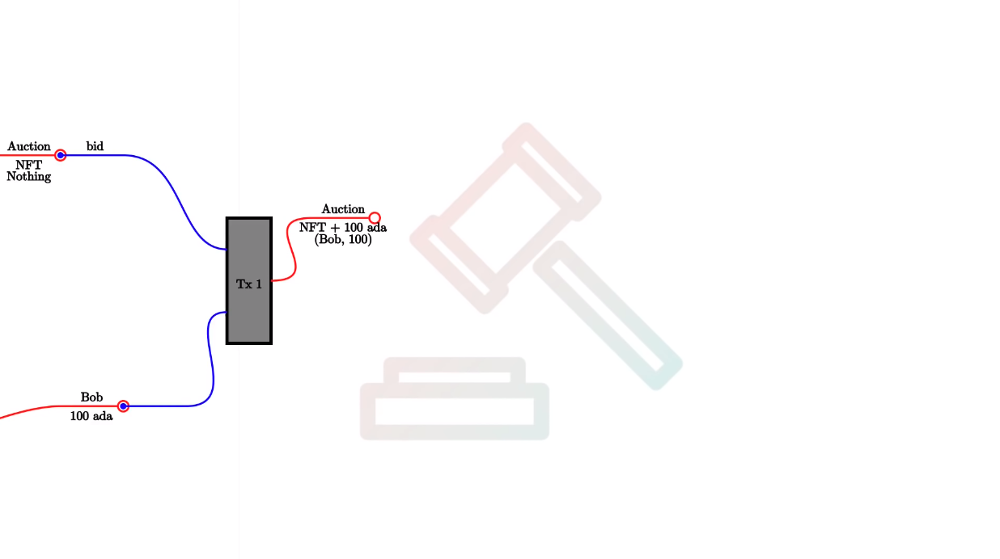

Để làm điều này, Bob tạo một giao dịch với hai đầu vào và một đầu ra.
Đầu vào đầu tiên là đấu giá UTxO và đầu vào thứ hai là giá thầu 100 Ada
của Bob. Đầu ra một lần nữa, ở tập lệnh đầu ra, nhưng bây giờ giá trị
và mức dữ liệu đã thay đổi. Trước đây số liệu là `Nothing` nhưng
bây giờ là (Bob, 100).

Giá trị đã thay đổi vì bây giờ không chỉ có NFT trong UTxO mà còn có giá
thầu  100 Ada.

Với tư cách là `Redeemer`, để mở khóa phiên đấu giá ban đầu UTxO,
chúng tôi sử dụng một thứ gọi là `Bid`. Đây chỉ là một kiểu dữ
liệu đại số. Cũng sẽ có các giá trị khác nhưng một trong số đó là `Bid`. Và kịch bản đấu giá sẽ kiểm tra xem tất cả các điều kiện đã
được thỏa mãn hay chưa. Vì vậy, trong trường hợp này, kịch bản phải kiểm
tra xem giá thầu có xảy ra trước thời hạn hay không, giá thầu đó có đủ
cao hay không.

Nó cũng phải kiểm tra xem có các đầu vào và đầu ra chính xác hay không.
Trong trường hợp này, điều đó có nghĩa là kiểm tra xem phiên đấu giá có
phải là đầu ra chứa NFT và có mức dữ liệu chính xác hay không.

Tiếp theo, giả sử rằng Charlie muốn trả giá cao hơn Bob và đặt giá thầu
200 Ada.


Charlie sẽ tạo một giao dịch khác, lần này là một giao dịch với hai đầu
vào và hai đầu ra. Như trong trường hợp đầu tiên, hai đầu vào là giá
thầu (lần này là giá thầu của Charlie là 200 Ada), và đấu giá UTxO. Một
trong những kết quả đầu ra là phiên đấu giá được cập nhật UTxO. Cũng sẽ
có đầu ra thứ hai, sẽ là UTxO trả về giá thầu 100 Ada của Bob.

Note

Trên thực tế, phiên đấu giá UTxO không được cập nhật vì `Nothing` thay
đổi.

Điều thực sự xảy ra là phiên đấu giá cũ UTxO được sử dụng và một phiên
đấu giá mới được tạo ra, nhưng nó có cảm giác cập nhật trạng thái của
phiên đấu giá UTxO


Lần này, chúng tôi lại sử dụng `redeemer` là `Bid`. Lần này kịch bản
phải kiểm tra xem thời hạn đã đến chưa, giá thầu cao hơn giá thầu trước
đó, nó phải kiểm tra xem phiên đấu giá UTxO có được tạo chính xác hay
không và phải kiểm tra xem người trả giá cao nhất trước đó có nhận lại
giá thầu của họ hay không.

Cuối cùng, hãy giả sử rằng sẽ không có một cuộc đấu giá nào khác, vì vậy
khi đã đến thời hạn cuối cùng, cuộc đấu giá có thể được đóng lại.

Để làm được điều đó, ai đó phải tạo thêm một giao dịch khác. Đó có thể
là Alice, người muốn thu giá hoặc có thể là Charlie, người muốn thu NFT.
Đó có thể là bất kỳ ai, nhưng Alice và Charlie có động cơ để làm như
vậy.

Giao dịch này sẽ có một đầu vào - đấu giá UTxO, lần này với `redeemer` là `Close` - và nó sẽ có hai đầu ra. Một trong những kết quả đầu ra dành
cho người trả giá cao nhất, Charlie và anh ta nhận được NFT và đầu ra
thứ hai thuộc về Alice, người có giá thầu cao nhất.

Trong trường hợp `Close`, tập lệnh phải kiểm tra xem đã đến thời
hạn hay chưa và người chiến thắng sẽ nhận được NFT và người chủ đấu giá
nhận được giá thầu cao nhất.

Có một kịch bản nữa để chúng ta xem xét, đó là không ai đưa ra bất kỳ
giá thầu nào.


Alice tạo phiên đấu giá, nhưng không nhận được giá thầu nào. Trong
trường hợp này, phải có một cơ chế để Alice lấy lại NFT của mình.

Vì vậy, cô ấy tạo một giao dịch với `Redeemer` là `Close`, nhưng
hiện tại vì không có người đặt giá thầu, NFT không đến tay người trả giá
cao nhất mà chỉ quay trở lại Alice.

Logic trong trường hợp này hơi khác một chút. Nó sẽ kiểm tra xem NFT có
quay trở lại Alice hay không, tuy nhiên, nó không thực sự cần kiểm tra
người nhận vì giao dịch sẽ được kích hoạt bởi Alice và cô ấy có thể gửi
NFT đến bất cứ nơi nào cô ấy muốn.

### Mã On-chain và Off-chain

Điều quan trọng cần nhận ra về Plutus là có mã On-chain và Off-chain.

### Mã On-chain

Mã trên chuỗi là các tập lệnh mà chúng ta đã thảo luận - các tập lệnh từ
mô hình UTxO. Ngoài các địa chỉ khóa công khai, chúng tôi có địa chỉ tập
lệnh và kết quả đầu ra có thể ở một địa chỉ như vậy, và nếu một giao
dịch cố gắng sử dụng một đầu ra như vậy, thì tập lệnh sẽ được thực thi
và giao dịch chỉ hợp lệ nếu tập lệnh thành công.

Nếu một nút nhận được một giao dịch mới, nó sẽ xác nhận nó trước khi
chấp nhận nó vào mempool của nó và cuối cùng thành một khối. Đối với mỗi
đầu vào của giao dịch, nếu đầu vào đó tình cờ là một địa chỉ tập lệnh,
tập lệnh tương ứng được thực thi. Nếu tập lệnh không thành công, giao
dịch không hợp lệ.

Ngôn ngữ lập trình mà tập lệnh này được thể hiện được gọi là `Plutus Core`, nhưng bạn không bao giờ viết Plutus Core bằng tay. Thay vào đó,
bạn viết Haskell và nó được biên dịch xuống `Plutus Core`. Luôn luôn có
thể có các ngôn ngữ cấp cao khác như Solidity, C hoặc Python có thể biên
dịch xuống `Plutus Core`.

Nhiệm vụ của một tập lệnh là nói có hay không về việc liệu một giao dịch
có thể sử dụng một đầu ra hay không.

### Mã Off-chain

Để mở khóa UTxO, bạn phải có khả năng xây dựng một giao dịch sẽ vượt qua
quá trình xác thực và đó là trách nhiệm của bộ phận ngoài chuỗi của
Plutus. Đây là phần chạy trên ví chứ không phải trên blockchain và sẽ
xây dựng các giao dịch phù hợp.

Một trong những điều thú vị về Plutus là cả các bộ phận On-chain và Off-chain đều được viết bằng Haskell. Một lợi thế
rõ ràng của điều đó là bạn không phải học hai ngôn ngữ lập trình. Ưu
điểm khác là bạn có thể chia sẻ mã giữa các bộ phận On-chain và Off-chain.

Ở phần sau của khóa học này, chúng ta sẽ nói về các máy trạng thái và
sau đó sự chia sẻ này giữa mã On-chain và Off-chain trở nên trực tiếp
hơn, nhưng ngay cả khi không có máy trạng thái vẫn có rất nhiều cơ hội
để chia sẻ mã.

Chúng ta sẽ có một cái nhìn ngắn gọn về mã nhưng đừng lo lắng, bạn sẽ
không hiểu nó tại thời điểm này.

Mã cho hợp đồng "English Auction" tại

    /path/to/plutus-pioneer-program/repo/code/week01/src/Week01/EnglishAuction.hs

Chúng tôi thấy kiểu dữ liệu ` Auction` đại diện cho các tham số cho
hợp đồng mà trong ví dụ của chúng tôi là Alice bắt đầu. Các tham số `aCurrency` và `aToken` đại diện cho NFT.

``` {.haskell}
data Auction = Auction
   { aSeller   :: !PubKeyHash
   , aDeadline :: !POSIXTime
   , aMinBid   :: !Integer
   , aCurrency :: !CurrencySymbol
   , aToken    :: !TokenName
   } deriving (Show, Generic, ToJSON, FromJSON, ToSchema)
```

Bạn cũng thấy các kiểu dữ liệu khác, nhưng trọng tâm của mã là hàm `mkAuctionValidator`. Đây là chức năng xác định xem một giao dịch nhất
định có được phép sử dụng UTxO tại địa chỉ tập lệnh này hay không.

``` {.haskell}
{-# INLINABLE mkAuctionValidator #-}
mkAuctionValidator :: AuctionDatum -> AuctionAction -> ScriptContext -> Bool
mkAuctionValidator ad redeemer ctx =
    traceIfFalse "wrong input value" correctInputValue &&
    case redeemer of
        MkBid b@Bid{..} ->
            traceIfFalse "bid too low" (sufficientBid bBid)                &&
            traceIfFalse "wrong output datum" (correctBidOutputDatum b)    &&
            traceIfFalse "wrong output value" (correctBidOutputValue bBid) &&
            traceIfFalse "wrong refund"       correctBidRefund             &&
            traceIfFalse "too late"           correctBidSlotRange
        Close           ->
            traceIfFalse "too early" correctCloseSlotRange &&
            case adHighestBid ad of
                Nothing      ->
                    traceIfFalse "expected seller to get token" (getsValue (aSeller auction) tokenValue)
                Just Bid{..} ->
                    traceIfFalse "expected highest bidder to get token" (getsValue bBidder tokenValue) &&
                    traceIfFalse "expected seller to get highest bid" (getsValue (aSeller auction) $ Ada.lovelaceValueOf bBid)

  where
      ...
```

Và đây là nơi diễn ra quá trình biên dịch sang `Plutus Core`. Nó sử dụng
một thứ gọi là Template Haskell để lấy chức năng Haskell ở trên và biên
dịch nó thành `Plutus Core`.

``` {.haskell}
auctionTypedValidator :: Scripts.TypedValidator Auctioning
auctionTypedValidator = Scripts.mkTypedValidator @Auctioning
    $$(PlutusTx.compile [|| mkAuctionValidator ||])
    $$(PlutusTx.compile [|| wrap ||])
  where
    wrap = Scripts.wrapValidator
```

Phần off-chain của mã xác định các endpoint có thể được gọi.

Chúng tôi có ba endpoint cho ví dụ này và mỗi endpoint có một kiểu dữ liệu
được xác định để đại diện cho các tham số của chúng.

``` {.haskell}
data StartParams = StartParams
   { spDeadline :: !POSIXTime
   , spMinBid   :: !Integer
   , spCurrency :: !CurrencySymbol
   , spToken    :: !TokenName
   } deriving (Generic, ToJSON, FromJSON, ToSchema)

data BidParams = BidParams
   { bpCurrency :: !CurrencySymbol
   , bpToken    :: !TokenName
   , bpBid      :: !Integer
   } deriving (Generic, ToJSON, FromJSON, ToSchema)

data CloseParams = CloseParams
   { cpCurrency :: !CurrencySymbol
   , cpToken    :: !TokenName
   } deriving (Generic, ToJSON, FromJSON, ToSchema)
```

Sau đó, các hoạt động off-chain được xác định.

Đầu tiên là endpoint `start`.

``` {.haskell}
start :: AsContractError e => StartParams -> Contract w s e ()
start StartParams{..} = do
    pkh <- pubKeyHash <$> ownPubKey
    let a = Auction
                { aSeller   = pkh
                , aDeadline = spDeadline
                , aMinBid   = spMinBid
                , aCurrency = spCurrency
                , aToken    = spToken
                }
        d = AuctionDatum
                { adAuction    = a
                , adHighestBid = Nothing
                }
        v = Value.singleton spCurrency spToken 1
        tx = mustPayToTheScript d v
    ledgerTx <- submitTxConstraints auctionTypedValidator tx
    void $ awaitTxConfirmed $ txId ledgerTx
    logInfo @String $ printf "started auction %s for token %s" (show a) (show v)
```

sau đó là endpoint `bid`.

``` {.haskell}
bid :: forall w s. BidParams -> Contract w s Text ()
bid BidParams{..} = do
    (oref, o, d@AuctionDatum{..}) <- findAuction bpCurrency bpToken
    logInfo @String $ printf "found auction utxo with datum %s" (show d)

    when (bpBid < minBid d) $
        throwError $ pack $ printf "bid lower than minimal bid %d" (minBid d)
    pkh <- pubKeyHash <$> ownPubKey
    let b  = Bid {bBidder = pkh, bBid = bpBid}
        d' = d {adHighestBid = Just b}
        v  = Value.singleton bpCurrency bpToken 1 <> Ada.lovelaceValueOf bpBid
        r  = Redeemer $ PlutusTx.toData $ MkBid b

        lookups = Constraints.typedValidatorLookups auctionTypedValidator <>
                  Constraints.otherScript auctionValidator                <>
                  Constraints.unspentOutputs (Map.singleton oref o)
        tx      = case adHighestBid of
                    Nothing      -> mustPayToTheScript d' v                            <>
                                    mustValidateIn (to $ aDeadline adAuction)          <>
                                    mustSpendScriptOutput oref r
                    Just Bid{..} -> mustPayToTheScript d' v                            <>
                                    mustPayToPubKey bBidder (Ada.lovelaceValueOf bBid) <>
                                    mustValidateIn (to $ aDeadline adAuction)          <>
                                    mustSpendScriptOutput oref r
    ledgerTx <- submitTxConstraintsWith lookups tx
    void $ awaitTxConfirmed $ txId ledgerTx
    logInfo @String $ printf "made bid of %d lovelace in auction %s for token (%s, %s)"
        bpBid
        (show adAuction)
        (show bpCurrency)
        (show bpToken)
```

và cuối cùng là endpoint `close` .

``` {.haskell}
close :: forall w s. CloseParams -> Contract w s Text ()
close CloseParams{..} = do
    (oref, o, d@AuctionDatum{..}) <- findAuction cpCurrency cpToken
    logInfo @String $ printf "found auction utxo with datum %s" (show d)

    let t      = Value.singleton cpCurrency cpToken 1
        r      = Redeemer $ PlutusTx.toData Close
        seller = aSeller adAuction

        lookups = Constraints.typedValidatorLookups auctionTypedValidator <>
                  Constraints.otherScript auctionValidator                <>
                  Constraints.unspentOutputs (Map.singleton oref o)
        tx      = case adHighestBid of
                    Nothing      -> mustPayToPubKey seller t                          <>
                                    mustValidateIn (from $ aDeadline adAuction)       <>
                                    mustSpendScriptOutput oref r
                    Just Bid{..} -> mustPayToPubKey bBidder t                         <>
                                    mustPayToPubKey seller (Ada.lovelaceValueOf bBid) <>
                                    mustValidateIn (from $ aDeadline adAuction)       <>
                                    mustSpendScriptOutput oref r
    ledgerTx <- submitTxConstraintsWith lookups tx
    void $ awaitTxConfirmed $ txId ledgerTx
    logInfo @String $ printf "closed auction %s for token (%s, %s)"
        (show adAuction)
        (show cpCurrency)
        (show cpToken)
```

Có một đoạn mã để ràng buộc mọi thứ đó.

``` {.haskell}
endpoints :: Contract () AuctionSchema Text ()
endpoints = (start' `select` bid' `select` close') >> endpoints
  where
    start' = endpoint @"start" >>= start
    bid'   = endpoint @"bid"   >>= bid
    close' = endpoint @"close" >>= close
```

Và những dòng cuối cùng chỉ là những trợ giúp để tạo một NFT mẫu
để cho phép chúng tôi thử đấu giá NFT này trong playground.

``` {.haskell}
mkSchemaDefinitions ''AuctionSchema

myToken :: KnownCurrency
myToken = KnownCurrency (ValidatorHash "f") "Token" (TokenName "T" :| [])

mkKnownCurrencies ['myToken]
```

Một ví dụ về việc sử dụng lại mã là hàm `minBid`.

``` {.haskell}
minBid :: AuctionDatum -> Integer
minBid AuctionDatum{..} = case adHighestBid of
    Nothing      -> aMinBid adAuction
    Just Bid{..} -> bBid + 1
```

Chức năng này được sử dụng trong phần on-chain để xác thực, nhưng cũng
trong mã off-chain, trong ví, trước khi nó làm phiền đến việc tạo giao
dịch, để kiểm tra xem nó có đáng làm như vậy hay không.

Đi đến Playground
-----------------

chúng ta sẽ chạy tại Plutus Playground của tôi.

### Cài đặt Plutus

Trước khi biên dịch mã hợp đồng mẫu, chúng ta cần thiết lập Plutus. Bạn
nên thiết lập một trình bao Nix từ kho lưu trữ chính của Plutus, tại đó
cũng có thể được sử dụng để biên dịch các hợp đồng mẫu.

[chi tiết làm như thế nào ở đây
here](https://www.evernote.com/shard/s426/client/snv?noteGuid=b34acc67-c94b-fc64-9350-398a8f6fc6ec&noteKey=7e6b84c9501e9949eef2cadf6e35eaff&sn=https%3A%2F%2Fwww.evernote.com%2Fshard%2Fs426%2Fsh%2Fb34acc67-c94b-fc64-9350-398a8f6fc6ec%2F7e6b84c9501e9949eef2cadf6e35eaff&title=Installation).

Điều này sẽ thiết lập môi trường của bạn với các phụ thuộc cần thiết để
biên dịch các hợp đồng mẫu.

Khi bạn đã ở bên trong Nix shell, bạn có thể khởi động máy khách và máy
chủ Plutus từ kho lưu trữ Plutus nhân bản.

Các video bài giảng được ghi lại vào nhiều thời điểm khác nhau và mã
Plutus cùng với chúng được biên soạn dựa trên các cam kết cụ thể của
nhánh chính của Plutus. Bạn có thể tìm thấy thẻ cam kết trong tệp
cabal.project.

#### Server

``` {.bash}
cd /path/to/plutus/repo/plutus-playground-client
plutus-playground-server
```

#### Client

``` {.bash}
cd /path/to/plutus/repo/plutus-playground-client
npm run start
```

Để kiểm tra xem mọi thứ có theo thứ tự hay không, sau đó bạn có thể biên dịch mã cho week01. Điều này không cần thiết để chạy mã trong sân chơi, vì sân chơi có thể tự biên dịch mã.

``` {.bash}
cd /path/to/plutus-pioneer-program/repo/code/week01
cabal build all
```

Nếu mọi thứ suôn sẻ trong thiết lập ở trên, bạn sẽ có thể mở sân chơi
tại https://localhost:8009. Bạn có thể sẽ nhận được lỗi chứng chỉ,
lỗi này có thể được bỏ qua.

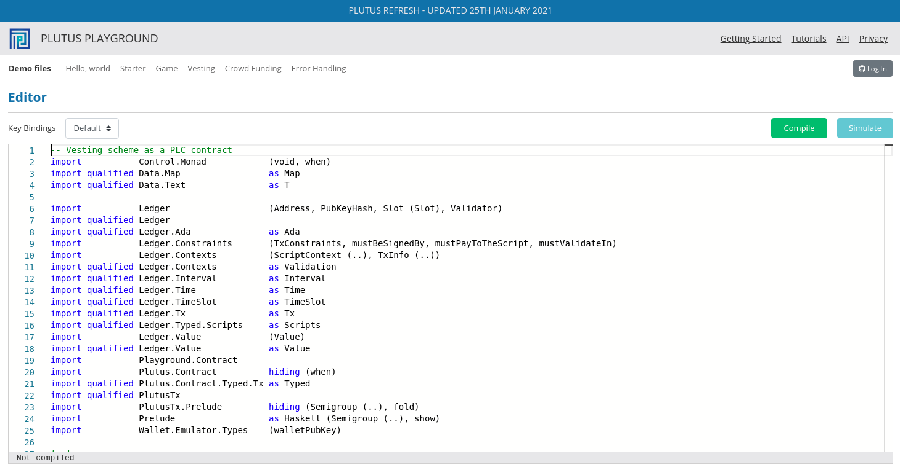

Sao chép và dán nội dung tệp EnglishAuction.sh vào playground, thay thế
hợp đồng demo hiện có.


Nhấp vào nút biên dịch. Khi nó đã được biên dịch, hãy nhấp vào nút
Simulate.


Các ví mặc định được thiết lập với 10 Lovelace và 10 T, trong đó T là mã
thông báo gốc được mô phỏng bởi tập lệnh trong các dòng sau:

``` {.haskell}
myToken :: KnownCurrency
myToken = KnownCurrency (ValidatorHash "f") "Token" (TokenName "T" :| [])

mkKnownCurrencies ['myToken]
```

Chúng tôi sẽ coi token T là token không thể thay thế (NFT)
và mô phỏng điều này bằng cách thay đổi các ví sao cho Ví 1 có 1 T và
các ví khác có 0 T.

Ngoài ra, 10 lovelace thấp đến mức nực cười, vì vậy hãy cho mỗi ví 1000
Ada, tức là 1.000.000.000 lovelace.

Nhấp vào tùy chọn "add wallet", sau đó điều chỉnh số dư cho phù hợp:


Bạn có thể thấy trong sân chơi rằng hợp đồng có ba `endpoints`: `start`, `bid` và `close`.

Theo mặc định, endpoint "Pay to Wallet" luôn ở đó trong sân chơi. Nó
cho phép chuyển Lovelace từ ví này sang ví khác một cách đơn giản.

Nhấp vào "start" trên ví 1, để tạo phiên đấu giá:

Đây là nơi người bán sẽ đặt ra các quy tắc cho cuộc đấu giá.

Trường `getSlot` chỉ định thời hạn cho cuộc đấu giá. Hợp đồng không cho
phép đấu thầu sau thời hạn này.

Giả sử rằng thời hạn là 10 slot.

Thời gian được đo bằng thời gian POSIX (giây kể từ ngày 1 tháng 1 năm
1970), vì vậy chúng ta cần tính giá trị này. May mắn thay, trong gói `plutus-ledger` trong mô-đun `Ledger.Timeslot`, có một hàm `slotToPOSIXTime`. Nếu chúng tôi nhập cái này vào REPL, chúng tôi có
thể nhận được giá trị mà chúng tôi cần. Mô phỏng bắt đầu vào đầu kỷ
nguyên Shelley, vì vậy giá trị này - 1596059101 - phản ánh điều đó và
giá trị này sẽ là vào ngày 29 tháng 7 năm 2020 - vị trí thứ 10 của kỷ
nguyên Shelley.

``` {.haskell}
Prelude Week01.EnglishAuction> import Ledger.TimeSlot
Prelude Ledger.TimeSlot Week01.EnglishAuction> slotToPOSIXTime 10
POSIXTime {getPOSIXTime = 1596059101}
```

Thêm giá trị này vào trường thời hạn.

`SpMinField` chỉ định số lượng ADA tối thiểu phải được đặt giá thầu. Nếu
không đạt mức tối thiểu này trước thời hạn, sẽ không có cuộc đấu thầu
nào thành công. Hãy thực hiện 100 Ada này.

Nhập 100000000 vào trường `spMinBid`.

Hai trường cuối cùng - `spCurrencySymbol` và `unTokenName` chỉ định đơn vị
tiền tệ của NFT là chủ đề của phiên đấu giá. Trong Plutus, token
gốc được xác định bằng ký hiệu tiền tệ và tên.

Trong trường hợp này, ký hiệu là 66 và tên token, như chúng ta đã
thấy là T.

Nhập các giá trị này vào các trường tương ứng của chúng.


Chúng tôi cũng có thể chèn các hành động "wait", để đợi một số slot.
Chúng tôi sẽ cần đợi ít nhất một thời điểm để giao dịch bắt đầu phiên
đấu giá hoàn tất.

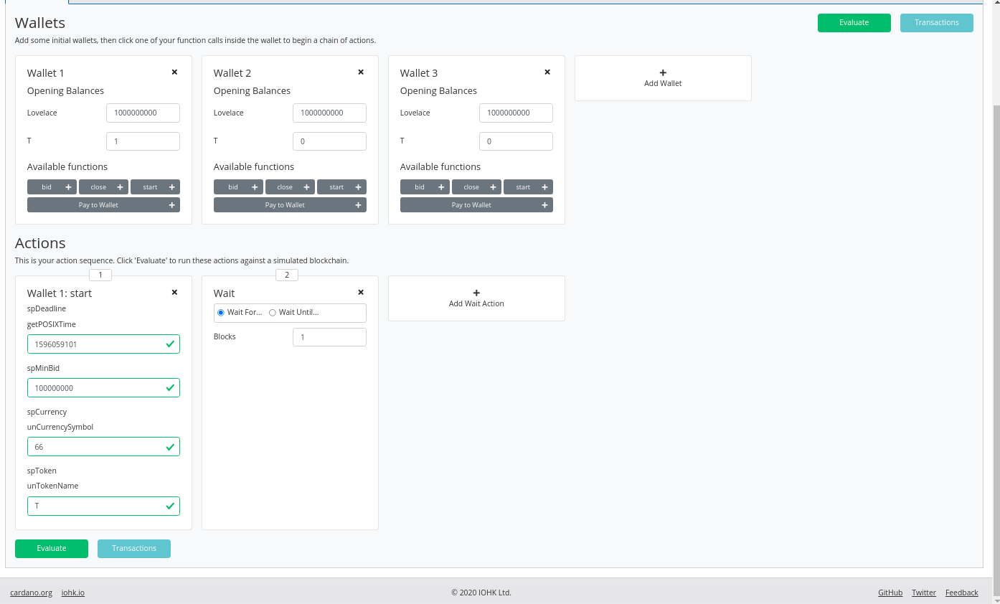

Bây giờ đấu thầu có thể bắt đầu.

Giả sử rằng Ví 2 và 3 muốn đặt giá thầu cho token này.

Ví 2 nhanh hơn và đặt giá thầu 100 Ada bằng cách gọi endpoint giá thầu
với các thông số như được hiển thị bên dưới.

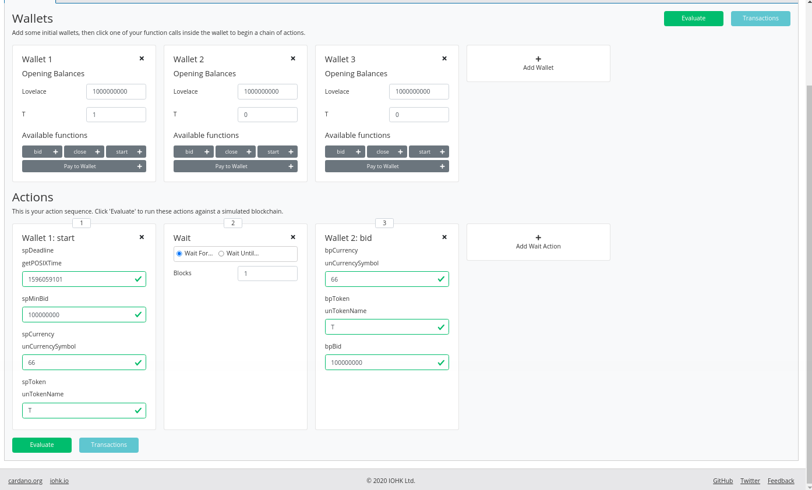

Bây giờ chúng tôi chèn một hành động chờ khác và bây giờ chúng tôi thêm
một giá thầu của Charlie (Wallet 3) cho 200 Ada.

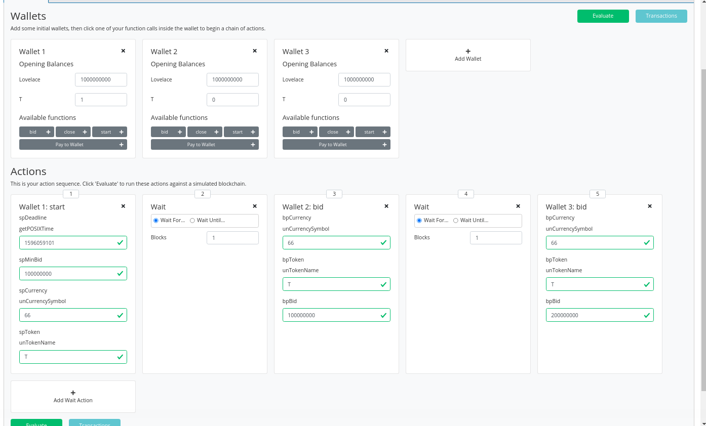

Giả sử rằng hai giá thầu này là giá thầu duy nhất.

Bây giờ chúng tôi thêm một hành động chờ đợi cho đến thời điểm 11, đó là
thời điểm sau thời hạn của phiên đấu giá.


Tại thời điểm này, bất kỳ ai cũng có thể gọi endpoint `close`.
Phiên đấu giá sẽ không tự giải quyết, nó cần được kích hoạt bởi một điểm
cuối.

Khi endpoint `Close` được kích hoạt, cuộc đấu giá sẽ được giải quyết
theo các quy tắc.

-   

    Nếu có ít nhất một giá thầu, người trả giá cao nhất sẽ nhận được token. Đây sẽ luôn là người trả giá cuối cùng vì kịch bản
        sẽ không cho phép giá thầu không cao hơn giá thầu cao nhất hiện
        có hoặc giá thầu thấp hơn mức giá thầu tối thiểu.

-   Nếu không có người đặt giá thầu, Ví 1 sẽ lấy lại token.

Giả sử Alice (Ví 1) gọi endpoint `close`. Chúng tôi sẽ thêm hành
động này và cũng thêm một hành động chờ khác mà chúng tôi cần ở cuối để
xem giao dịch cuối cùng khi chúng tôi chạy mô phỏng.

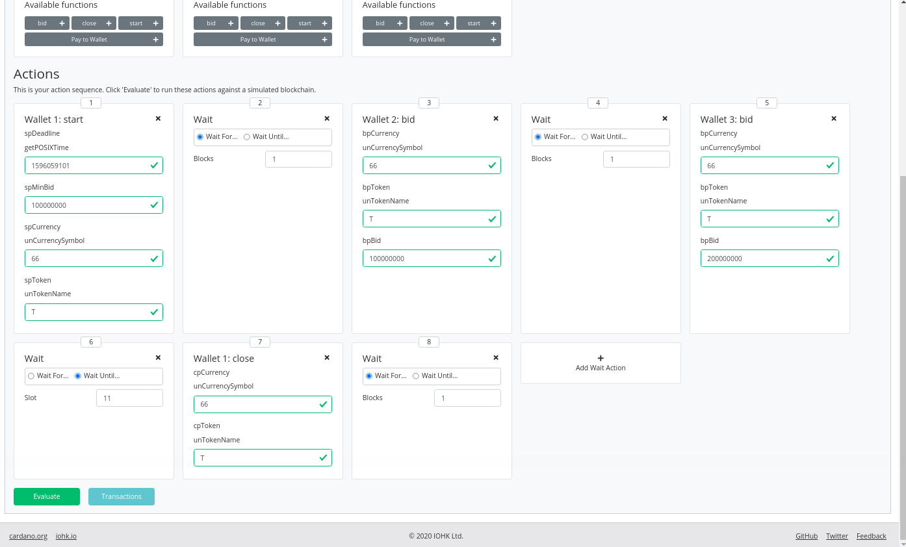

Bây giờ, hãy nhấp vào nút "Evaluate" - nút ở cuối hoặc nút ở đầu
trang.

Sau một lúc, bạn sẽ thấy chế độ xem giả lập.

Ở đầu trang, bạn sẽ thấy các vị trí có liên quan đến mô phỏng, tức là
các vị trí đã xảy ra một hành động. Ở đây chúng ta thấy rằng đây là các
khe 1,2,3,4 và 20.

Vị trí số 0 không phải do hợp đồng của chúng tôi gây ra, đó là giao dịch
Genesis thiết lập số dư ban đầu của ví. Có ba đầu ra cho giao dịch này.

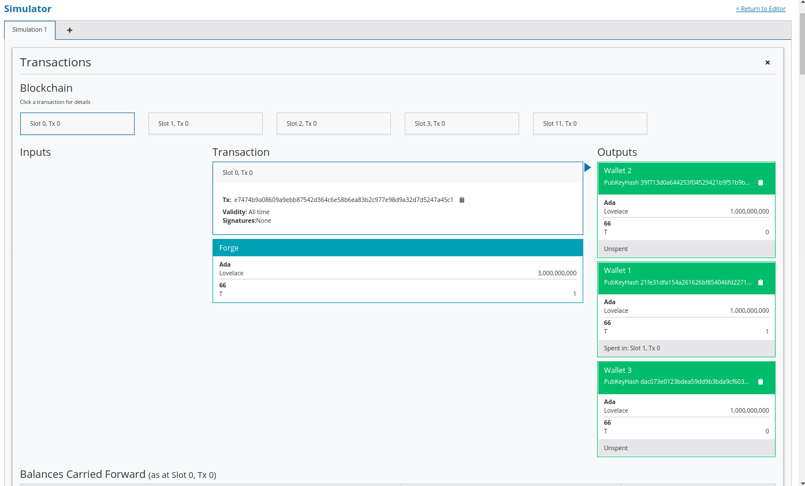

Bây giờ hãy nhấp vào giao dịch Slot 1.

Giao dịch có một đầu vào và ba đầu ra. Đầu vào là chỉ UTxO mà Wallet 1
có. Mặc dù đó là hai token, 1000 Ada và 1T, chúng nằm trong một
UTxO. Như đã đề cập trước đó, UTxO luôn cần được sử dụng toàn bộ, vì vậy
toàn bộ UTxO được gửi dưới dạng đầu vào.

Kết quả đầu ra là phí 10 lovelace (đây là phí demo và không phản ánh mức
phí thực sẽ là bao nhiêu), 999.999.990 lovelace trở lại Ví 1 và 1 T cho
hợp đồng để giữ trong khi đấu thầu diễn ra. Ở đây bạn cũng thấy địa chỉ
tập lệnh.

Như chúng ta đã biết từ phần giới thiệu về mô hình UTxO, cũng có thể có
một mức dữ liệu và có một mức dữ liệu, nhưng điều này không hiển thị
trong màn hình này.

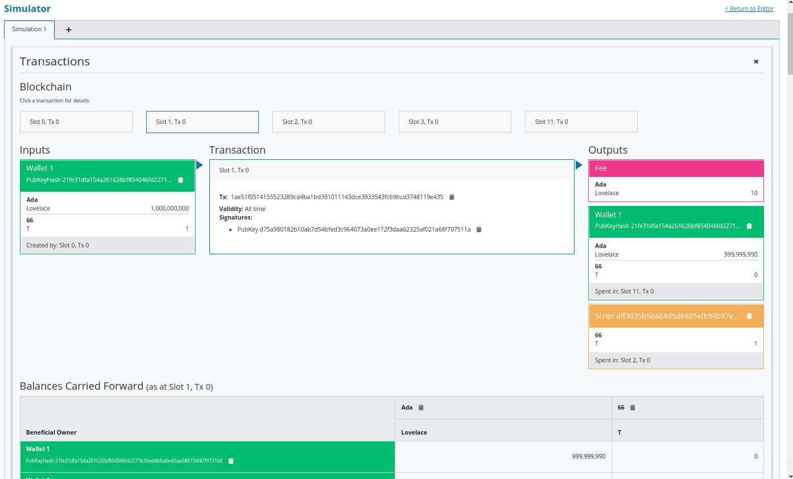

Vì vậy, bây giờ cuộc đấu giá đã được thiết lập, hãy xem giao dịch tiếp
theo, nơi Bob (Wallet 2) đặt giá thầu là 100 Ada.

Có hai đầu vào - tập lệnh UTxO và UTxO mà Bob sở hữu.

Ngoài ra còn có ba đầu ra. Đầu tiên là khoản phí 14,129 lovelace. Điều
thứ hai mang lại cho Bob tiền thay đổi của anh ấy - số tiền ban đầu của
anh ấy trừ đi các khoản phí và giá thầu. Đầu ra thứ ba khóa giá thầu vào
hợp đồng.

Trình xác thực tập lệnh ở đây phải đảm bảo rằng Wallet 2 không thể chỉ
lấy token, vì vậy nó sẽ chỉ xác thực trong trường hợp có đầu ra
mà token kết thúc trong hợp đồng một lần nữa. Hãy nhớ rằng trong
mô hình (E) UTxO, tất cả các đầu vào và đầu ra đều hiển thị với tập
lệnh.

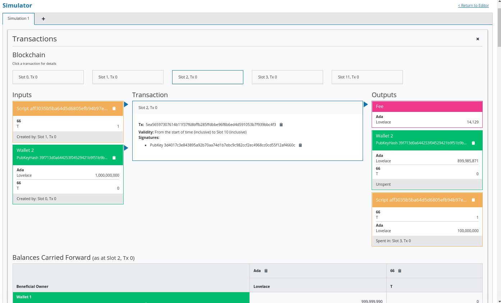

Bây giờ chúng ta hãy xem xét giao dịch tiếp theo. Đây là nơi Charlie đặt
giá thầu 200 Ada Lovelace (trong video của Lars là 5 Lovelace, nhưng tôi
đã nhập nó là 4 và tôi không muốn chụp lại tất cả các ảnh chụp màn hình
đó).

Các đầu vào ở đây là UTxO của Wallet 3 và địa chỉ tập lệnh.

Kết quả đầu ra là sự thay đổi của 6 Lovelace thành Ví 3, tập lệnh được
cập nhật với giá thầu cao mới của 4 Lovelace và việc trả lại giá thầu 3
Lovelace của Wallet 2 cho địa chỉ của Wallet 2.

Một lần nữa, logic trong tập lệnh phải đảm bảo rằng tất cả những điều
này được xử lý chính xác, tức là giá thầu mới cao hơn giá thầu trước đó
và token T tiếp tục bị khóa trong hợp đồng cùng với giá thầu mới.

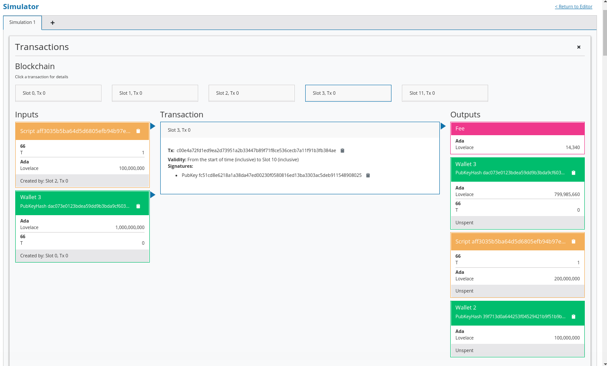

Giao dịch cuối cùng là hành động `Close`. Hai đầu vào này - một từ
Alice để trả phí và đầu vào thứ hai là tập lệnh UTxO làm đầu vào. Có bốn
kết quả đầu ra - phí từ Alice và sự thay đổi trở lại Alice, sau đó là
giá thầu thành công 200 Ada cho Alice và chuyển NFT cho Charlie.

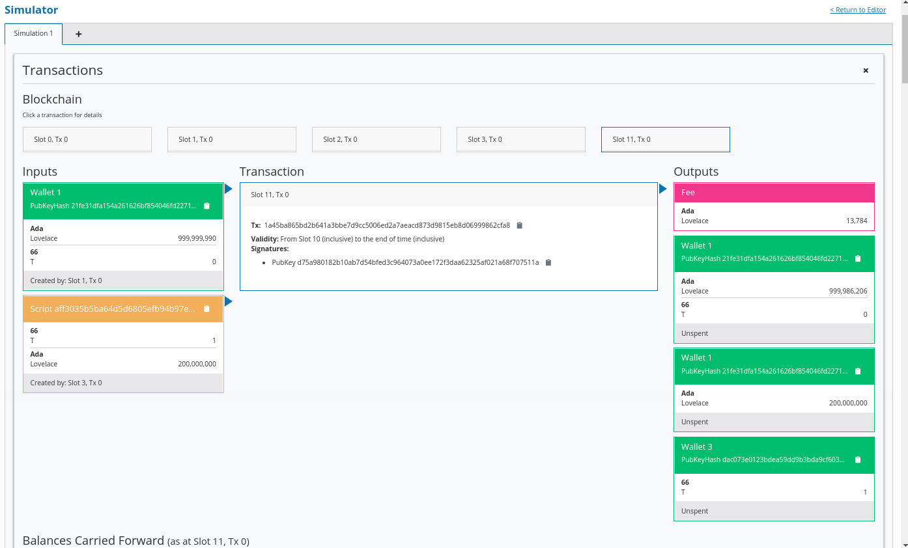

Nếu chúng ta cuộn xuống, bây giờ chúng ta có thể thấy số dư cuối cùng.

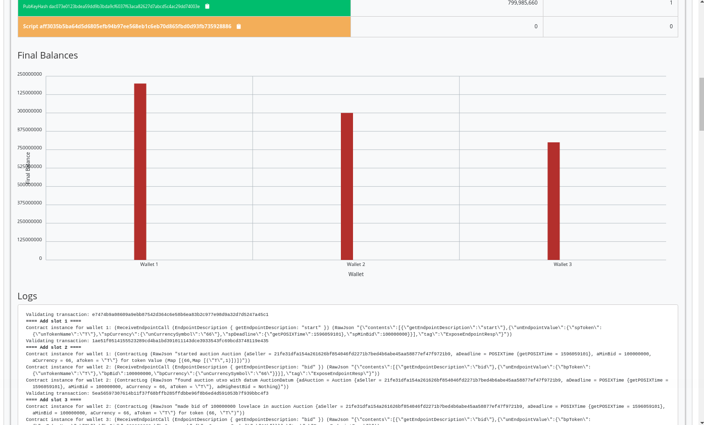

Hãy kiểm tra xem điều gì sẽ xảy ra khi có sự cố xảy ra, chẳng hạn như
nếu Charlie đưa ra giá thầu thấp hơn giá thầu của Bob. Giả sử Charlie
mắc lỗi và chỉ trả giá 20 Ada.

Bây giờ chúng tôi thấy rằng chúng tôi chỉ có bốn giao dịch và Bob thắng
cuộc đấu giá.


Hãy xem điều gì sẽ xảy ra nếu không có giá thầu hợp lệ.

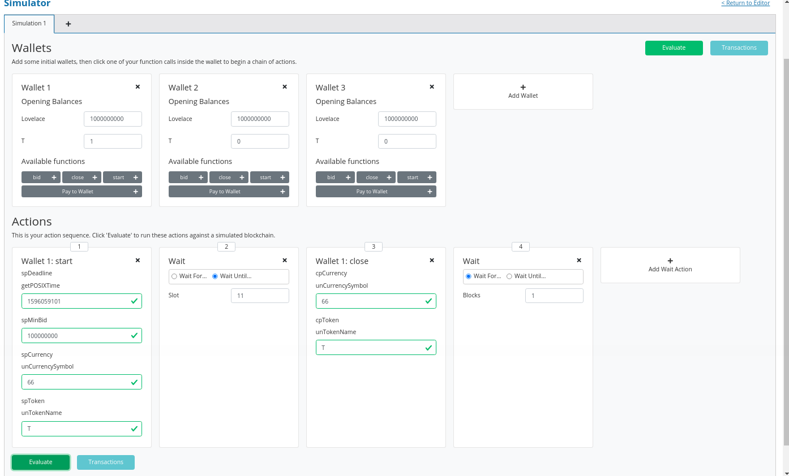

Bây giờ chỉ có ba giao dịch, giao dịch cuối cùng là giao dịch đóng. Vì
đây là một cuộc đấu giá thất bại, không có giá thầu thành công, giao
dịch này trả lại NFT cho Ví 1.

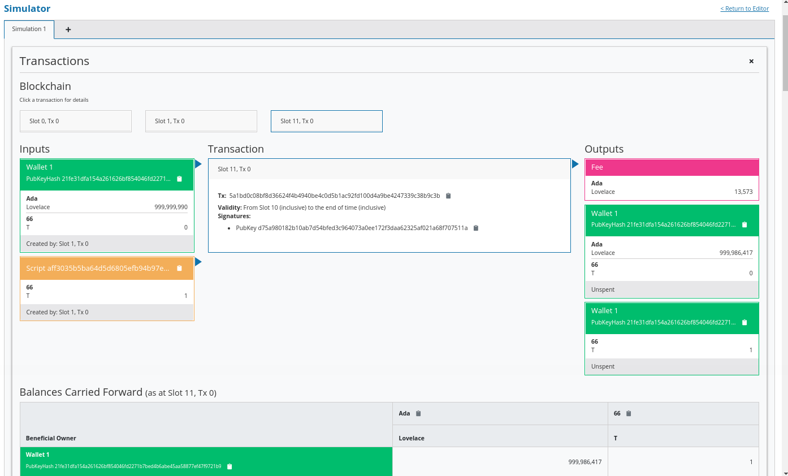
