Week 02 - Validation
====================

Đây là tài liệu [Bài giảng \#2, Dr. Lars](https://youtu.be/7nDGZkUIeUQ).

Nó bao gồm mức thấp và mức cao tập lệnh xác thực on-chain.

> Mã trong bài giảng này sử dụng cam kết Plutus
> 81ba78edb1d634a13371397d8c8b19829345ce0d
:::

Trước khi bắt đầu 
-----------------

Hãy nói về một điểm quan trọng được đưa ra bởi một trong những người
tiên phong sau bài giảng số 1.

Bạn sẽ gọi lại trong ví dụ đấu giá, chúng tôi tạo ra ba endpoints -
`start`, `bid` và `close`. `close` có hai kịch bản. Nếu có giá thầu đủ
cao, mã thông báo sẽ được chuyển đến người đặt giá thầu cao nhất. Nếu
không có giá thầu đủ cao, mã thông báo sẽ quay trở lại người bán.

Điều gì sẽ xảy ra nếu `endpoint close` không có ở đó? Tiền có thể bị
khóa mãi mãi trong hợp đồng không?

Đây là một điểm thực sự quan trọng, bởi vì những gì bạn phải nhận ra là
UTxO trên blockchain chỉ là dữ liệu, chúng hoàn toàn thụ động. Để bất cứ
điều gì xảy ra phải có một giao dịch. Để đạt được tiến bộ và thay đổi
trạng thái của blockchain, phải có một giao dịch mới được gửi sử dụng
các UTxO khác nhau và tạo ra các UTxO mới.

Chỉ có các giao dịch mới thay đổi trạng thái. UTxO sẽ không bao giờ tự
hoạt động và thực hiện điều gì đó. Bạn không thể có một hợp đồng thông
minh nằm trên blockchain và vào một thời điểm nào đó, đột nhiên thực
hiện một hành động.

Vì vậy, chúng tôi thực sự cần `endpoint close` nếu chúng tôi muốn cuộc
đấu giá được giải quyết. Trong trường hợp của chúng tôi, điểm cuối được
kích hoạt theo cách thủ công. Bạn có thể viết một hợp đồng chạy trong ví
sẽ tự động tạo closegiao dịch - có thể viết mã ngoài chuỗi khá phức tạp.

Tuy nhiên, theo quan điểm của blockchain, nó luôn là một yếu tố kích
hoạt bên ngoài thực hiện điều gì đó. Không có gì xảy ra nếu nó không
được kích hoạt từ bên ngoài.

Vì vậy, nếu không có `endpoint close` , hoặc `endpoint close` không bao
giờ được kích hoạt, thì tiền sẽ vẫn nằm ở địa chỉ tập lệnh mãi mãi.

Giới thiệu
----------

Trong bài giảng đầu tiên, chúng ta đã thấy rằng hợp đồng thông minh có
hai mặt - một phần trong chuỗi và một phần ngoài chuỗi.

Phần on-chain là về xác nhận. Nó cho phép các nút xác thực một giao dịch
nhất định và liệu nó có được phép sử dụng một UTxO nhất định hay không.

Phần off-chain nằm trong ví của người dùng. Nó xây dựng và gửi các giao
dịch phù hợp.

Cả hai đều là chủ đề quan trọng. Chúng tôi phải thành thạo cả hai để
viết hợp đồng thông minh, nhưng hiện tại chúng tôi sẽ tập trung vào phần
on-chain.

Hãy nhớ lại mô hình UTxO mở rộng mà ý tưởng là chúng tôi giới thiệu một
loại địa chỉ mới.


Trong mô hình UTxO đơn giản, cái gọi là địa chỉ khóa công khai, trong đó
địa chỉ được cung cấp bởi hàm băm của khóa công khai. Nếu một UTxO nằm ở
địa chỉ khóa công khai như vậy, thì một giao dịch có thể sử dụng UTxO đó
làm đầu vào nếu chữ ký thuộc khóa công khai đó được bao gồm trong giao
dịch.

Những gì mô hình (E) UTxO làm là mở rộng điều này bằng cách thêm các địa
chỉ tập lệnh có thể chạy logic tùy ý.

Khi một giao dịch muốn sử dụng UTxO ở một địa chỉ tập lệnh được xác thực
bởi một nút, thì nút đó sẽ chạy tập lệnh và sau đó, tùy thuộc vào kết
quả của tập lệnh, quyết định xem giao dịch có hợp lệ hay không.

Và nhớ lại rằng hai là ba bổ sung nữa:

Thay vì chỉ có chữ ký trên các giao dịch, chúng tôi có cái gọi là Người
nhận thừa - các phần dữ liệu tùy ý. Ở phía đầu ra UTxO, chúng tôi có một
phần dữ liệu tùy ý bổ sung được gọi là Datum, bạn có thể coi đây là một
phần nhỏ của trạng thái nằm trên UTxO. Cuối cùng, chúng ta có bối cảnh.
Có nhiều lựa chọn khác nhau về bối cảnh này có thể là gì. Nó có thể rất
hạn chế, chỉ bao gồm Chúa cứu thế (như trong Bitcoin) hoặc rất toàn cầu,
bao gồm toàn bộ trạng thái của blockchain (như trong Etheum). Trong
Cardano, đó là giao dịch đang được xác thực, bao gồm tất cả các đầu vào
và đầu ra của nó.

Vì vậy, có ba phần dữ liệu mà một tập lệnh Plutus nhận được. Datum, đặt
tại UTxO, người mua lại, đến từ đầu vào và xác thực, và ngữ cảnh, bao
gồm giao dịch đang được xác thực và các đầu vào và đầu ra của nó.

Trong một triển khai cụ thể như Plutus, những phần thông tin này cần
được biểu diễn bằng một kiểu dữ liệu cụ thể - kiểu dữ liệu Haskell. Khi
nó xảy ra, lựa chọn đã được thực hiện để sử dụng cùng một kiểu dữ liệu
cho cả ba người trong số họ. Ít nhất là ở mức độ thực hiện thấp.

Chúng ta sẽ xem xét điều đó đầu tiên, nhưng trong cuộc sống thực không
ai thực sự sử dụng phương pháp tiếp cận cấp thấp này. Có nhiều cách
thuận tiện hơn để sử dụng các kiểu dữ liệu phù hợp hơn cho những việc
này, và chúng ta sẽ đề cập đến vấn đề đó ở phần sau của bài giảng này.

PlutusTx.Data
-------------

Như đề cập, the datum, redeemer and context chia sẻ một kiểu dữ liệu.

Kiểu dữ liệu đó được đống gói trong `plutus-core`, trong mô-đul
`PlutusCore.Data`.

Nó đực gọi đơn giản là `Data`.

``` {.haskell}
data Data =
     Constr Integer [Data]
   | Map [(Data, Data)]
   | List [Data]
   | I Integer
   | B BS.ByteString
   deriving stock (Show, Eq, Ord, Generic)
   deriving anyclass (NFData)
```

Nó có 5 hàm tạo.

-   `Constr` lấy một Số nguyên và, một cách đệ quy, một danh sách `Data`
-   `Map` lấy một danh sách các cặp *Data*. Bạn có thể coi đây là một
    bảng tra cứu các cặp khóa-giá trị trong đó cả khóa và giá trị đều
    thuộc loại `Data`
-   `List` lấy một danh sách `Data`
-   `I` lấy một số nguyên duy nhất
-   `B` lấy một chuỗi Byte

Đối với những người quen thuộc với định dạng JSON, điều này rất giống.
Các hàm tạo không hoàn toàn giống nhau, nhưng giống như JSON, bạn có thể
biểu diễn số, chuỗi, danh sách dữ liệu và các cặp khóa-giá trị. Nó có
thể đại diện cho dữ liệu tùy ý, điều này làm cho nó rất phù hợp với mục
đích của chúng tôi.

Chúng ta cũng có thể khám phá loại này trong REPL.

Chạy phần sau từ kho lưu trữ chương trình tiên phong của plutus. Bạn có
thể cần khởi động nix-shell từ kho lưu trữ Plutus trước khi thay đổi vào
thư mục `week02`.

    cd code/week02
    cabal repl

Từ REPL, chúng ta cần import `PlutusTx` để chúng có quyền truy cập
vào`Data` . `Data` không được định nghĩa trong `PlutusTx`, nhưng nó được
tái xuất từ đó.

    import PlutusTx

chúng ta có thể thấy thông tin về `Data`.

    :i Data

Điều này chung ta có thể nhận được một số thông tin về *Data*.

``` {.haskell}
Prelude Week02.Burn> import PlutusTx
Prelude PlutusTx Week02.Burn> :i Data
type Data :: *
data Data
  = Constr Integer [Data]
  | Map [(Data, Data)]
  | List [Data]
  | I Integer
  | B bytestring-0.10.12.0:Data.ByteString.Internal.ByteString
        -- Defined in ‘plutus-core-0.1.0.0:PlutusCore.Data’
instance Eq Data
  -- Defined in ‘plutus-core-0.1.0.0:PlutusCore.Data’
instance Ord Data
  -- Defined in ‘plutus-core-0.1.0.0:PlutusCore.Data’
instance Show Data
  -- Defined in ‘plutus-core-0.1.0.0:PlutusCore.Data’
instance IsData Data -- Defined in ‘PlutusTx.IsData.Class’
```

Bây giờ chúng ta có thể chơi với nó. Chúng ta có thể sử dụng hàm `I` tạo
để tạo một giá trị của kiểu `Data`.

``` {.haskell}
Prelude PlutusTx.Data Week02.Burn> I 42
I 42
```

Chúng ta có thể hỏi loại của nó và xác nhận rằng nó thực sự thuộc loại
`Data`:

``` {.haskell}
Prelude PlutusTx.Data Week02.Burn> :t I 42
I 42 :: Data
```

TCách dễ nhất để tạo một giá trị kiểu `Data` bằng cách sử dụng hàm `B`
tạo là sử dụng Phần mở rộng GHC `OverloadedStrings`. Điều này cho phép
các chuỗi ký tự được sử dụng thay cho các kiểu dữ liệu giống chuỗi và
trình biên dịch sẽ diễn giải chúng như kiểu dự định của chúng.

``` {.haskell}
Prelude PlutusTx.Data Week02.Burn> :set -XOverloadedStrings
Prelude PlutusTx.Data Week02.Burn> :t B "Haskell"
B "Haskell" :: Data
```

Chúng ta cũng có thể sử dụng các hàm tạo phức tạp hơn, như `Map` and
`List`:

``` {.haskell}
Prelude PlutusTx.Data Week02.Burn> :t Map [(I 42, B "Haskell"), (List [I 0], I 1000)]
Map [(I 42, B "Haskell"), (List [I 0], I 1000)] :: Data
```

Plutus Validator
----------------

Bây giờ chúng tôi đã sẵn sàng triển khai trình xác thực đầu tiên của
mình..

### Ví dụ 1 - Hợp đồng Gift

#### The Code

Chúng tôi bắt đầu tập lệnh bằng cách sao chép, dán danh sách các phần mở
rộng ngôn ngữ GHC, cộng với một số phần nhập phụ thuộc từ ví dụ mà chúng
tôi đã sử dụng trong bài giảng trước.

``` {.haskell}
{-# LANGUAGE DataKinds           #-}
{-# LANGUAGE FlexibleContexts    #-}
...

module Week02.Gift where

import           Control.Monad       hiding (fmap)
import           Data.Map            as Map
...
import           Text.Printf         (printf)
```

Sau đó, chúng tôi viết trình xác nhận. Cuối cùng, trình xác thực sẽ là
một tập lệnh, sống trên blockchain trong Plutus Core, là một ngôn ngữ
cấp thấp hơn dựa trên phép tính lambda. Nhưng, chúng ta không cần phải
viết Plutus Core. Chúng ta có thể viết Haskell và sau này chúng ta sẽ
xem cách chúng ta chuyển đổi Haskell đó thành tập lệnh Plutus Core.

Vì vậy, chúng tôi viết một hàm Haskell đại diện cho trình xác thực của
chúng tôi. Như chúng ta đã biết, trình xác thực là một tập lệnh có ba
phần đầu vào - dữ liệu, trình đổi và ngữ cảnh, tương ứng, ở cấp thấp
nhất được biểu thị bằng `Data` kiểu dữ liệu.

``` {.haskell}
mkValidator :: Data -> Data -> Data -> ()
```

Hơi ngạc nhiên, kết quả của hàm là `()`. Trong Haskell `Unit` kiểu,
tương tự như `void` trong một số ngôn ngữ khác, như C hoặc C \# hoặc
Java - đó là kiểu không mang thông tin.

`Unit` là một kiểu tích hợp sẵn trong Haskell và nó chỉ có một giá trị,
được viết theo cùng một cách với chính kiểu đó, như chúng ta có thể thấy
từ REPL.

``` {.haskell}
Prelude Week02.Gift> ()
()
Prelude Week02.Gift> :t ()
() :: ()
```

Một hàm có kiểu trả về `()` là khá bất thường trong Haskell. Trong các
ngôn ngữ chính thống hơn, việc các hàm hoặc thủ tục không trả về giá trị
là điều khá phổ biến. Trong những tình huống này, các hàm chỉ quan trọng
đối với các tác dụng phụ của chúng, chẳng hạn như hàm Java in nội dung
nào đó ra bảng điều khiển.

Nhưng Haskell là một ngôn ngữ thuần túy. Nếu bạn muốn có tác dụng phụ,
điều này sẽ được hiển thị bởi hệ thống loại. Ví dụ: nếu mkValidator thực
hiện bất kỳ IO nào, nó sẽ có chữ ký kiểu:

``` {.haskell}
mkValidator :: Data -> Data -> Data -> IO ()
```

Điều này sẽ chỉ ra một hàm thực hiện các tác dụng phụ IO nhưng không có
giá trị trả về thú vị.

Nhưng, như chúng ta biết rằng `mkValidator` hàm thực không thực hiện tác
dụng phụ và không trả về giá trị nào, thực sự không có gì hữu ích mà nó
có thể làm được.

Tuy nhiên, có điều gì đó mà hàm có thể làm cũng như trả về `()`, cụ thể
là nó có thể ném ra một ngoại lệ hoặc có lỗi. Và đó là những gì Plutus
sử dụng.

Ý tưởng là nếu `mkValidatorhàm` không gặp lỗi hoặc đưa ra một ngoại lệ,
thì quá trình xác nhận sẽ thành công. Nếu nó xuất hiện một lỗi thì việc
xác thực không thành công và giao dịch bị từ chối.

Hãy viết trình xác nhận đơn giản nhất mà chúng ta có thể.

``` {.haskell}
mkValidator :: Data -> Data -> Data -> ()
mkValidator _ _ _ = ()
```

Đối số đầu tiên là dữ liệu, đối số thứ hai là trình chuộc và đối số thứ
ba là ngữ cảnh. Điều đơn giản nhất mà chúng ta có thể làm là hoàn toàn
bỏ qua cả ba đối số và quay trở lại ngay lập tức `()`.

Điều này có nghĩa là địa chỉ tập lệnh tương ứng với trình xác thực này
không quan tâm đến dữ liệu, nó không quan tâm đến trình đổi và không
quan tâm đến ngữ cảnh. Nó sẽ luôn thành công và điều này có nghĩa là bất
kỳ giao dịch nào cũng có thể sử dụng tập lệnh tại địa chỉ này làm đầu
vào. Không quan trọng dữ liệu nào tồn tại cho UTxO tại địa chỉ tập lệnh
này, không quan trọng công cụ đổi quà nào được sử dụng cho giao dịch và
giao dịch có cấu trúc nào không quan trọng.

Nếu bạn gửi bất kỳ khoản tiền nào đến địa chỉ tập lệnh này, bất kỳ ai
cũng có thể nhận ngay.

Hàm này chưa phải là mã Plutus, nó chỉ là một hàm Haskell. Để biến nó
thành một tập lệnh Plutus, chúng ta cần phải biên dịch nó.

Kết quả của quá trình biên dịch của chúng tôi sang Plutus sẽ thuộc loại
`Validator`. Bên dưới hàm trong `Gift.hs`, chúng tôi thêm đoạn mã sau.

``` {.haskell}
validator :: Validator
validator = mkValidatorScript $$(PlutusTx.compile [|| mkValidator ||])
```

Các chức năng `mkValidatorScript` mang kiểu
`CompiledCode (Data -> Data -> Data -> ()) -> Validator`. Nhằm mục đích
tạo kiểu này và biên dịch tập lệnh `mkValidator` bằng cách sử dụng một
thứ gọi là Template Haskell.

Template Haskell là một tính năng nâng cao của Haskell giải quyết một
vấn đề tương tự như các hệ thống macro trong các ngôn ngữ khác. Macro là
thứ được mở rộng tại thời điểm biên dịch.

Vì vậy, với mã này

``` {.haskell}
$$(PlutusTx.compile [|| mkValidator ||])
```

Chúng tôi đang yêu cầu trình biên dịch viết mã cho hàm `validator` tại
thời điểm biên dịch dựa trên `mkValidatorhàm` của chúng ta , và sau đó
tiến hành biên dịch bình thường.

Bạn không cần phải hiểu nhiều về Template Haskell để viết Plutus vì nó
luôn luôn giống nhau. Khi bạn đã xem một vài ví dụ, bạn có thể ít nhiều
chỉ cần sao chép và dán.

Mẫu Haskell hy vọng tất cả mã sẽ có sẵn trong Oxford Brackets - `[| |]`.

Với các trình xác thực phức tạp hơn, bạn có thể sẽ dựa vào nhiều hàm trợ
giúp và bạn không muốn phải thêm chúng vào trong Dấu ngoặc đơn Oxford.
Để tránh điều này, có một điều chúng ta cần làm đối với `mkValidator`
hàm và đó là làm cho nó có thể nhập được bằng cách thêm thông số
`INLINABLE`.

``` {.haskell}
{-# INLINABLE mkValidator #-}
mkValidator :: Data -> Data -> Data -> ()
mkValidator _ _ _ = ()
```

Bạn sẽ thấy điều này thường xuyên trong các tập lệnh Plutus và nó thường
là một dấu hiệu cho thấy một hàm được sử dụng trong một tập lệnh xác
thực. Tất cả các chức năng mà trình xác nhận phụ thuộc phải có thể nhập
được.

Hãy quay lại REPL và xem xét trình xác nhận.

``` {.haskell}
:l src/Week02/Gift.hs
Ok, one module loaded.
Prelude PlutusTx Week02.Gift> import Ledger.Scripts
Prelude PlutusTx Ledger.Scripts Week02.Gift> validator
Validator { <script> }
```

Chúng tôi có thể yêu cầu thông tin về `Validator`.

``` {.haskell}
Prelude PlutusTx Ledger.Scripts Week02.Gift> :i Validator
type Validator :: *
newtype Validator = Validator {getValidator :: Script}
        -- Defined in ‘plutus-ledger-api-0.1.0.0:Plutus.V1.Ledger.Scripts’
instance Eq Validator
  -- Defined in ‘plutus-ledger-api-0.1.0.0:Plutus.V1.Ledger.Scripts’
instance Ord Validator
  -- Defined in ‘plutus-ledger-api-0.1.0.0:Plutus.V1.Ledger.Scripts’
instance Show Validator
  -- Defined in ‘plutus-ledger-api-0.1.0.0:Plutus.V1.Ledger.Scripts’
```

Chúng ta thấy rằng nó là một lớp bao bọc xung quanh `getValidator`

``` {.haskell}
Prelude PlutusTx Ledger.Scripts Week02.Gift> getValidator validator
<Script>
```

Sau đó, chúng ta có thể lấy một số thông tin về `Script`

``` {.haskell}
Prelude PlutusTx Ledger.Scripts Week02.Gift> :i Script
type Script :: *
newtype Script
  = Script {unScript :: plutus-core-0.1.0.0:UntypedPlutusCore.Core.Type.Program
                          plutus-core-0.1.0.0:PlutusCore.DeBruijn.Internal.DeBruijn
                          plutus-core-0.1.0.0:PlutusCore.Default.Universe.DefaultUni
                          plutus-core-0.1.0.0:PlutusCore.Default.Builtins.DefaultFun
                          ()}
        -- Defined in ‘plutus-ledger-api-0.1.0.0:Plutus.V1.Ledger.Scripts’
instance Eq Script
  -- Defined in ‘plutus-ledger-api-0.1.0.0:Plutus.V1.Ledger.Scripts’
instance Ord Script
  -- Defined in ‘plutus-ledger-api-0.1.0.0:Plutus.V1.Ledger.Scripts’
instance Show Script
  -- Defined in ‘plutus-ledger-api-0.1.0.0:Plutus.V1.Ledger.Scripts’
```

Và ở đây chúng ta thấy rằng chúng ta có một unScripthàm, chúng ta có thể
chạy

``` {.haskell}
Prelude PlutusTx Ledger.Scripts Week02.Gift> unScript $ getValidator validator
Program () (Version () 1 0 0) (Apply () (Apply () (LamAbs () (DeBruijn {dbnIndex = 0}) (LamAbs () (DeBruijn {dbnIndex = 0}) (Apply () (Apply () (Apply () (LamAbs () (DeBruijn {dbnIndex = 0}) (LamAbs () (DeBruijn {dbnIndex = 0}) (LamAbs () (DeBruijn {dbnIndex = 0}) (Apply () (Apply () (Apply () (Apply () (Apply () (Apply () (LamAbs () (DeBruijn {dbnIndex = 0}) (LamAbs () (DeBruijn {dbnIndex = 0}) (LamAbs () (DeBruijn {dbnIndex = 0}) (LamAbs () (DeBruijn {dbnIndex = 0}) (LamAbs () (DeBruijn {dbnIndex = 0}) (LamAbs () (DeBruijn {dbnIndex = 0}) (Apply () (Apply () (LamAbs () (DeBruijn {dbnIndex = 0}) (LamAbs () (DeBruijn {dbnIndex = 0}) (Apply () (LamAbs () (DeBruijn {dbnIndex = 0}) (Var () (DeBruijn {dbnIndex = 1}))) (LamAbs () (DeBruijn {dbnIndex = 0}) (LamAbs () (DeBruijn {dbnIndex = 0}) (LamAbs () (DeBruijn {dbnIndex = 0}) (Var () (DeBruijn {dbnIndex = 5})))))))) (Delay () (LamAbs () (DeBruijn {dbnIndex = 0}) (Var () (DeBruijn {dbnIndex = 1}))))) (LamAbs () (DeBruijn {dbnIndex = 0}) (Var () (DeBruijn {dbnIndex = 1})))))))))) (LamAbs () (DeBruijn {dbnIndex = 0}) (Delay () (LamAbs () (DeBruijn {dbnIndex = 0}) (LamAbs () (DeBruijn {dbnIndex = 0}) (LamAbs () (DeBruijn {dbnIndex = 0}) (LamAbs () (DeBruijn {dbnIndex = 0}) (LamAbs () (DeBruijn {dbnIndex = 0}) (Apply () (Var () (DeBruijn {dbnIndex = 5})) (Var () (DeBruijn {dbnIndex = 6}))))))))))) (LamAbs () (DeBruijn {dbnIndex = 0}) (LamAbs () (DeBruijn {dbnIndex = 0}) (Delay () (LamAbs () (DeBruijn {dbnIndex = 0}) (LamAbs () (DeBruijn {dbnIndex = 0}) (LamAbs () (DeBruijn {dbnIndex = 0}) (LamAbs () (DeBruijn {dbnIndex = 0}) (LamAbs () (DeBruijn {dbnIndex = 0}) (Apply () (Apply () (Var () (DeBruijn {dbnIndex = 4})) (Var () (DeBruijn {dbnIndex = 7}))) (Var () (DeBruijn {dbnIndex = 6})))))))))))) (LamAbs () (DeBruijn {dbnIndex = 0}) (Delay () (LamAbs () (DeBruijn {dbnIndex = 0}) (LamAbs () (DeBruijn {dbnIndex = 0}) (LamAbs () (DeBruijn {dbnIndex = 0}) (LamAbs () (DeBruijn {dbnIndex = 0}) (LamAbs () (DeBruijn {dbnIndex = 0}) (Apply () (Var () (DeBruijn {dbnIndex = 3})) (Var () (DeBruijn {dbnIndex = 6}))))))))))) (LamAbs () (DeBruijn {dbnIndex = 0}) (Delay () (LamAbs () (DeBruijn {dbnIndex = 0}) (LamAbs () (DeBruijn {dbnIndex = 0}) (LamAbs () (DeBruijn {dbnIndex = 0}) (LamAbs () (DeBruijn {dbnIndex = 0}) (LamAbs () (DeBruijn {dbnIndex = 0}) (Apply () (Var () (DeBruijn {dbnIndex = 2})) (Var () (DeBruijn {dbnIndex = 6}))))))))))) (LamAbs () (DeBruijn {dbnIndex = 0}) (Delay () (LamAbs () (DeBruijn {dbnIndex = 0}) (LamAbs () (DeBruijn {dbnIndex = 0}) (LamAbs () (DeBruijn {dbnIndex = 0}) (LamAbs () (DeBruijn {dbnIndex = 0}) (LamAbs () (DeBruijn {dbnIndex = 0}) (Apply () (Var () (DeBruijn {dbnIndex = 1})) (Var () (DeBruijn {dbnIndex = 6}))))))))))) (LamAbs () (DeBruijn {dbnIndex = 0}) (Var () (DeBruijn {dbnIndex = 1}))))))) (Delay () (Delay () (LamAbs () (DeBruijn {dbnIndex = 0}) (LamAbs () (DeBruijn {dbnIndex = 0}) (Var () (DeBruijn {dbnIndex = 2}))))))) (Delay () (LamAbs () (DeBruijn {dbnIndex = 0}) (LamAbs () (DeBruijn {dbnIndex = 0}) (Delay () (LamAbs () (DeBruijn {dbnIndex = 0}) (LamAbs () (DeBruijn {dbnIndex = 0}) (Apply () (Apply () (Var () (DeBruijn {dbnIndex = 1})) (Var () (DeBruijn {dbnIndex = 4}))) (Var () (DeBruijn {dbnIndex = 3})))))))))) (Delay () (LamAbs () (DeBruijn {dbnIndex = 0}) (Var () (DeBruijn {dbnIndex = 1}))))))) (Delay () (Delay () (LamAbs () (DeBruijn {dbnIndex = 0}) (LamAbs () (DeBruijn {dbnIndex = 0}) (Delay () (LamAbs () (DeBruijn {dbnIndex = 0}) (Apply () (Apply () (Var () (DeBruijn {dbnIndex = 1})) (Var () (DeBruijn {dbnIndex = 3}))) (Var () (DeBruijn {dbnIndex = 2})))))))))) (Delay () (Delay () (LamAbs () (DeBruijn {dbnIndex = 0}) (Var () (DeBruijn {dbnIndex = 1}))))))
```

Và ở đây bạn có thể thấy bản trình bày trung thực đến tốt đẹp của tập
lệnh Plutus Core cho trình xác thực.

Quay lại mã.

Bây giờ chúng tôi có trình xác thực đầu tiên của mình, có hai loại nữa
mà chúng tôi có thể xác định.

Một là \'\'ValidatorHash\'\', như tên cho thấy, là băm của trình xác
nhận.

``` {.haskell}
valHash :: Ledger.ValidatorHash
valHash = Scripts.validatorHash validator
```

Và, chúng tôi cũng có thể biến trình xác thực thành địa chỉ tập lệnh, là
địa chỉ của tập lệnh trên blockchain.

``` {.haskell}
scrAddress :: Ledger.Address
scrAddress = ScriptAddress valHash
```

Bây giờ chúng ta có một địa chỉ tập lệnh được biểu diễn dưới dạng
`scrAddress`.

Chúng ta có thể xem xét hai kết quả này trong REPL

``` haskell

Prelude PlutusTx Ledger.Scripts Week02.Gift

valHash
c3168d465a84b7f50c2eeb51ccacd53a305bd7883787adb54236d8d17535ca14
Prelude PlutusTx Ledger.Scripts Week02.Gift

scrAddress Address
{addressCredential = ScriptCredential
c3168d465a84b7f50c2eeb51ccacd53a305bd7883787adb54236d8d17535ca14,
addressStakingCredential = Nothing}
```

Ngoại trừ hàm logic `mkValidator` (trong trường hợp của chúng ta là một
dòng), phần còn lại của mã chúng ta đã viết cho đến nay là bản soạn sẵn
và sẽ rất giống nhau đối với tất cả các tập lệnh Plutus.

Để thực sự thử tập lệnh này, chúng tôi cần mã ví. Trọng tâm của bài
giảng này là xác nhận và không phải mã ví, nhưng ngắn gọn, đây là phần
còn lại của mã.

Hai điểm cuối được xác định. Điểm cuối là cách để người dùng kích hoạt
một thứ gì đó với các tham số đầu vào.

`Endpoint give` sẽ lấy một đối số `Integer` để chỉ định số lượng
lovelace sẽ được gửi vào hợp đồng.

`Endpoint grab` sẽ không có đối số và sẽ đơn giản tìm kiếm các UTxO tại
địa chỉ tập lệnh này và sử dụng chúng.

``` {.haskell}
type GiftSchema =
            Endpoint "give" Integer
        .\/ Endpoint "grab" ()
```

`endpoint give` ử dụng hàm trợ giúp `mustPayToOtherScript` hàm này lấy
`valHash` của tập lệnh người nhận và một hàm `Datum` Cái mà trong ví dụ
này là hoàn toàn bị bỏ qua. nó sử dụng hàm tạo `Datum` để biến `Data`
thành `Datum`. Trong trường hợp này `Data` được sử dụng bằng cách sử
dụng `Constr` hàm tạo lấy 0 và một danh sách trống.

Cuối cùng số tiền cần gửi đến địa chỉ được chỉ định bằng cách sử dụng
chức năng trợ giúp `ADA.lovelaceValueOf`.

Giao dịch sau đó được gửi đi, tập lệnh chờ nó được xác nhận và sau đó in
thông báo nhật ký.

``` {.haskell}
give :: AsContractError e => Integer -> Contract w s e ()
give amount = do
   let tx = mustPayToOtherScript valHash (Datum $ Constr 0 []) $ ADA.lovelaceValueOf amount
   ledgerTx <- submitTx tx
   void $ awaitTxConfirmed $ txId ledgerTx
   logInfo @String $ printf "made a gift of %d lovelace" amount
```

`endpoint grab` phức tạp hơn một chút.

Chúng tôi sử dụng `utxoAt` địa chỉ tập lệnh mới của mình `scrAddress` để
tra cứu tất cả các UTxO ở địa chỉ đó. Sau đó, chúng tôi cần tra cứu, sẽ
được sử dụng bởi ví để tạo giao dịch. Tại đây, chúng tôi cho ví biết nơi
tìm tất cả các UTxO và chúng tôi thông báo cho ví về trình xác thực. Hãy
nhớ rằng, nếu bạn muốn sử dụng UTxO ở một địa chỉ tập lệnh, thì giao
dịch chi tiêu cần cung cấp mã xác thực, trong khi giao dịch tạo ra UTxO
chỉ cần cung cấp hàm băm.

Sau đó, chúng tôi xác định giao dịch bằng cách sử dụng
`mustSpendScriptOutput` cho mỗi UTxO được tìm thấy. Điều này nói lên
rằng mọi UTxO ở địa chỉ tập lệnh này phải được chi tiêu bằng giao dịch
mà chúng tôi đang xây dựng.

Chúng tôi cũng chuyển một công cụ đổi quà hoàn toàn bị bỏ qua trong ví
dụ của chúng tôi, vì vậy chúng tôi có thể đặt bất kỳ thứ gì ở đó - trong
trường hợp này, một công cụ đổi quà được tạo bằng cách sử dụng hàm tạo
`I` của loại `Data` có giá trị là `17`.

Một lần nữa, chúng tôi gửi, chờ xác nhận và sau đó viết thông báo nhật
ký.

``` {.haskell}
grab :: forall w s e. AsContractError e => Contract w s e ()
grab = do
   utxos <- utxoAt scrAddress
   let orefs   = fst <$> Map.toList utxos
      lookups  = Constraints.unspentOutputs utxos      <>
                 Constraints.otherScript validator
      tx :: TxConstraints Void Void
      tx       = mconcat [mustSpendScriptOutput oref $ Redeemer $ I 17 | oref <- orefs]
   ledgerTx <- submitTxConstraintsWith @Void lookups tx
   void $ awaitTxConfirmed $ txId ledgerTx
   logInfo @String $ "collected gifts"
```

Cuối cùng, chúng tôi đặt tất cả lại với nhau trong hàm `endpoints`. Đây
là mã soạn sẵn thông báo cho ví cung cấp tùy chọn của một số điểm cuối
nhất định cho người dùng và sau đó, khi một điểm cuối đã được chọn, sẽ
lặp lại và tiếp tục cung cấp các tùy chọn tương tự lặp đi lặp lại. Trong
trường hợp của `give` người dùng sẽ được yêu cầu cung cấp đối số
`Integer` .

``` {.haskell}
endpoints :: Contract () GiftSchema Text ()
endpoints = (give' `select` grab') >> endpoints
  where
    give' = endpoint @"give" >>= give
    grab' = endpoint @"grab" >>  grab
```

Sau đó, chúng tôi có một lệnh nhỏ.

``` {.haskell}
mkSchemaDefinitions ''GiftSchema
```

Và sau đó một số mã chỉ được sử dụng bởi Plutus Playground cho phép
chúng tôi chỉ định các mã thông báo bổ sung có thể được sử dụng để thử
nghiệm.

``` {.haskell}
mkKnownCurrencies []
```

Thử Nghiệm +++++++

Bây giờ chúng tôi sẽ thử nghiệm script `Gift` trong playground.

Bạn Copy `Gift` vào playground, sau đó biên dịch tập lệnh trong
playground and nhấn nút `Simulate`.


Giờ hãy thêm một chiếc ví thứ ba và cung cấp cho tất cả các ví 10 ADA
(10 triệu lovelace).


Chúng tôi sẽ tạo một kịch bản trong đó ví 1 và 2 cho cảm giác yêu thích
và ví 3 lấy tất cả.

Bạn sẽ thấy rằng sân chơi đã hiển thị các nút giao diện người dùng cho
hai endpoints `give` và `grab`. Sử dung `endpoint give` để tạo ví 1 tặng
4 ADA và để tạo ví 2 tặng 6 ADA. Sau đó, thêm hành động chờ để đợi 1
khối, và sau đó sử dụng vào endpoints `grab` để tạo ví 3 lấy tiền. Sau
đó, thêm một hành động chờ khác để đợi 1 khối.

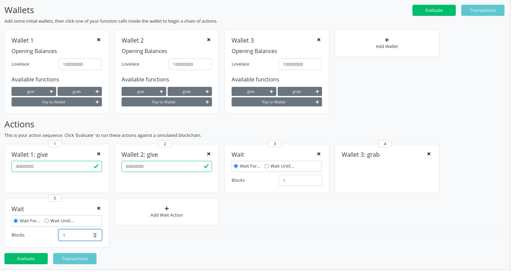

Và bây giờ hãy nhấp vào `Evaluate`. Chúng tôi thấy rằng đã có bốn giao
dịch.

Giao dịch đầu tiên, như mọi khi, là giao dịch khởi đầu phân phối các
khoản tiền ban đầu vào ví.

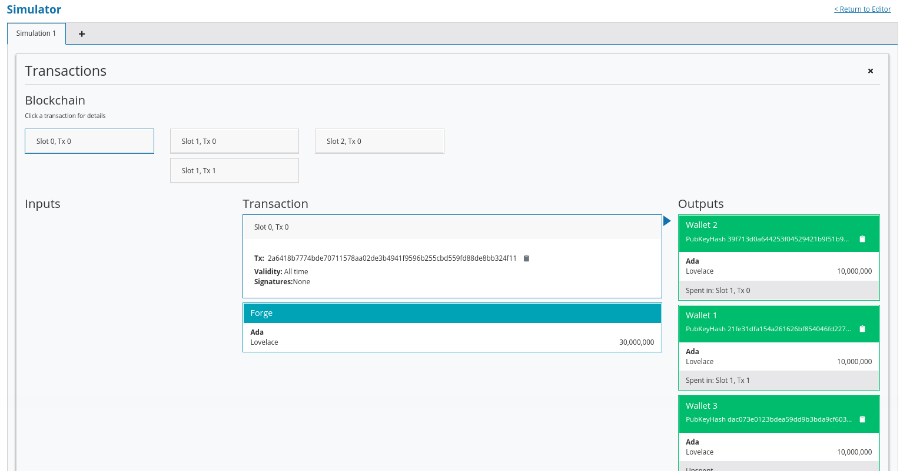

Và có hai giao dịch xảy ra tại khe 1. Chúng là hai giao dịch `give`

Lệnh đầu tiên, Tx 0, là từ ví 2. Thứ tự ở đây không được xác định bởi
thứ tự mà chúng tôi đã tạo các giao dịch trong trình mô phỏng. Điều quan
trọng cần lưu ý là cả hai giao dịch `give` đều xảy ra tại cùng một thời
điểm.

Chúng tôi thấy ba kết quả đầu ra. Đầu ra đầu tiên là phí 10 lovelace
được trả bằng ví 2. Đầu ra thứ hai là 6 ADA được gửi đến địa chỉ tập
lệnh và đầu ra thứ ba là trả về thay đổi cho ví 2, là 4 ADA trừ đi phí.


Và thứ hai, Tx 1, là từ ví 1. Một lần nữa, với các UTxO đầu ra tương tự.

Bây giờ chúng ta có hai UTxO ở địa chỉ tập
lệnh.

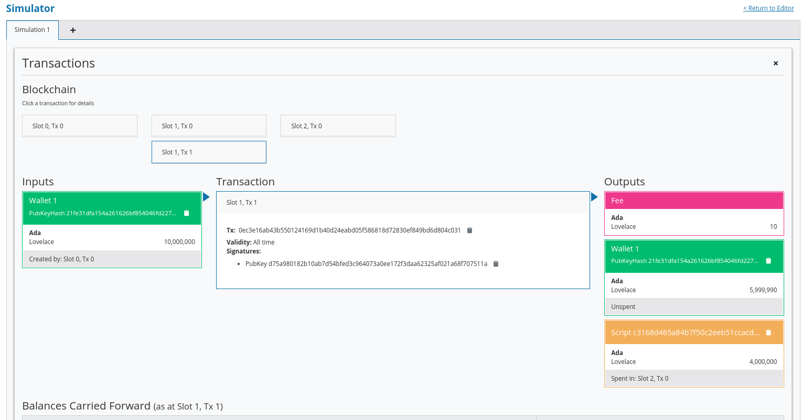

Sau đó, chúng tôi có `grab` tại vị trí 2 được kích hoạt bởi ví 3. Chúng
tôi thấy hai UTxO từ tập lệnh là đầu vào và sau đó là hai đầu ra. Một
đầu ra là phí và đầu ra còn lại, được trả cho ví 3, là 10 ADA trừ đi các
khoản phí đó. Bạn sẽ nhận thấy rằng phí hiện cao hơn chúng ta đã thấy
trước đây và điều này là do một tập lệnh hiện đã được thực thi, điều này
làm cho nó đắt hơn. Tuy nhiên, các khoản phí ở đây vẫn chưa được hiệu
chỉnh hoàn toàn với những khoản phí sẽ được tính trên blockchain thực.

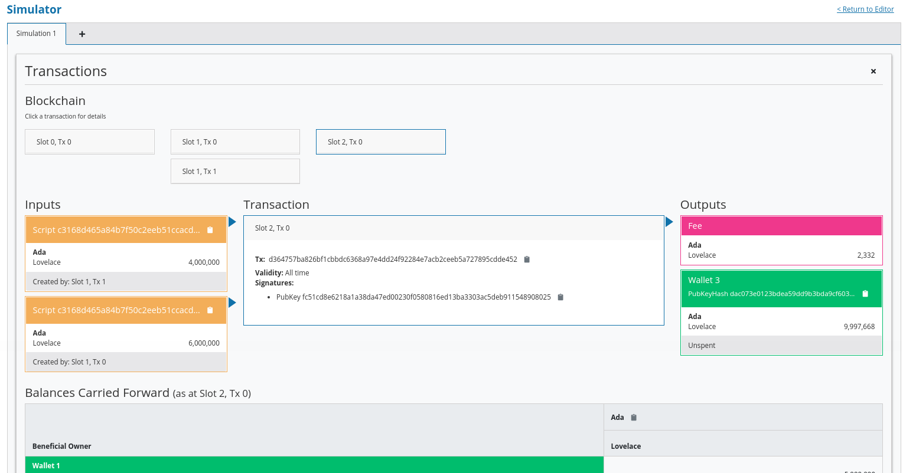

Và, bằng cách cuộn xuống, chúng tôi thấy số dư cuối cùng của ví.

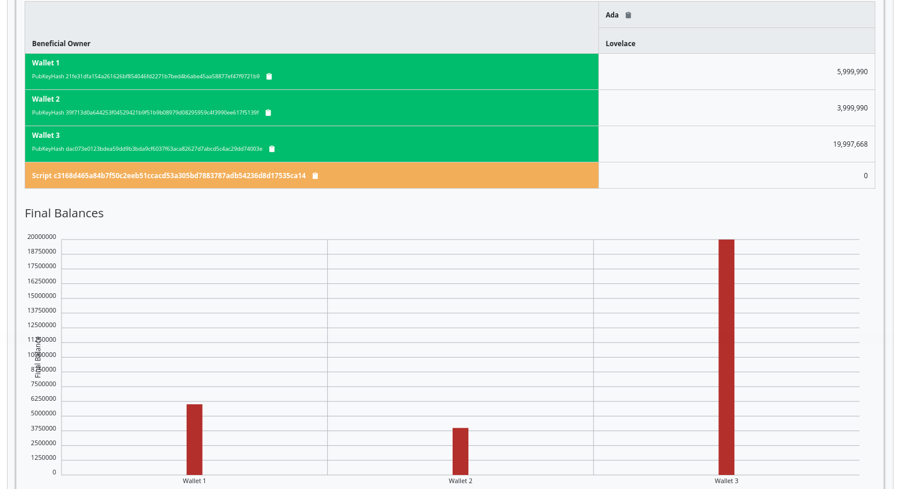

Nếu bạn cuộn xuống sâu hơn, bạn sẽ thấy một số dấu vết và kết quả đầu ra
nhật ký sẽ cung cấp thêm chi tiết về việc thực thi.

Như đã đề cập, tập lệnh này sử dụng trình xác thực đơn giản nhất có thể,
một trình xác thực luôn thành công. Nhưng trình xác thực nhỏ ngớ ngẩn
này có thể hữu ích trong tình huống ai đó muốn đóng góp một số biểu
tượng tình yêu cho cộng đồng và để lại cho bạn!

### Ví dụ 2 - Burn

Hãy xem ví dụ thứ hai về trình xác nhận.

Chúng ta sẽ bắt đầu bằng cách sao chép `Gift.hs`và đổi tên nó `Burn.hs`.

Trong ví dụ `Gift`, chúng tôi có một trình xác nhận luôn thành công.
Trong ví dụ này, chúng tôi muốn làm ngược lại - một trình xác nhận luôn
không thành công.

Nhớ lại rằng trình xác thực chỉ ra sự thất bại bằng cách ném ra một lỗi.
Vì vậy, chúng tôi có thể sửa đổi trình xác thực của mình cho phù hợp.

``` {.haskell}
mkValidator :: Data -> Data -> Data -> ()
mkValidator _ _ _ = error ()
```

Nếu chúng tôi tải mô-đun trong REPL và nhìn thấy *error*

``` {.haskell}
Prelude Week02.Burn> :t error
error :: [Char] -> a
```

Chúng tôi thấy định nghĩa cho chức năng `error` được xác định trong
Haskell tiêu chuẩn `Prelude`. Tuy nhiên, một trong phạm vi trong mã của
chúng tôi trên thực tế là chức năng `error`.

``` {.haskell}
Prelude Week02.Burn> :t PlutusTx.Prelude.error
PlutusTx.Prelude.error :: () -> a
```

Thông thường trong Haskell, bạn có hàm `error` nhận một chuỗi thông báo
lỗi và gây ra lỗi. Trong Plutus, hàm `error`không nhận một chuỗi - nó
chỉ nhận khiểu trống `()` và trả về một kiểu tùy ý.

Và điều đó đưa chúng ta đến một điểm quan trọng.

Chúng tôi đã đề cập trước đó rằng chúng tôi sử dụng `INLINABLE` trên hàm
`mkValidator` để cho phép nó được sử dụng bởi mã Haskell Prelude. Trong
Haskell có nhiều chức năng có sẵn thông qua mô-đun `Prelude`, nhưng
những chức năng này sẽ không thể sử dụng được trong Plutus vì chúng
không được định nghĩa là có thể nhập được. Vì vậy, nhóm Plutus đã cung
cấp một Đoạn dạo đầu thay thế có thể được sử dụng để xác nhận.

Cách mà Plutus Prelude có thể được ưu tiên hơn Haskell Prelude, thường
có trong phạm vi theo mặc định, là sử dụng `LANGUAGE` trong mã.

``` {.haskell}
{-# LANGUAGE NoImplicitPrelude   #-}
```

Sau đó, bằng cách nhập PlutusTx.Prelude, các chức năng của nó được sử
dụng thay cho các chức năng Prelude tiêu chuẩn.

``` {.haskell}
import PlutusTx.Prelude hiding (Semigroup(..), unless)
```

Bạn cũng có thể nhận thấy rằng Prelude tiêu chuẩn cũng được nhập khẩu.
Tuy nhiên, nó chỉ nhằm mang lại một số chức năng không liên quan gì đến
xác thực mà chỉ dành cho mã off-chain và playground.

``` {.haskell}
import Prelude (IO, Semigroup (..), String)
```

Nó có thể gây nhầm lẫn. Rất nhiều chức năng trong Plutus Prelude có cùng
chữ ký và hành vi giống như tên gọi của chúng trong Prelude tiêu chuẩn,
nhưng điều đó không phải lúc nào cũng đúng và đây errorlà một ví dụ.

Chỉ cần nhớ rằng khi bạn đang sử dụng một cái gì đó trong tập lệnh
Plutus trông giống như một hàm từ Đoạn dạo đầu tiêu chuẩn, thì những gì
bạn thực sự đang sử dụng là một hàm từ Đoạn dạo đầu Plutus. Thường thì
chúng sẽ có cùng một chữ ký, nhưng chúng không phải lúc nào cũng giống
hệt nhau - ví dụ: tiền lệ của toán tử có thể không giống nhau

Nhìn lại trình xác thực mới của chúng tôi, bây giờ chúng ta có một trình
xác thực sẽ luôn không thành công.

``` {.haskell}
mkValidator :: Data -> Data -> Data -> ()
mkValidator _ _ _ = error ()
```

Chúng tôi sẽ để mọi thứ khác như cũ và kiểm tra tác dụng của sự thay đổi
này, bằng cách sử dụng sân chơi. Sau khi nhấp `Compile`, kịch bản trước
đó vẫn sẽ xuất hiện trong trình mô phỏng. Và sau khi nhấp `Evaluate` và
cuộn xuống một chút, chúng ta có thể thấy ví 1 và 2 đã tạo quà tặng
nhưng ví 3 không thể lấy được.

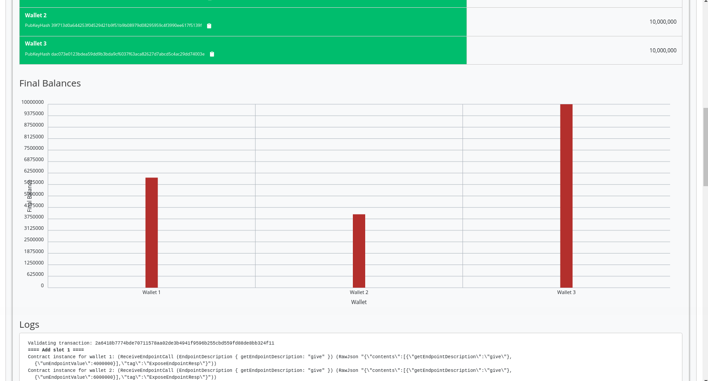

Nếu chúng tôi cuộn xuống thêm, chúng tôi sẽ tìm thấy một thông báo nhật
ký cho thấy rằng việc xác thực không thành công.

``` {.}
, Slot 2: 00000000-0000-4000-8000-000000000002 {Contract instance for wallet 3}:
      Contract instance stopped with error: "WalletError (ValidationError (ScriptFailure (EvaluationError [])))" ]
```

Vì vậy, trong ví dụ đầu tiên của chúng tôi, chúng tôi có một trình xác
thực luôn thành công và cho phép bất kỳ ai lấy UTxO từ nó. Trong ví dụ
thứ hai, chúng tôi có trình xác thực luôn không thành công và bất kỳ
UTxO nào được gửi đến địa chỉ tập lệnh này không bao giờ có thể được
truy xuất. Về cơ bản đây là một cách để đốt tiền, có thể hữu ích trong
một số trường hợp.

Khi nhìn vào nhật ký, chúng tôi thấy rằng quá trình xác nhận không thành
công, nhưng chúng tôi không biết tại sao nó không thành công. đây là một
cách để thay đổi điều đó bằng cách sử dụng một biến thể của lỗi -
`traceError`.

``` {.haskell}
Prelude Week02.Burn> :t PlutusTx.Prelude.traceError
PlutusTx.Prelude.traceError :: PlutusTx.Builtins.String -> a      
```

Hàm nhận một chuỗi, nhưng không phải là một chuỗi Haskell. Nó là một
chuỗi Plutus. Để biên dịch cái này, chúng ta cần sử dụng
OverloadedStringsphần mở rộng GHC.

``` {.haskell}
{-# LANGUAGE OverloadedStrings   #-}
```

Sau đó, chúng tôi có thể cập nhật trình xác thực của mình.

``` {.haskell}
mkValidator _ _ _ = traceError "BURNT!"
```

Nếu bây giờ chúng tôi chạy cùng một kịch bản trong sân chơi với mã mới,
chúng tôi sẽ thấy thông báo lỗi tùy chỉnh mà chúng tôi đã thêm.

``` {.}
, Slot 2: 00000000-0000-4000-8000-000000000002 {Contract instance for wallet 3}:
      Contract instance stopped with error: "WalletError (ValidationError (ScriptFailure (EvaluationError [\"BURNT!\"])))" ]
```

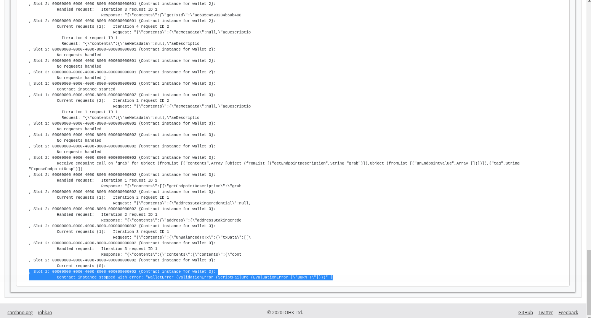

### Ví dụ 3 - Forty Two (42)

Đối với ví dụ tiếp theo, chúng tôi sẽ viết một trình xác nhận không hoàn
toàn bỏ qua tất cả các đối số của nó. Chúng tôi sẽ viết một bài báo mong
đợi một người mua lại đơn giản.

Bây giờ chúng ta quan tâm đến người đổi quà, chúng ta cần có thể tham
khảo nó. Hãy gọi nó `r`.

``` {.haskell}
{-# INLINABLE mkValidator #-}
mkValidator :: Data -> Data -> Data -> ()
mkValidator _ r _
```

Giả sử rằng chúng tôi muốn xác thực được thông qua nếu người đổi `I 42`.

``` {.haskell}
{-# INLINABLE mkValidator #-}
mkValidator :: Data -> Data -> Data -> ()
mkValidator _ r _
   | r == I 42 = ()
   | otherwise = traceError "wrong redeemer"
```

Nếu chúng ta chạy điều này ngay bây giờ trong sân chơi, việc xác nhận sẽ
luôn không thành công. Chúng tôi cần sửa đổi mã off-chain để thêm đầu
vào cho Endpoint `grab` để ví 3 có thể chuyển vào một điểm `Integer` mà
sau đó chúng tôi có thể chuyển cho trình xác thực với tư cách là
redeemer.

``` {.haskell}
type GiftSchema =
          Endpoint "give" Integer
      .\/ Endpoint "grab" Integer
```

Chung tôi thêm đối số redeemer vào khai báo `grab`. Lưu ý rằng việc thêm
số `Integer` trong chức năng ký, cũng như tham số `n` cái mà làm tham
chiếu.

``` {.haskell}
grab :: forall w s e. AsContractError e => Integer -> Contract w s e ()
grab n = do
```

Sau đó, chúng ta có thể chuyển nó vào hàm `mustSpendScriptOutput` thay
vì giá trị vứt bỏ mà chúng ta đã sử dụng trước đó.

``` {.haskell}
tx = mconcat [mustSpendScriptOutput oref $ Redeemer $ I n | oref <- orefs]
```

Một thay đổi nữa, chúng ta cần thay đổi `>>` thành `>>=` trong đoạn mã
sau, và bây giờ `grab` có một đối số. Bạn có thể sử dụng REPL để thấy
`>>` và `>>=` và bây giờ tại sao dừng cái thứ hai. Về cơ bản, cả hai đều
trình tự các hành động, nhưng `>>` không lấy giá trị đầu múp,con `>>=`
truy cập giá trị được bao bọc và chuyển nó cho hành động tiếp theo.

``` {.haskell}
grab' = endpoint @"grab" >>= grab
```

Bây giờ chúng ta có thể thử nó trong sân chơi. Sau khi thêm mã mới và
nhấp vào `Simulate` bạn sẽ nhận thấy rằng kịch bản cũ đã biến mất. Đó là
bởi vì các điểm cuối (Endpoint) đã thay đổi và kịch bản cũ không còn hợp
lệ.

Hãy thiết lập một kịch bản chỉ sử dụng hai ví. Ví một sẽ cung cấp cho 3
ADA oo hợp đồng và ví 2 sẽ cố gắng lấy chúng, nhưng lần này, ví 2 sẽ cần
chuyển vào một giá trị sẽ được sử dụng để tạo người đổi.

Đối với lần thử đầu tiên, chúng tôi sẽ thêm giá trị người đổi sai, trong
trường hợp này là 100.

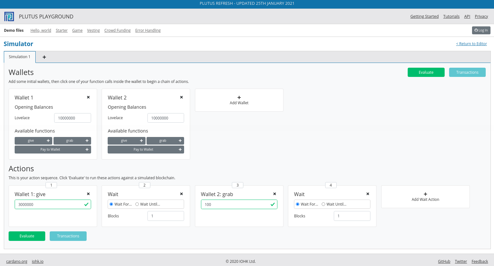

Nếu chúng tôi nhấp vào `Evaluate`, chúng ta thấy rằng chúng ta chỉ có
hai giao dịch và chúng ta thấy rằng ADA vẫn còn trong tập lệnh, điều này
cho thấy rằng ví 2 không lấy được nó.

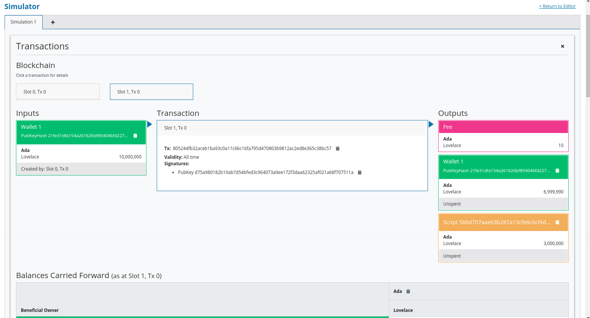

Các số dư cuối cùng cũng cho thấy điều này.

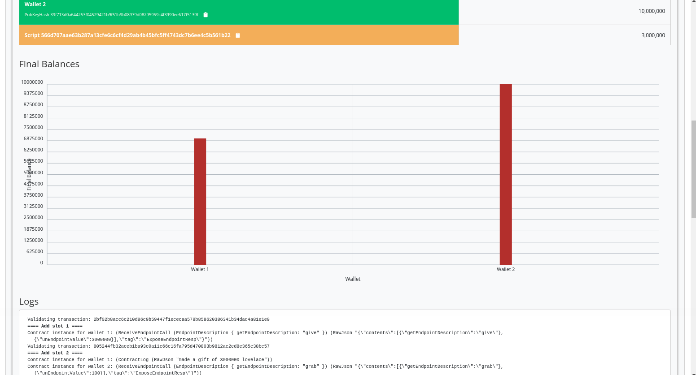

Và, nếu chúng ta nhìn vào dấu vết, chúng ta sẽ tìm ra lỗi.

``` {.}
, Slot 2: 00000000-0000-4000-8000-000000000001 {Contract instance for wallet 2}:
      Contract instance stopped with error: "WalletError (ValidationError (ScriptFailure (EvaluationError [\"wrong redeemer\"])))" ]
```

Nếu chúng ta quay lại kịch bản, thay đổi giá trị thành `42` và nhấp
`Evaluate` lại, chúng ta sẽ thấy rằng xác thực thành công.

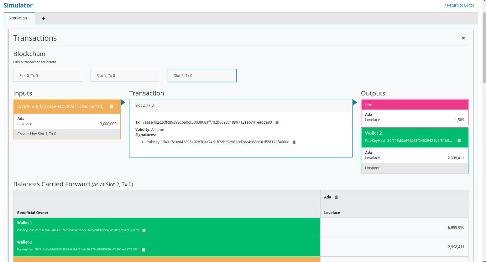

Bây giờ chúng ta thấy giao dịch thứ ba trong đó ví 2 quản lý để thu
tiền, trừ đi phí.


Chúng tôi thấy rằng số dư cuối cùng là như chúng tôi mong đợi và các bản
ghi cũng cho thấy rằng việc xác thực không gây ra lỗi, điều đó có nghĩa
là quá trình xác thực đã thành công.

Vì vậy, đó là ví dụ đầu tiên về trình xác thực xem xét ít nhất một trong
các đối số của nó.

### Ví dụ 4 - Typed

Nó đã được đề cập ở phần đầu của bài giảng, đây là Plutus cấp thấp và
trên thực tế, không ai sẽ viết các hàm xác nhận như thế này.

Bây giờ chúng ta sẽ xem nó thực sự được thực hiện như thế nào bằng cách
sử dụng một phiên bản đã đánh máy.

Mặc dù kiểu `Data`này mạnh mẽ và bạn có thể mã hóa tất cả các loại dữ
liệu vào nó, nhưng nó không thực sự giống Haskell. Nó gần giống như bạn
đang viết bằng một ngôn ngữ không định kiểu như Javascript hoặc Python.
Nó giống như một khối dữ liệu, nó có thể chứa bất cứ thứ gì nên bạn
không thực sự có bất kỳ loại an toàn nào. Bạn sẽ luôn cần kiểm tra, ví
dụ, nếu bạn đang mong đợi một số nguyên mà bạn thực sự được cung cấp một
số nguyên.

Nó đặc biệt tệ với đối số thứ ba, bối cảnh. Mặc dù thật dễ dàng để tưởng
tượng rằng bằng cách nào đó bạn có thể mã hóa một giao dịch với các đầu
vào và đầu ra của nó thành kiểu `Data`, nhưng hoàn toàn không rõ ràng
điều đó được thực hiện như thế nào.

Chúng tôi muốn sử dụng các kiểu dữ liệu cụ thể hơn được điều chỉnh cho
phù hợp với logic nghiệp vụ.

Điều này thực sự có thể thực hiện được với cái gọi là Typed Validators.
Điều này có nghĩa là chúng ta có thể thay thế các lần xuất hiện `Data`
trong `mkValidator` chữ ký bằng các kiểu phù hợp hơn.

``` {.haskell}
mkValidator :: Data -> Data -> Data -> ()
```

Trong ví dụ nhỏ ngớ ngẩn của chúng tôi, chúng tôi hoàn toàn bỏ qua
Datum, vì vậy một loại phù hợp hơn sẽ chỉ là loại Unit - ().

``` {.haskell}
mkValidator :: () -> Data -> Data -> ()
```

Đối với redeemer, trong ví dụ này, chúng tôi chỉ xử lý các số nguyên, vì
vậy có lẽ sẽ hợp lý hơn khi sử dụng Số nguyên thay thế..

``` {.haskell}
mkValidator :: () -> Integer -> Data -> ()
```

Đối với context, có một kiểu hay hơn nhiều được gọi là `ScriptContext`
được tạo ra chính xác cho mục đích này.

``` {.haskell}
mkValidator :: () -> Integer -> ScriptContext -> ()
```

Cuối cùng, chúng tôi đã đề cập rằng hơi bất thường khi sử dụng `()` làm
kiểu trả về. Tự nhiên hơn nhiều sẽ được sử dụng `Bool` để chỉ ra xác
thực thành công hay thất bại.

``` {.haskell}
mkValidator :: () -> Integer -> ScriptContext -> Bool
```

Vì vậy, đây là một cách tốt hơn để viết mã xác nhận. Hai loại cuối cùng
`SciprtContext` và `Bool`, nhưng hai loại đầu tiên có thể khác nhau tùy
thuộc vào tình huống.

Trong trường hợp này, bây giờ chúng ta hãy viết lại hàm cho phù hợp bằng
cách sử dụng các kiểu mới này. Tham số r bây giờ không còn là kiểu
`Data` nữa- nó là một kiểu `Integer`, vì vậy chúng ta có thể chỉ cần
kiểm tra xem nó bằng 42 thay vì kiểm tra nó với một kiểu `Data` đã xây
dựng .

Và, khi chúng ta trả về a Bool, chúng ta có thể biến hàm thành một biểu
thức boolean.

``` {.haskell}
{-# INLINABLE mkValidator #-}
mkValidator :: () -> Integer -> ScriptContext -> Bool
mkValidator _ r _ = r == 42
```

Điều này sẽ có cùng một vấn đề mà chúng tôi đã gặp trước đó, trong
trường hợp có lỗi, chúng tôi sẽ không nhận được thông báo lỗi đẹp. Có
một hàm Plutus hay được gọi là hàm `traceIfFalse` nó nhẫn `String` và
`Bool` sau đó trả về `Bool`. Nếu đầu tiên `Bool` là `True`, thì kết quả
sẽ là `True` và `String` sẽ bỏ qua. Tuy nhiên nếu đầu tiên `Bool` là
`False`, thì kết quả là `False` và `String` được ghi lại.

``` {.haskell}
PlutusTx.Prelude.traceIfFalse
      :: PlutusTx.Builtins.String -> Bool -> Bool
```

Đây chính xác là những gì chúng ta cần.

``` {.haskell}
{-# INLINABLE mkValidator #-}
mkValidator :: () -> Integer -> ScriptContext -> Bool
mkValidator _ r _ = traceIfFalse "wrong redeemer" $ r == 42
```

Điều này sẽ chưa được biên dịch vì các phần khác của mã chưa được nhập
chính xác. Chúng tôi cần phải điều chỉnh bảng nấu của chúng tôi.

Đầu tiên, chúng tôi giới thiệu một kiểu dữ liệu giả mới, ở đây chúng tôi
gọi là `Typed`, đơn giản dựa trên tên của tập lệnh. Đối với loại này,
chúng tôi phải cung cấp một phiên bản của `Scripts.ValidatorTypes`.

Mục đích của trường hợp này là khai báo các loại cho datum và redeemer.

``` {.haskell}
data Typed
instance Scripts.ValidatorTypes Typed where
    type instance DatumType Typed = ()
    type instance RedeemerType Typed = Integer
```

Đây là Haskell khá nâng cao, được gọi là lập trình mức kiểu, nhưng cũng
giống như Template Haskell mà chúng ta đã gặp, bạn không thực sự cần
hiểu sâu về nó vì tất cả các script sẽ tuân theo cùng một khuôn mẫu.

Bây giờ chúng ta cần biên dịch trình xác nhận. Nơi trước đây chúng ta đã
sử dụng `mkValidatorScript`,, bây giờ chúng ta sử dụng một cái gì đó
được gọi là `mkTypedValidator`, lấy kiểu dữ liệu mới của chúng ta làm
tham số và tạo ra một cái gì đó có kiểu `TypedValidator`.

``` {.haskell}
typedValidator :: Scripts.TypedValidator Typed
typedValidator = Scripts.mkTypedValidator @Typed
    $$(PlutusTx.compile [|| mkValidator ||])
    $$(PlutusTx.compile [|| wrap ||])
  where
    wrap = Scripts.wrapValidator @() @Integer
```

Điều này tương tự với mã `mkValidator`, nhưng loại này chúng tôi cũng
biên dịch một hàm `wrapValidator` nhận kiểu dữ liệu và redeemer.

Để điều này hoạt động, trước tiên, chúng ta cần thêm một import.

``` {.haskell}
import qualified Ledger.Typed.Scripts as Scripts
```

Trong ví dụ này, nó đang được nhập đủ điều kiện và sử dụng tiền tố
`Scripts` , nhưng điều này là tùy ý và bạn có thể chọn một số cách khác
để tham chiếu đến mô-đun.

Chúng tôi thực hiện những thay đổi này, mã Haskell sẽ được biên dịch và
bây giờ chúng tôi cần thay đổi bản soạn thảo Haskell Mẫu tạo ra hàm
`validator`.

``` {.haskell}
validator :: Validator
validator = Scripts.validatorScript typedValidator
```

Ở đây chúng tôi đã sử dụng hàm `validatorScript` để tạo trình xác thực
không định kiểu từ phiên bản đã nhập của chúng tôi.

Tất nhiên, để có được hàm băm, chúng ta có thể sử dụng trình xác thực mà
chúng ta có và biến nó thành một trình xác thực như `ValidatorHash`
chúng ta đã làm trước đây, nhưng có một cách trực tiếp hơn, trông giống
hệt nhau, nhưng trong trường hợp `Scripts`này là đến từ mô-đun
`Ledger.Typed.Scripts` hơn là `Ledger.Scripts`. Phiên bản này lấy trực
tiếp trình xác thực đã nhập.

``` {.haskell}
valHash :: Ledger.ValidatorHash
valHash = Scripts.validatorHash typedValidator
```

Địa chỉ tập lệnh được tính như trước đây.

``` {.haskell}
scrAddress :: Ledger.Address
scrAddress = scriptAddress validator
```

Trong ví dụ cực kỳ đơn giản này, nó có vẻ không đáng để nỗ lực, nhưng
đối với các hợp đồng thực tế, làm như thế này sẽ tốt hơn nhiều.

Mã off-chain gần như giống hệt nhau.

Có một thay đổi nhỏ đối với giveđiểm cuối. Mặc dù chúng tôi vẫn chưa xem
xét chi tiết phần này của mã, nhưng có thể thực hiện các thay đổi sau.

``` {.haskell}
let tx = mustPayToTheScript () $ ADA.lovelaceValueOf amount
ledgerTx <- submitTxConstraints inst tx
```

Hàm `mustPayToOtherScript` đã được thay thế bằng `mustPayToTheScript`.
Đây là một script tiện lợi cho phép chúng ta truyền chỉ vào () vì chúng
ta còn cần phải xây dựng một giá trị của kiểu Data. Chúng ta cũng không
cần chuyển mã băm tập lệnh nữa.

Hành vi của mã này sẽ giống với hành vi trong ví dụ trước, vì vậy chúng
tôi sẽ không xem qua nó trong sân chơi.

Bây giờ chúng tôi sẽ giải thích cách hoạt động thực sự của nó. Làm cách
nào để Plutus chuyển đổi các kiểu dữ liệu tùy chỉnh này thành kiểu triển
khai cấp thấp thực tế - Datakiểu.

Chúng ta có thể xem mã trong mô-đun PlutusTx.IsData.Class .

Ở đây chúng ta thấy rằng có một lớp kiểu khá đơn giản được định nghĩa
được gọi là `IsData`.


Lớp này cung cấp hai chức năng

-   `toData` nhận một giá trị và chuyển đổi nó thành `Data`
-   `fromData` nhận một giá trị của kiểu `Data` cố gắng chuyển đổi nó
    thành một thể hiện của kiểu `IsData`. Điều này có thể không thành
    công vì không phải tất cả các giá trị của kiểu `Data` sẽ được chuyển
    đổi thành kiểu đích..

Hãy thử điều này trong REPL.

``` {.haskell}
Prelude Week02.Typed> import PlutusTx
Prelude PlutusTx Week02.Typed> import PlutusTx.IsData.Class
Prelude PlutusTx PlutusTx.IsData.Class Week02.Typed> :i IsData
```

Chúng tôi biết điều đó `()` and `Integer` cả hai đều là trường hợp của
`IsData` vì chúng đã hoạt động trong ví dụ của chúng tôi.

Hãy chuyển đổi `Integer` thành `Data`

``` {.haskell}
Prelude PlutusTx PlutusTx.IsData.Class Week02.Typed> toData (42 :: Integer)
I 42
```

Chúng tôi thấy rằng điều này đã được chuyển đổi thành một phiên bản của
kiểu Data bằng cách sử dụng hàm tạo I , mà chúng tôi đã thực hiện theo
cách thủ công trước khi chúng tôi sử dụng xác thực.

Bây giờ hãy làm theo cách khác

``` {.haskell}
Prelude PlutusTx PlutusTx.IsData.Class Week02.Typed> fromData (I 42) :: Maybe Integer
Just 42
```

Chúng tôi nhận được một `Just 42` back - `Just` là `Maybe` tạo khi
`Maybe` là `Nothing`.

Và khi nó không thành công, khi nó không thể chuyển đổi sang loại đích,
chúng ta sẽ lấy lại `Nothing`.

``` {.haskell}
Prelude PlutusTx PlutusTx.IsData.Class Week02.Typed> fromData (List []) :: Maybe Integer
Nothing
```

Nếu chúng ta kiểm tra`IsData`. Chúng ta có thể thấy tất cả các kiểu mà
mẫu này sẽ hoạt động cho tất cả các kiểu là `IsData` được xác định.

``` {.haskell}
Prelude PlutusTx PlutusTx.IsData.Class Week02.Typed> :i IsData
type IsData :: * -> Constraint
class IsData a where
  toData :: a -> Data
  fromData :: Data -> Maybe a
  {-# MINIMAL toData, fromData #-}
        -- Defined in ‘PlutusTx.IsData.Class’
instance IsData a => IsData (Maybe a)
  -- Defined in ‘plutus-tx-0.1.0.0:PlutusTx.IsData.Instances’
instance (IsData a, IsData b) => IsData (Either a b)
  -- Defined in ‘plutus-tx-0.1.0.0:PlutusTx.IsData.Instances’
instance IsData Bool
  -- Defined in ‘plutus-tx-0.1.0.0:PlutusTx.IsData.Instances’
instance (IsData a, IsData b, IsData c, IsData d) =>
         IsData (a, b, c, d)
  -- Defined in ‘plutus-tx-0.1.0.0:PlutusTx.IsData.Instances’
instance (IsData a, IsData b, IsData c) => IsData (a, b, c)
  -- Defined in ‘plutus-tx-0.1.0.0:PlutusTx.IsData.Instances’
instance (IsData a, IsData b) => IsData (a, b)
  -- Defined in ‘plutus-tx-0.1.0.0:PlutusTx.IsData.Instances’
instance IsData ()
  -- Defined in ‘plutus-tx-0.1.0.0:PlutusTx.IsData.Instances’
instance IsData a => IsData [a]
  -- Defined in ‘PlutusTx.IsData.Class’
instance IsData Integer -- Defined in ‘PlutusTx.IsData.Class’
instance (TypeError ...) => IsData Int
  -- Defined in ‘PlutusTx.IsData.Class’
instance IsData Data -- Defined in ‘PlutusTx.IsData.Class’
```

Đây vẫn là một danh sách khá ngắn về các loại có thể. Chúng tôi muốn sử
dụng nhiều loại hơn thế này cho dữ liệu và công cụ đổi quà của chúng
tôi.

Để làm được điều này, thông thường chúng ta cần xác định một IsDatathể
hiện cho bất kỳ kiểu nào mà chúng ta muốn sử dụng. Điều này sẽ cho phép
chúng tôi cho trình biên dịch biết cách thực hiện chuyển đổi qua lại.
Tuy nhiên, điều này một lần nữa sẽ rất tẻ nhạt vì nó là một quá trình
máy móc. Vì vậy, có một cơ chế trong Plutus thực hiện điều này cho chúng
ta.

Ví dụ 5 - Các kiểu IsData tùy chỉnh
\~\~\~\~\~\~\~\~\~\~\~\~\~\~\~\~\~\~\~\~\~\~\~\~\~\~\~\~\~\~\~

Bây giờ chúng ta hãy nói về các kiểu dữ liệu tùy chỉnh. Hãy xác định một
cái ngớ ngẩn và sử dụng nó trong hàm xác nhận của chúng tôi.

``` {.haskell}
newtype MySillyRedeemer = MySillyRedeemer Integer

PlutusTx.unstableMakeIsData ''MySillyRedeemer

{-# INLINABLE mkValidator #-}
mkValidator :: () -> MySillyRedeemer -> ScriptContext -> Bool
mkValidator () (MySillyRedeemer r) _ = traceIfFalse "wrong redeemer" $ r == 42
```

::: {.note}
::: {.title}
Note
:::

Ngoài ra còn có một phiên bản ổn định của hàm
PlutusTx.unstableMakeIsData và phiên bản ổn định phải luôn được sử dụng
trong mã sản xuất. Sự khác biệt giữa cả hai là, trong trường hợp yêu cầu
Data nhiều hơn một hàm tạo, phiên bản không ổn định sẽ không đảm bảo,
giữa các phiên bản Plutus, thứ tự của các hàm tạo sẽ được giữ nguyên.
:::

Và chúng ta cần thay đổi một số tấm boilerplate.

``` {.haskell}
data Typed
instance Scripts.ValidatorTypes Typed where
...
   type instance RedeemerType Typed = MySillyRedeemer

typedValidator :: Scripts.TypedValidator Typed
...
where
   wrap = Scripts.wrapValidator @() @MySillyRedeemer
```

We also need to change some off-chain code in the `grab` endpoint.

Instead of using `I r`, we will use `toData (MySillyRedeemer r)`.

``` {.haskell}
grab :: forall w s e. AsContractError e => Integer -> Contract w s e ()
grab r = do
    utxos <- utxoAt scrAddress
    let orefs   = fst <$> Map.toList utxos
        lookups = Constraints.unspentOutputs utxos      <>
                  Constraints.otherScript validator
        tx :: TxConstraints Void Void
        tx      = mconcat [mustSpendScriptOutput oref $ Redeemer $ PlutusTx.toData (MySillyRedeemer r) | oref <- orefs]
    ledgerTx <- submitTxConstraintsWith @Void lookups tx
    void $ awaitTxConfirmed $ txId ledgerTx
    logInfo @String $ "collected gifts"
```

Nếu chúng ta cố gắng biên dịch mã ngay bây giờ, trên dòng lệnh hoặc
trong sân chơi, chúng ta sẽ gặp lỗi vì Plutus không biết cách chuyển đổi
qua lại giữa `IsData` and `MySillyRedeemer`.

Chúng tôi có thể viết một ví dụ của IsData cho MySillyRedeemer bằng tay.
Nhưng, chúng ta không cần phải làm vậy.

Thay vào đó, chúng ta có thể sử dụng một chút phép thuật của Template
Haskell.

``` {.haskell}
PlutusTx.unstableMakeIsData ''MySillyRedeemer
```

Tại thời điểm biên dịch, trình biên dịch sẽ sử dụng Template Haskell để
viết một IsDatathể hiện cho chúng ta. Và bây giờ, nó sẽ biên dịch.

Hãy kiểm tra nó trong REPL.

``` {.haskell}
Prelude PlutusTx PlutusTx.IsData.Class> :l src/Week02/IsData.hs
Ok, one module loaded.
Prelude PlutusTx PlutusTx.IsData.Class Week02.IsData> toData (MySillyRedeemer 42)
Constr 0 [I 42]
```

Nếu bạn thử mã này IsData.hs, trong sân chơi, bạn sẽ thấy rằng nó hoạt
động theo cách giống như trước đây.

Tóm lược \-\-\-\-\-\--

Chúng tôi đã thấy một vài ví dụ về trình xác nhận đơn giản.

Chúng tôi đã bắt đầu với một trình xác thực sẽ luôn thành công, hoàn
toàn bỏ qua các lập luận của nó. Sau đó, chúng tôi xem xét một trình xác
thực luôn không thành công, một lần nữa hoàn toàn bỏ qua các đối số của
nó. Sau đó, chúng tôi xem xét một công cụ kiểm tra người mua lại của nó
để kiểm tra một giá trị được xác định trước nhất định.

Sau đó, chúng tôi đã biến trình xác thực này thành một phiên bản đã
nhập, phiên bản này sẽ được sử dụng trong thực tế. Đầu tiên, chúng tôi
sử dụng các kiểu dữ liệu tích hợp và sau đó chúng tôi xem cách chúng tôi
có thể sử dụng các kiểu dữ liệu tùy chỉnh.

Chúng tôi vẫn chưa xem xét các ví dụ trong đó dữ liệu hoặc bối cảnh được
kiểm tra, điều này sẽ được yêu cầu để có các ví dụ thực tế hơn.

Chúng ta sẽ xem xét điều đó trong bài giảng tiếp theo.
