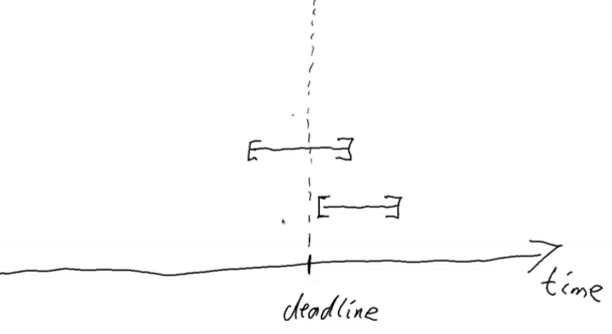
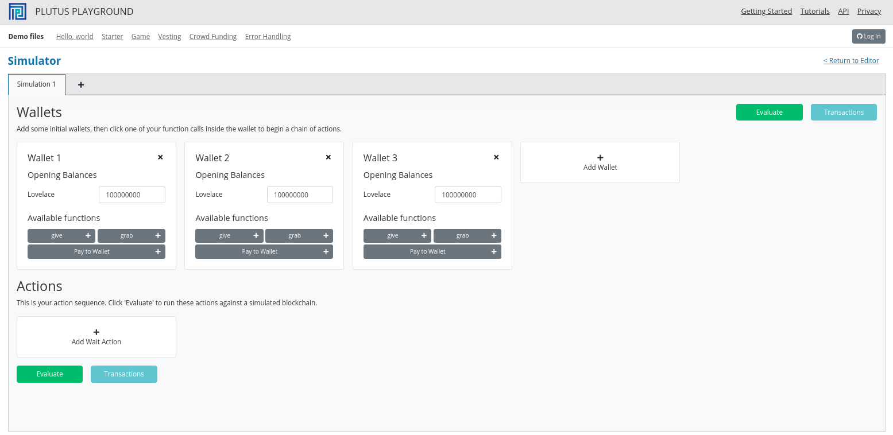
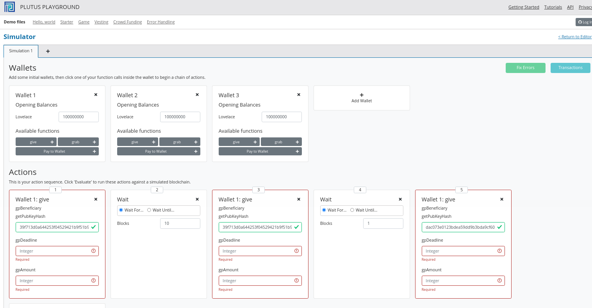
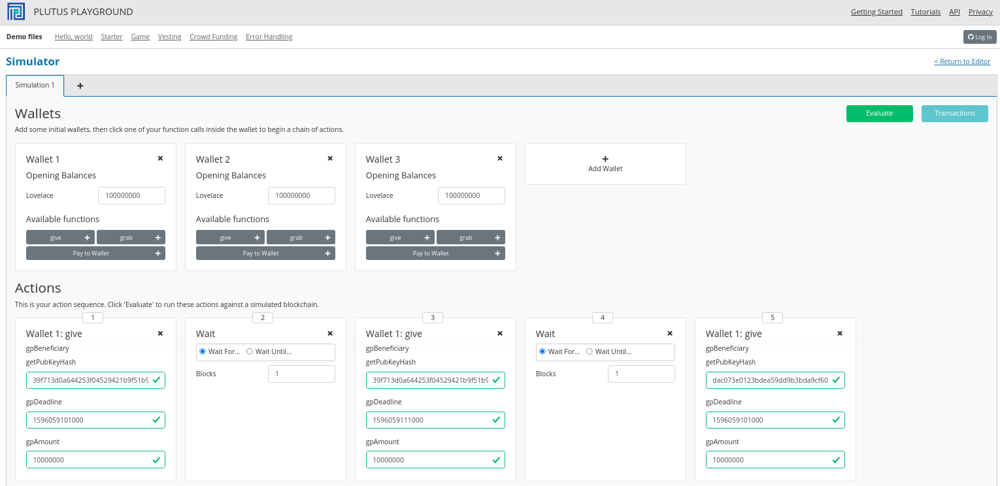
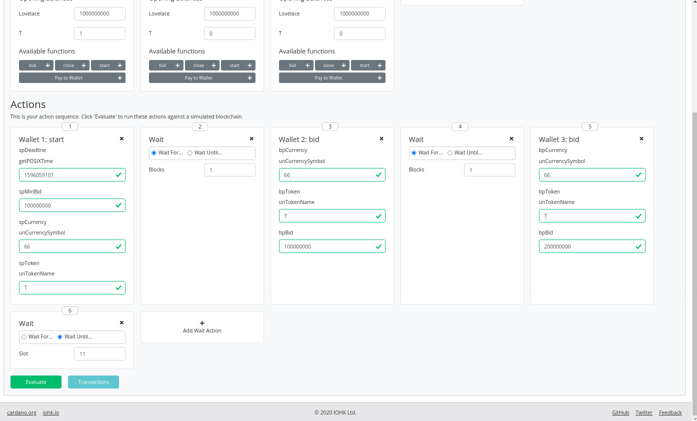
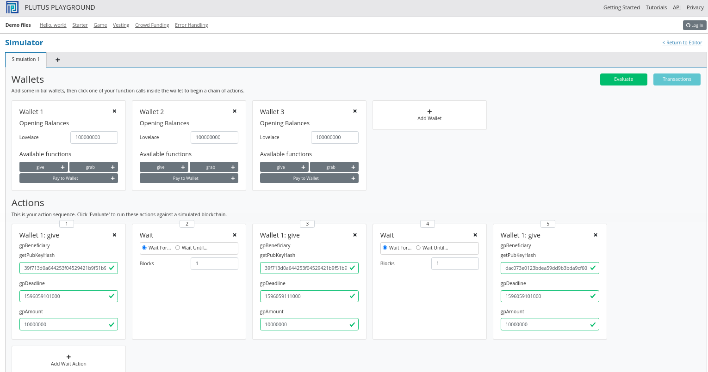
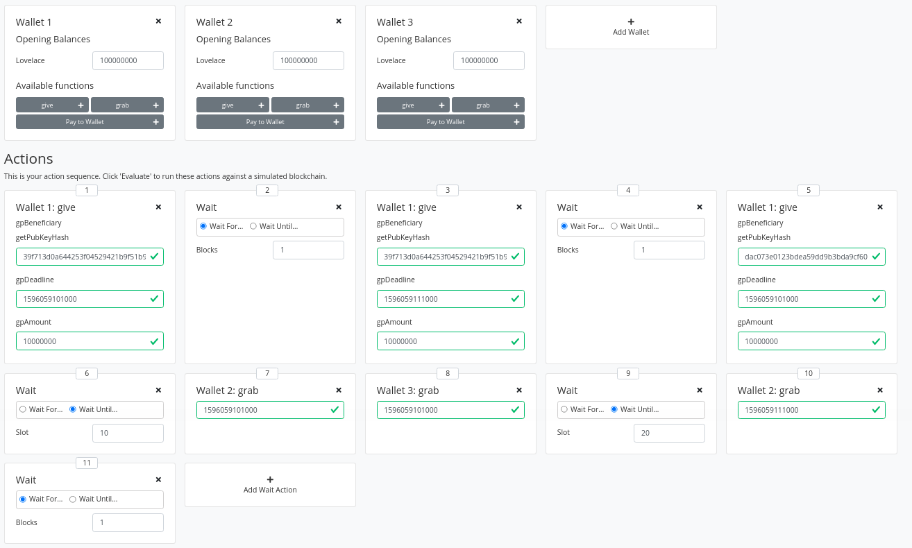
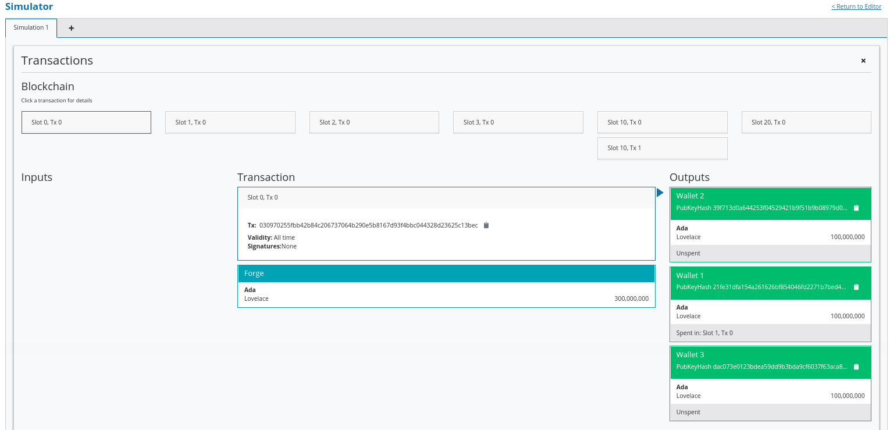
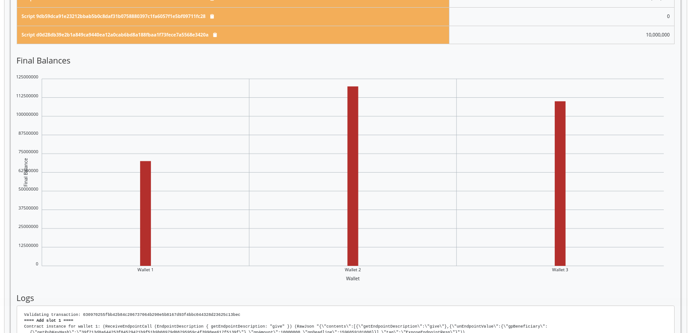

Week 03 - Script Context
========================


Đây là phiên bản đã dịch của [Bài giảng số 3 Dr. Lars](https://youtu.be/WG3uw-TkW2k).

<iframe width="560" height="315" src="https://www.youtube.com/embed/WG3uw-TkW2k" title="YouTube video player" frameborder="0" allow="accelerometer; autoplay; clipboard-write; encrypted-media; gyroscope; picture-in-picture" allowfullscreen></iframe>

Trong bài giảng này, chúng ta tìm hiểu về context script (đối số xác thực thứ ba), thời gian xử lý và các hợp đồng được tham số hóa.

Đoạn mã trong bài giảng này sử dụng Plutus commit là `81ba78edb1d634a13371397d8c8b19829345ce0d`.

Trước khi chúng ta bắt đầu
---------------

Kể từ bài giảng cuối cùng đã có một bản cập nhật cho sân chơi, có trong bản cam kết Plutus mà chúng tôi đang sử dụng cho bài giảng này (xem ghi chú ở trên).

Đã xảy ra sự cố khi thời gian chờ được mã hóa cứng vào sân chơi quá ngắn. Điều này sẽ khiến mô phỏng không thành công nếu chúng mất nhiều thời gian hơn thời gian chờ mã cứng.

Bây giờ có một tùy chọn khi bạn khởi động Máy chủ sân chơi Plutus cho phép bạn chỉ định thời gian chờ. Ví dụ sau đặt thời gian chờ thành 120 giây.

``` {.}
plutus-playground-server -i 120s
```

Tóm tắt lại
-----

Khi chúng tôi đã giải thích mô hình (E) UTxO  trong bài giảng đầu tiên, chúng tôi đề cập rằng để mở khóa một địa chỉ kịch bản, kịch bản gắn liền với địa chỉ được chạy, và kịch bản này có được ba thông tin - *datum*,  *redeemer* và *context*.

Trong bài giảng thứ hai, chúng ta đã xem các ví dụ về điều đó và chúng ta đã thấy nó thực sự hoạt động như thế nào trong Haskell.

Chúng tôi đã thấy việc triển khai cấp thấp, trong đó cả ba đối số đều được biểu thị bằng kiểu `Data`. Chúng tôi cũng thấy rằng trong thực tế điều này không được sử dụng.

Thay vào đó, chúng tôi sử dụng phiên bản `Typed`, trong đó Datum và Redeemer có thể là kiểu tùy chỉnh (miễn là chúng triển khai lớp kiểu `IsData`) và trong đó đối số thứ ba là kiểu `ScriptContext`.

Trong các ví dụ mà chúng tôi đã thấy cho đến nay, chúng tôi đã xem xét Datum và Redeemer, nhưng chúng tôi luôn bỏ qua Context. Nhưng Context rất quan trọng. Vì vậy, trong bài giảng này, chúng ta sẽ bắt đầu xem xét với Context.

ScriptContext
-------------

`ScriptContext` được định nghĩa trong gói `plutus-ledger-api`, mà là một gói phần mềm, cho đến bây giờ, chúng tôi đã không cần thiết. Nhưng bây giờ chúng tôi cần nó, và nó đã được đưa vào files `.cabal` của tuần này . Nó được định nghĩa trong mô-đun `Plutus.V1.Ledger.Contexts`.

``` {.haskell}
data ScriptContext = ScriptContext { 
            scriptContextTxInfo :: TxInfo, 
            scriptContextPurpose :: ScriptPurpose 
      }
```

Nó là một loại bản ghi có hai trường.

Trường thứ hai thuộc loại `ScriptPurpose`, được xác định trong cùng một mô-đun. Nó xác định mục đích mà một tập lệnh đang được chạy.

``` {.haskell}
data ScriptPurpose
   = Minting CurrencySymbol
   | Spending TxOutRef
   | Rewarding StakingCredential
   | Certifying DCert
```

Đối với chúng tôi, quan trọng nhất là `Spending`. Đây là những gì chúng ta đã nói cho đến nay trong context của mô hình (E) UTxO. Đây là khi một tập lệnh được chạy để xác thực đầu vào chi tiêu cho một giao dịch.

Các `Minting` dùng khi bạn muốn định nghĩa một token gốc. Mục đích của nó là chúng tôi mô tả trong những trường hợp nào token gốc có thể được đúc hoặc đốt.

Ngoài ra còn có hai mục đích hoàn toàn mới -`Rewarding`-  liên quan đến đặt cược và `Certifying` liên quan đến ủy quyền cổ phần.

Trường thú vị nhất, trường chứa Context thực tế `scriptContextTxInfo` là trường thuộc loại `TxInfo`, cũng được xác định trong cùng một mô-đun.

``` {.haskell}
data TxInfo = TxInfo
   { txInfoInputs      :: [TxInInfo] -- ^ Transaction inputs
   , txInfoOutputs     :: [TxOut] -- ^ Transaction outputs
   , txInfoFee         :: Value -- ^ The fee paid by this transaction.
   , txInfoForge       :: Value -- ^ The 'Value' forged by this transaction.
   , txInfoDCert       :: [DCert] -- ^ Digests of certificates included in this transaction
   , txInfoWdrl        :: [(StakingCredential, Integer)] -- ^ Withdrawals
   , txInfoValidRange  :: SlotRange -- ^ The valid range for the transaction.
   , txInfoSignatories :: [PubKeyHash] -- ^ Signatures provided with the transaction, attested that they all signed the tx
   , txInfoData        :: [(DatumHash, Datum)]
   , txInfoId          :: TxId
   -- ^ Hash of the pending transaction (excluding witnesses)
   } deriving (Generic)
```

Nó mô tả giao dịch chi tiêu. Trong mô hình (E) UTxO, Context xác thực là giao dịch chi tiêu và các đầu vào và đầu ra của nó. Context này được thể hiện trong `TxInfo`.

Có một số trường là toàn cầu cho toàn bộ giao dịch và cụ thể là chúng tôi có danh sách tất cả các đầu vào `txInfoInputs` và danh sách tất cả các đầu ra `txInfoOutputs`. Mỗi thứ trong số chúng có nhiều trường khác nhau để đi sâu vào từng đầu vào hoặc đầu ra riêng lẻ.

Chúng tôi cũng thấy các trường về phí `txFee`, giá trị giả mạo `txInfoForge`, được sử dụng khi đúc hoặc đốt các token gốc.

Sau đó, chúng tôi có một danh sách các chứng chỉ ủy quyền trong `txInfoDCert` và một trường `txInfoWdrl` để nắm giữ thông tin về việc rút tiền đặt cược.

Trường `txInfoValidRange` mà chúng ta sẽ xem xét chi tiết hơn trong giây lát, xác định phạm vi vị trí mà giao dịch này hợp lệ.

`txInfoSignatories` là danh sách các khóa công khai đã ký kết giao dịch này.

Các giao dịch sử dụng đầu ra tập lệnh cần phải bao gồm dữ liệu của đầu ra tập lệnh. Các `txInfoData` lĩnh vực là một danh sách liên kết `Datum` với băm tương ứng của nọ. Nếu có một đầu ra giao dịch tới một địa chỉ tập lệnh mang một số dữ liệu nào đó, bạn không cần phải bao gồm dữ liệu đó, bạn chỉ có thể bao gồm dữ liệu băm . Tuy nhiên, các tập lệnh sử dụng một đầu ra cần phải bao gồm Datum, trong trường hợp đó, nó sẽ được đưa vào danh sách `txInfoData` .

Cuối cùng, trường `txInfoId` là ID của giao dịch này.

### txInfoValidRange

Mặc dù có rất nhiều thông tin chứa trong kiểu `txInfo`, nhưng đối với ví dụ đầu tiên của chúng tôi về cách sử dụng đối số thứ ba để xác thực, chúng tôi sẽ tập trung vào trường `txInfoValidRange` này.

Điều này đưa chúng ta đến một tình huống khó xử thú vị. Chúng tôi đã nhấn mạnh nhiều lần rằng lợi thế lớn mà Cardano có so với Ethereum là việc xác thực có thể xảy ra trong ví. Nhưng chúng tôi cũng đã lưu ý rằng một giao dịch vẫn có thể không thành công trên on-chain sau khi xác thực, nếu khi giao dịch trên blockchain, nó đã bị người khác sử dụng. Trong trường hợp này, giao dịch không thành công mà không phải trả phí.

Điều không bao giờ nên xảy ra trong các trường hợp bình thường là một tập lệnh xác thực chạy và sau đó không thành công. Điều này là do bạn luôn có thể chạy xác thực trong cùng một điều kiện trong ví, vì vậy nó sẽ không thành công trước khi bạn gửi nó.

Vì vậy, đó là một tính năng rất hay, nhưng không rõ ràng là làm thế nào để quản lý thời gian trong `Context` đó. Thời gian rất quan trọng, bởi vì chúng tôi muốn thể hiện rằng một giao dịch nhất định chỉ có hiệu lực trước hoặc chỉ có hiệu lực sau khi đã đạt đến một thời điểm nhất định.

Chúng ta đã thấy một ví dụ về điều này trong bài giảng 1 - ví dụ đấu giá (bid), trong đó giá thầu chỉ được phép cho đến khi đạt đến thời hạn cuối cùng và Endpoint `close` chỉ khi có thể gọi sau khi thời hạn đã qua.

Điều đó dường như là một sự mâu thuẫn, bởi vì thời gian rõ ràng là đang trôi. Vì vậy, khi bạn cố gắng xác thực một giao dịch mà bạn đang tạo trong ví của mình, tất nhiên, thời gian bạn đang thực hiện có thể khác với thời gian giao dịch đến một nút để xác thực. Vì vậy, không rõ làm thế nào để kết hợp hai điều này lại với nhau để xác thực là xác định và để đảm bảo rằng nếu và chỉ khi, xác thực thành công trong ví, thì nó cũng sẽ thành công trong nút.

Cách Cardano giải quyết điều đó, là bằng cách thêm trường phạm vi vị trí `txInfoValidRange` vào một giao dịch, về cơ bản nói rằng `"Giao dịch này hợp lệ giữa vị trí này và vị trí kia"`.

Khi một giao dịch được gửi đến blockchain và được xác thực bởi một nút, sau đó trước khi chạy bất kỳ tập lệnh nào, một số kiểm tra chung sẽ được thực hiện, chẳng hạn như tất cả các đầu vào đều có và số dư cộng lại cả phí được bao gồm, v.v.

Một trong những kiểm tra xảy ra trước khi xác thực là kiểm tra xem phạm vi vị trí có hợp lệ hay không. Nút sẽ xem xét thời điểm hiện tại và kiểm tra xem nó có nằm trong phạm vi vị trí hợp lệ của giao dịch hay không. Nếu không, thì xác thực không thành công ngay lập tức mà không bao giờ chạy các tập lệnh trình xác thực.

Vì vậy, nếu kiểm tra trước thành công, thì điều này có nghĩa là thời gian hiện tại rơi vào phạm vi vị trí hợp lệ. Đến lượt nó, điều này có nghĩa là chúng ta lại hoàn toàn xác định được. Tập lệnh xác thực có thể đơn giản giả định rằng nó đang được chạy tại một vị trí hợp lệ.

Theo mặc định, một tập lệnh sẽ sử dụng phạm vi vị trí vô hạn, một tập lệnh bao gồm tất cả các vị trí bắt đầu từ khối gốc và chạy cho đến hết thời gian.

Có một sự phức tạp nhỏ với điều này, đó là Ouroboros, giao thức đồng thuận cung cấp năng lượng cho Cardano không sử dụng thời gian POSIX, nó sử dụng các khe slot. Nhưng Plutus sử dụng thời gian thực, vì vậy chúng ta cần có khả năng chuyển đổi qua lại giữa thời gian thực và khe slot. Điều này không có vấn đề gì miễn là thời gian slot được cố định. Ngay bây giờ là một giây, vì vậy ngay bây giờ nó là dễ dàng.

Tuy nhiên, điều này có thể thay đổi trong tương lai. Có thể có một đợt hard fork với một số thay đổi thông số sẽ thay đổi thời gian của vị trí. Chúng tôi không thể biết trước điều đó. Ví dụ, chúng tôi không biết độ dài vị trí sẽ là bao nhiêu trong 10 năm nữa.

Điều đó có nghĩa là các khoảng thời gian được xác định cho các giao dịch không được có giới hạn trên xác định là quá xa trong tương lai. Chỉ càng xa trong tương lai thì người ta mới có thể biết được độ dài slot sẽ là bao nhiêu. Điều này xảy ra tương tự như 36 giờ. Chúng tôi biết rằng nếu sắp có một đợt hard fork, chúng tôi sẽ biết về nó trước ít nhất 36 giờ.

### POSIXTimeRange

Hãy xem `POSIXTimeRange` này , được định nghĩa trong `Plutus.V1.Ledger.Time`.

``` {.haskell}
type POSIXTimeRange = Interval POSIXTime.
```

Nó là một từ đồng nghĩa với `Interval POSIXTime` và chúng ta thấy rằng nó `Interval` được định nghĩa bởi  `LowerBound` và `UpperBound`.

``` {.haskell}
Interval
      ivFrom :: LowerBound a
      inTo   :: UpperBound a      
```

Nếu chúng ta đi sâu vào, `LowerBound` chúng ta sẽ thấy hàm tạo

``` {.haskell}
data LowerBound a = LowerBound (Extended a) Closure
```

`Closure` là một từ đông nghĩa với `Bool` và chắc chắn rằng có đưa vào `Interval` hay không.

`Extended` có thể là `NegInf` âm vô cùng, `PosInf` dương vô cùng, hoặc `Finite`.

Chúng tôi cũng tìm thấy một số hàm trợ giúp bao gồm cả hàm `member` kiểm tra xem một cái đã cho `a` có phải là một phần của một cái đã cho hay không `Interval`, miễn là kiểu của `a` là một kiểu con của `Ord`, đây là trường hợp cho `POSIXTime`.

``` {.haskell}
member :: Ord a => a -> Interval a -> Bool
member a i = i `contains` singleton a
```

`interval` là một hàm tạo thông minh cho `Interval` Kiểu này tạo `Interval` với giới hạn trên và dưới.

``` {.haskell}
interval :: a -> a -> Interval a
interval s s' = Interval (lowerBound s) (upperBound s')
```

Sau đó chúng ta có `from` với `Interval` cái này bắt đầu từ `a`
và kéo dài đến vô cùng.

``` {.haskell}
from :: a -> Interval a
from s = Interval (lowerBound s) (UpperBound PosInf True)
```

Và chúng ta có `to`, nó là ngước lại với `from`. Nó cũng được dùng `Interval`
nó bắt đầu block genesis tới `a`, và bao gồm cả `a`.

``` {.haskell}
to :: a -> Interval a
to s = Interval (LowerBound NegInf True) (upperBound s)
```

`always` luôn mặc định `Interval` bao gồm tất cả từ âm vô cùng đến dương vô cùng.

``` {.haskell}
always :: Interval a
always = Interval (LowerBound NegInf True) (UpperBound PosInf True)
```

và có điều ngươc lại, `never`, Nó không chứa slots nào.

``` {.haskell}
never :: Interval a
never = Interval (LowerBound PosInf True) (UpperBound NegInf True)
```

Ngoài ra còn trình trợ giúp `singleton`, nó bao gồm một slot

``` {.haskell}
singleton :: a -> Interval a
singleton s = interval s s      
```

Hàm `hull` cho khoảng nhỏ nhất chứa cả hai khoảng đã cho.

``` {.haskell}
hull :: Ord a => Interval a -> Interval a -> Interval a
hull (Interval l1 h1) (Interval l2 h2) = Interval (min l1 l2) (max h1 h2)
```

Hàm `intersection` xác định khoảng thời gian lớn nhất được chứa trong khoảng thời gian nhất định. Đây là một `Interval` bắt đầu từ giới hạn dưới lớn nhất của hai khoảng và kéo dài cho đến giới hạn trên nhỏ nhất.

``` {.haskell}
intersection :: Ord a => Interval a -> Interval a -> Interval a
intersection (Interval l1 h1) (Interval l2 h2) = Interval (max l1 l2) (min h1 h2)    
```

Hàm `overlaps` kiểm tra chức năng cho dù hai khoảng thời gian chồng lên nhau, có nghĩa là, cho dù có một giá trị chồng lên nhau của cả hai khoảng thời gian.

``` {.haskell}
overlaps :: Ord a => Interval a -> Interval a -> Bool
overlaps l r = isEmpty (l `intersection` r)
```

`contains` lấy hai khoảng và xác định xem khoảng thứ hai có hoàn toàn nằm trong khoảng thời gian đầu hay không.

``` {.haskell}
contains :: Ord a => Interval a -> Interval a -> Bool
contains (Interval l1 h1) (Interval l2 h2) = l1 <= l2 && h2 <= h1
```

Và chúng tôi có các chức năng `before` và `after` để xác định nếu một thời gian nhất định tương ứng, trước hoặc sau mọi thứ trong một thời gian nhất định `Interval`.

``` {.haskell}
before :: Ord a => a -> Interval a -> Bool
before h (Interval f _) = lowerBound h < f

after :: Ord a => a -> Interval a -> Bool
after h (Interval _ t) = upperBound h > t
```

Hãy vào trong REPL.

``` {.haskell}
Prelude Week03.Homework1> import Plutus.V1.Ledger.Interval
Prelude Plutus.V1.Ledger.Interval Week03.Homework1>
```

Hãy xây dựng `Interval` từ 10 đến 20, bao gồm cả hai đầu.

``` {.haskell}
Prelude Plutus.V1.Ledger.Interval Week03.Homework1> interval (10 :: Integer) 20
Interval {ivFrom = LowerBound (Finite 10) True, ivTo = UpperBound (Finite 20) True}
```

Chúng ta có thể kiểm tra xem một giá trị có phải là thành viên của một khoảng hay không:

``` {.haskell}
Prelude Plutus.V1.Ledger.Interval Week03.Homework1> member 9 $ interval (10 :: Integer) 20
False

Prelude Plutus.V1.Ledger.Interval Week03.Homework1> member 10 $ interval (10 :: Integer) 20
True

Prelude Plutus.V1.Ledger.Interval Week03.Homework1> member 12 $ interval (10 :: Integer) 20
True

Prelude Plutus.V1.Ledger.Interval Week03.Homework1> member 20 $ interval (10 :: Integer) 20
True

Prelude Plutus.V1.Ledger.Interval Week03.Homework1> member 21 $ interval (10 :: Integer) 20
False
```

Chúng ta có thể sử dụng hàm `from`. Ở đây giới hạn dưới lại là một slot hữu hạn, nhưng giới hạn trên là dương vô cùng.

``` {.haskell}
Prelude Plutus.V1.Ledger.Interval Week03.Homework1> member 21 $ from (30 :: Integer)
False

Prelude Plutus.V1.Ledger.Interval Week03.Homework1> member 30 $ from (30 :: Integer)
True

Prelude Plutus.V1.Ledger.Interval Week03.Homework1> member 300000 $ from (30 :: Integer)
True
```

Và hàm `to`. Ở đây giới hạn dưới là âm vô cùng, trong khi giới hạn trên là số slot hữu hạn.

``` {.haskell}
Prelude Plutus.V1.Ledger.Interval Week03.Homework1> member 300000 $ to (30 :: Integer)
False

Prelude Plutus.V1.Ledger.Interval Week03.Homework1> member 31 $ to (30 :: Integer)
False

Prelude Plutus.V1.Ledger.Interval Week03.Homework1> member 30 $ to (30 :: Integer)
True

Prelude Plutus.V1.Ledger.Interval Week03.Homework1> member 7 $ to (30 :: Integer)
True
```

Bây giờ, chúng ta hãy thử hàm `intersection` với `Interval` từ 10 đến 20 và `Interval` từ 18 đến 30.

``` {.haskell}
Prelude Plutus.V1.Ledger.Interval Week03.Homework1> intersection (interval (10 :: Integer) 20) $ interval 18 30
Interval {ivFrom = LowerBound (Finite 18) True, ivTo = UpperBound (Finite 20) True}
```

Như mong đợi, chúng tôi nhận được `Interval` chạy từ 18 đến 20, bao gồm cả giá trị hai đầu.

Chúng tôi có thể kiểm tra xem một cái `Interval` có chứa cái khác hay không.

``` {.haskell}
Prelude Plutus.V1.Ledger.Interval Week03.Homework1> contains (to (100 :: Integer)) $ interval 30 80
True

Prelude Plutus.V1.Ledger.Interval Week03.Homework1> contains (to (100 :: Integer)) $ interval 30 100
True

Prelude Plutus.V1.Ledger.Interval Week03.Homework1> contains (to (100 :: Integer)) $ interval 30 101
False
```

Chúng tôi thấy rằng ngay sau khi giây thứ hai `Interval` kéo dài đến 101, nó không còn được chứa đầy đủ bên trong giá trị `Interval` chạy đến 100.

Tuy nhiên, nếu chúng ta kiểm tra với `overlaps`, thì nó sẽ đúng vì có các phần tử, chẳng hạn như 40, được chứa trong cả hai khoảng.

``` {.haskell}
Prelude Plutus.V1.Ledger.Interval Week03.Homework1> overlaps (to (100 :: Integer)) $ interval 30 101
True

Prelude Plutus.V1.Ledger.Interval Week03.Homework1> overlaps (to (100 :: Integer)) $ interval 101 110
False
```

Ví dụ - Vesting
-----------------

Hãy tưởng tượng bạn muốn tặng một món quà bằng Ada cho một đứa trẻ. Bạn muốn đứa trẻ sở hữu Ada, nhưng bạn chỉ muốn đứa trẻ có quyền truy cập vào nó khi tròn mười tám tuổi.

Sử dụng Plutus, nó rất dễ thực hiện. Là hợp đồng đầu tiên của chúng tôi sẽ xem xét đối số Context, chúng tôi sẽ thực hiện một hợp đồng thực hiện một kế hoạch `vesting`. Tiền sẽ được đưa vào một hợp đồng và sau đó nó có thể được lấy bởi một người nào đó, nhưng chỉ khi đến một thời hạn nhất định.

Chúng tôi bắt đầu bằng cách sao chép hợp đồng `IsData` từ bài giảng 2 vào một mô-đun mới được gọi là `Vesting`.

Bước đầu tiên là suy nghĩ về các loại `Datum` và `Redeemer`.

Đối với `Datum`, điều hợp lý là có hai phần thông tin, người thụ hưởng và thời hạn. Vì vậy, hãy xác định loại này:


``` {.haskell}
data VestingDatum = VestingDatum
   { beneficiary :: PubKeyHash
   , deadline    :: POSIXTime
   } deriving Show

PlutusTx.unstableMakeIsData ''VestingDatum
```

Để biết ai đó có thể chi tiêu đầu ra tập lệnh này hay không, cần có hai thông tin, tức là chữ ký của người thụ hưởng và thời gian của giao dịch. Trong trường hợp này, cả hai phần thông tin đó đều được chứa trong chính giao dịch. Điều này có nghĩa là chúng tôi không cần bất kỳ thông tin nào trong trình `Redeemer`, vì vậy chúng tôi chỉ có thể sử dụng  `()` cho trình `Redeemer`.

``` {.haskell}
mkValidator :: VestingDatum -> () -> ScriptContext -> Bool
```

Chúng ta cần kiểm tra hai điều kiện.

1.  Chỉ người thụ hưởng chính xác mới có thể mở khóa UTxO tại địa chỉ này. Chúng tôi có thể xác nhận điều này bằng cách kiểm tra xem chữ ký của người thụ hưởng có được trong giao dịch hay không.
2.  Rằng giao dịch này chỉ được thực hiện sau khi đến thời hạn cuối cùng.

Chúng tôi có thể chỉ viết điều này trong một lần, nhưng chúng tôi sẽ viết nó theo kiểu từ trên xuống và ủy quyền cho một số chức năng trợ giúp.


``` {.haskell}
mkValidator dat () ctx =
      mkValidator dat () ctx = traceIfFalse "beneficiary's signature missing" signedByBeneficiary &&
                               traceIfFalse "deadline not reached" deadlineReached
where
      info :: TxInfo
      info = scriptContextTxInfo ctx
```

Để kiểm tra xem giao dịch có được ký bởi người thụ hưởng hay không, chúng tôi có thể lấy khóa công khai của người thụ hưởng từ dữ liệu và chuyển nó, cùng với thông tin giao dịch vào `txSignedBy`.

``` {.haskell}
signedByBeneficiary :: Bool
signedByBeneficiary = txSignedBy info $ beneficiary dat
```

Làm thế nào để chúng tôi kiểm tra xem thời hạn đã qua?



Hãy xem xét một giao dịch có giá trị hợp lệ vượt qua thời hạn, được hiển thị dưới dạng phạm vi cao nhất trong biểu đồ trên.

Nhớ lại rằng trước khi chạy tập lệnh trình xác thực, các kiểm tra khác được thực hiện, bao gồm cả kiểm tra thời gian. Nút kiểm tra xem thời gian hiện tại có nằm trong phạm vi hợp lệ của giao dịch hay không và chỉ sau đó trình xác thực mới được chạy. Vì vậy, chúng tôi biết rằng, nếu chúng tôi đang ở trong trình xác thực, thời gian hiện tại nằm ở đâu đó trong khoảng thời gian hiệu lực.

Trong trường hợp phạm vi vượt qua thời hạn, mã trình xác thực không thể biết liệu thời điểm hiện tại là trước hay sau thời hạn. Trong trường hợp này, người xác nhận phải tuyên bố rằng giao dịch không hợp lệ.

Tuy nhiên, ví dụ thứ hai trong sơ đồ là đúng. Chúng tôi vẫn chưa biết chính xác thời gian hiện tại là bao nhiêu, nhưng chúng tôi biết rằng dù thời gian là bao nhiêu thì cũng sẽ đến sau thời hạn.

Vì vậy, những gì chúng tôi đang kiểm tra là toàn bộ khoảng thời gian hiệu lực nằm ở bên phải của thời hạn cuối cùng. Một cách để làm điều này là sử dụng  hàm `contains` để kiểm tra xem khoảng thời gian hiệu lực có được chứa đầy đủ trong khoảng thời gian bắt đầu từ thời hạn và kéo dài cho đến hết thời gian hay không. 

``` {.haskell}
deadlineReached :: Bool
deadlineReached = contains (from $ deadline dat) $ txInfoValidRange info
```

Điều đó hoàn thành logic xác thực. Hãy quan tâm đến một số boilerplate.

``` {.haskell}
data Vesting
instance Scripts.ValidatorTypes Vesting where
    type instance DatumType Vesting = VestingDatum
    type instance RedeemerType Vesting = ()

typedValidator :: Scripts.TypedValidator Vesting
typedValidator = Scripts.mkTypedValidator @Vesting
    $$(PlutusTx.compile [|| mkValidator ||])
    $$(PlutusTx.compile [|| wrap ||])
  where
    wrap = Scripts.wrapValidator @VestingDatum @()
```

Chúng tôi sẽ tập trung nhiều hơn vào phần ví của script sau, nhưng đây là những thay đổi.

Ngoài ra thêm vào tham số mới `LANGUAGE` và một số module bổ xung, chung tôi có tạo kiểu `GiveParams`, và sửa endpoint `grab` để không yêu cầu tham số.

Các kiểu `VestingSchema` định nghĩa endpoints cái mà Chúng ta muốn  cho người dùng biết. Như trong ví dụ cuối cùng của chúng tôi, `give` sẽ được sử dụng bởi người dùng đặt tiền vào hợp đồng, sau đó `grab` sẽ được sử dụng bởi người dùng muốn nhận tiền.

``` {.haskell}
type VestingSchema =
   .\/ Endpoint "give" GiveParams
   .\/ Endpoint "grab" ()
```

Vậy chúng ta cần những thông số nào `give`? Endpoint sẽ tạo một UTxO tại địa chỉ tập lệnh vesting với một số tiền và một D`atum`. Nếu bạn nhớ lại, `Datum` của chúng tôi chứa người thụ hưởng và thời hạn. Vì vậy, có ba phần thông tin mà chúng ta phải chuyển đến endpoint `give`.

``` {.haskell}
data GiveParams = GiveParams
   { gpBeneficiary :: !PubKeyHash
   , gpDeadline    :: !POSIXTime
   , gpAmount      :: !Integer
   } deriving (Generic, ToJSON, FromJSON, ToSchema)
```

 Endpoint `grab`  không yêu cầu bất kỳ tham số nào vì người thụ hưởng sẽ chỉ tìm các UTxO ở địa chỉ tập lệnh và sau đó có thể kiểm tra xem họ có phải là người thụ hưởng hay không và thời hạn đã qua hay chưa. Nếu vậy, họ có thể dùng chúng.

Giờ hãy nhìn vào endpoint `give` .

``` {.haskell}
give :: AsContractError e => GiveParams -> Contract w s e ()
give gp = do
    let dat = VestingDatum
                { beneficiary = gpBeneficiary gp
                , deadline    = gpDeadline gp
                }
        tx  = mustPayToTheScript dat $ Ada.lovelaceValueOf $ gpAmount gp
    ledgerTx <- submitTxConstraints typedValidator tx
    void $ awaitTxConfirmed $ txId ledgerTx
    logInfo @String $ printf "made a gift of %d lovelace to %s with deadline %s"
        (gpAmount gp)
        (show $ gpBeneficiary gp)
        (show $ gpDeadline gp)
```

Đầu tiên, chúng tôi tính toán dữ liệu mà chúng tôi muốn sử dụng và chúng tôi có thể nhận được cả hai phần thông tin từ `GiveParams` đó được chuyển vào hàm.

Sau đó, đối với giao dịch, chúng tôi thêm một ràng buộc rằng phải có một đầu ra tại địa chỉ tập lệnh này với dữ liệu mà chúng tôi vừa xác định và một số lovelace nhất định, mà chúng tôi cũng nhận được từ `GiveParams`.

Phần còn lại của chức năng vẫn như trước, chỉ với một thông báo nhật ký khác.

Endpoint `grab`  có liên quan nhiều hơn một chút.

Có thể có nhiều UTxO tại địa chỉ tập lệnh này và một số trong số chúng có thể không phù hợp với chúng tôi, vì chúng tôi không phải là người thụ hưởng hoặc vì thời hạn chưa trôi qua. Nếu chúng tôi cố gắng gửi một giao dịch khi không có UTxO phù hợp, chúng tôi sẽ trả phí nhưng không nhận lại được gì.

``` {.haskell}
grab :: forall w s e. AsContractError e => Contract w s e ()
grab = do
    now   <- currentTime
    pkh   <- pubKeyHash <$> ownPubKey
    utxos <- Map.filter (isSuitable pkh now) <$> utxoAt scrAddress
    if Map.null utxos
        then logInfo @String $ "no gifts available"
        else do
            let orefs   = fst <$> Map.toList utxos
                lookups = Constraints.unspentOutputs utxos  <>
                          Constraints.otherScript validator
                tx :: TxConstraints Void Void
                tx      = mconcat [mustSpendScriptOutput oref $ Redeemer $ PlutusTx.toData () | oref <- orefs] <>
                          mustValidateIn (from now)
            ledgerTx <- submitTxConstraintsWith @Void lookups tx
            void $ awaitTxConfirmed $ txId ledgerTx
            logInfo @String $ "collected gifts"
  where
    isSuitable :: PubKeyHash -> POSIXTime -> TxOutTx -> Bool
    isSuitable pkh now o = case txOutDatumHash $ txOutTxOut o of
        Nothing -> False
        Just h  -> case Map.lookup h $ txData $ txOutTxTx o of
            Nothing        -> False
            Just (Datum e) -> case PlutusTx.fromData e of
                Nothing -> False
                Just d  -> beneficiary d == pkh && deadline d <= now
```

Đầu tiên, chúng tôi lấy thời gian hiện tại và tính toán băm khóa công khai của chúng tôi. Sau đó, chúng tôi tra cứu tất cả các UTxO tại địa chỉ này và lọc chúng bằng cách sử dụng hàm `isSuitable` trợ giúp, được định nghĩa trong mệnh đề `where`.

Trước tiên, nó kiểm tra băm Datum và nếu tìm thấy nó, nó sẽ cố gắng tìm kiếm Datum tương ứng. Nhớ lại rằng giao dịch sản xuất, trong trường hợp `give` này không phải cung cấp datum, nó chỉ cần cung cấp băm datum. Tuy nhiên, trong trường hợp của chúng ta, chúng ta cần có sẵn dữ liệu cho endpoint `grab` , vì vậy endpoint `give` cung cấp Datum.

Nếu endpoint `grab` tìm thấy Datum, nó phải chuyển thành kiểu`Vesting` .

Nếu tất cả những điều này thành công, chúng tôi có thể kiểm tra xem chúng tôi có phải là người thụ hưởng hay không và thời hạn đã qua hay chưa.

Tại thời điểm này, `utxos` chứa tất cả các UTxO mà chúng ta có thể sử dụng. Nếu chúng tôi không tìm thấy, thì chúng tôi chỉ cần ghi lại một thông báo cho hiệu ứng đó. Nếu có ít nhất một giao dịch, thì chúng tôi tạo một giao dịch sử dụng tất cả chúng làm đầu vào và thanh toán tiền vào ví của chúng tôi.

Nhìn  hàm `lookups`, chúng tôi cung cấp danh sách các UTxO cũng như tập lệnh trình xác thực. Nhớ lại rằng, để sử dụng UTxO tại địa chỉ này, giao dịch chi tiêu phải cung cấp tập lệnh xác thực.

Sau đó, chúng tôi tạo một giao dịch sử dụng tất cả các UTxO phù hợp cùng với một ràng buộc mà nó phải xác thực trong đó `Interval` kéo dài từ slot hiện tại cho đến hết thời hạn. Nếu chúng tôi không cung cấp khoảng thời gian ở đây, thì việc xác thực sẽ không thành công, vì khoảng thời gian mặc định là từ ban đầu cho đến khi kết thúc thời gian. Xác thực On-chain sẽ từ chối điều này vì nó cần một khoảng thời gian được chứa đầy đủ trong khoảng thời gian kéo dài từ thời hạn cho đến khi kết thúc thời gian.

Chúng tôi có thể sử dụng  `Interval` `now`, nhưng nếu có bất kỳ sự cố nào, chẳng hạn như sự chậm trễ của mạng và giao dịch đến một nút muộn hơn một hoặc hai slot, thì quá trình xác thực sẽ không hoạt động nữa.

và giờ, chúng ta chỉ tập hợp các endpoints.

``` {.haskell}
endpoints :: Contract () VestingSchema Text ()
endpoints = (give' `select` grab') >> endpoints
  where
    give' = endpoint @"give" >>= give
    grab' = endpoint @"grab" >>  grab
```

Sau đó, có một số tấm bảng được sử dụng trong playground.

``` {.haskell}
mkSchemaDefinitions ''VestingSchema

mkKnownCurrencies []
```

### Trong sân chơi (playground)

Đầu tiên, hãy thêm một ví thứ ba. Chúng tôi sẽ tạo một kịch bản trong đó Ví 1 tạo hai quà tặng cho Ví 2 với thời hạn khác và cũng tạo một quà tặng cho Ví 3 với thời hạn khác.



Thông thường, có thể gửi cả hai giao dịch `give` trong cùng một vị trí, nhưng cách mã của chúng tôi được triển khai, chúng tôi chờ xác nhận, có nghĩa là chúng tôi cần thêm hành động chờ. Đây có thể không phải là cách tốt nhất để làm điều đó, nhưng đó là cách làm trong thời điểm hiện tại.


Ở đây chúng tôi gặp phải vấn đề đầu tiên của chúng tôi. Chúng tôi cần cung cấp địa chỉ người thụ hưởng, nhưng không có cách nào trong sân chơi để lấy mã băm khóa công khai của ví.

Nhưng chúng ta có thể lấy nó từ REPL.

``` {.haskell}
Prelude Week03.Homework1> :l src/Week03/Vesting.hs 
Ok, one module loaded.
Prelude Week03.Vesting> import Ledger
Prelude Ledger Week03.Vesting> import Wallet.Emulator
Prelude Ledger Wallet.Emulator Week03.Vesting> pubKeyHash $ walletPubKey $ Wallet 2
39f713d0a644253f04529421b9f51b9b08979d08295959c4f3990ee617f5139f
Prelude Ledger Wallet.Emulator Week03.Vesting> pubKeyHash $ walletPubKey $ Wallet 3
dac073e0123bdea59dd9b3bda9cf6037f63aca82627d7abcd5c4ac29dd74003e
```



Vấn đề tiếp theo là thời hạn. Trong bài giảng trước, chúng ta đã biết cách chuyển đổi giữa các vị trí (slot) và thời gian POSIX. Điều này đã thay đổi. Trước đây, bạn chỉ cần một vị trí và xuất hiện thời gian POSIX. Bây giờ có một cuộc tranh cãi thứ hai.

``` {.haskell}
Prelude Ledger Wallet.Emulator Week03.Vesting> import Ledger.TimeSlot 
Prelude Ledger Wallet.Emulator Ledger.TimeSlot Week03.Vesting> :t slotToBeginPOSIXTime
slotToBeginPOSIXTime :: SlotConfig -> Slot -> POSIXTime
```

Cũng có những phiên bản `slotToBeginPOSIXTime` có thời gian bắt đầu và kết thúc. Điều này là do một thời điểm không chỉ là một thời điểm, mà là một khoảng thời gian.

Vậy đây là `SlotConfig`?

``` {.haskell}
Prelude Ledger Wallet.Emulator Ledger.TimeSlot Week03.Vesting> :i SlotConfig 
type SlotConfig :: *
data SlotConfig
  = SlotConfig {scSlotLength :: Integer, scZeroSlotTime :: POSIXTime}
        -- Defined in ‘Ledger.TimeSlot’
instance Eq SlotConfig -- Defined in ‘Ledger.TimeSlot’
instance Show SlotConfig -- Defined in ‘Ledger.TimeSlot’
```

Nó tính theo độ dài vị trí và thời gian mà vị trí số 0 bắt đầu.

Vì vậy, bây giờ chúng ta phải tìm ra những gì `SlotConfig` để sử dụng cho sân chơi. May mắn thay, nó là mặc định. Để làm được điều đó, chúng ta cần sử dụng `Data.Default`.

``` {.haskell}
Prelude Ledger Wallet.Emulator Ledger.TimeSlot Week03.Vesting> import Data.Default
Prelude Ledger Wallet.Emulator Ledger.TimeSlot Data.Default Week03.Vesting> def :: SlotConfig
SlotConfig {scSlotLength = 1000, scZeroSlotTime = POSIXTime {getPOSIXTime = 1596059091000}}
```

Bây giờ chúng ta có thể sử dụng `slotToBeginPOSIXTime` với cấu hình mặc định để lấy thời gian POSIX cho vùng 10 và vùng 20.

``` {.haskell}
Prelude Ledger Wallet.Emulator Ledger.TimeSlot Data.Default Week03.Vesting> slotToBeginPOSIXTime def 10
POSIXTime {getPOSIXTime = 1596059101000}

Prelude Ledger Wallet.Emulator Ledger.TimeSlot Data.Default Week03.Vesting> slotToBeginPOSIXTime def 20
POSIXTime {getPOSIXTime = 1596059111000}
```

Và chúng ta có thể sử dụng chúng trong sân chơi. Chúng tôi sẽ sử dụng vị trí 10 làm thời hạn cho `give` ví đầu tiên và thứ ba và vị trí 20 cho `give` ví thứ hai. Chúng tôi cũng sẽ đưa ra 10 Ada trong mỗi trường hợp. 



Hãy tạo một kịch bản mà mọi thứ đều hoạt động. Ví 3 nhận ở vị trí 10 khi thời hạn cho Ví 3 đã qua và Ví 2 lấy ở vị trí 20, khi cả hai thời hạn của Ví 2 đã qua. Chúng tôi sẽ sử dụng `Wait Until..` tùy chọn cho việc này.


Sau khi đánh giá, đầu tiên chúng ta thấy giao dịch Genesis.


Nếu chúng ta xem xét giao dịch tiếp theo, chúng ta thấy quà tặng từ Ví 1 đến Ví 2 với thời hạn là 10 slot. Tại đây, 10 Ada bị khóa tại địa chỉ tập lệnh.


Giao dịch tiếp theo là quà tặng từ Ví 1 đến Ví 2 với thời hạn là 20 slot. Một UTxO mới hiện đã được tạo tại địa chỉ tập lệnh với 10 Ada.


Và món quà thứ ba, lần này là Ví 3, với thời hạn là 10 slot. Ví 1 hiện còn khoảng 70 Ada và một UTxO khác được tạo với 10 Ada bị khóa tại địa chỉ tập lệnh.


Tại vị trí số 10, Ví 3 lấy ADA thành công. UTxO thứ ba là đầu vào, một số khoản phí được thanh toán và sau đó phần còn lại của được gửi đến Ví 3.


Sau đó, tại vị trí 20, Wallet 2 lấy thành công cả hai UTxO mà họ là người thụ hưởng. Lần này phí cao hơn vì phải chạy hai trình xác thực.


Số dư cuối cùng phản ánh những thay đổi.


Bây giờ chúng ta hãy xem xét trường hợp xảy ra quá sớm. Chúng tôi sẽ tạo cho Wallet 2 lấy ở vị trí 15 thay vì vị trí 20.



Bây giờ chúng ta thấy rằng các giao dịch đầu tiên giống nhau, nhưng giao dịch cuối cùng tại vị trí 15 chỉ có một đầu vào, vì UTxO thứ hai chưa có sẵn.


Và chúng ta có thể thấy rằng có 10 Ada vẫn bị khóa tại địa chỉ tập lệnh.


Mã off-chain của chúng tôi được viết theo cách mà nó sẽ chỉ gửi một giao dịch nếu có UTxO phù hợp có thể được lấy. Điều này có nghĩa là chúng tôi không thực sự sử dụng trình xác thực vì chúng tôi chỉ gửi các giao dịch đến chuỗi khối sẽ vượt qua xác thực.

Nếu bạn muốn kiểm tra trình xác thực, bạn có thể sửa đổi mã ví để điểm cuối lấy cố gắng lấy mọi thứ và sau đó xác thực sẽ không thành công nếu bạn không phải là người thụ hưởng hoặc chưa đến thời hạn.

Bạn cần lưu ý rằng bất kỳ ai cũng có thể viết mã ngoài chuỗi. Vì vậy, mặc dù nó hoạt động ngay bây giờ miễn là bạn sử dụng endpoint`grab`  mà chúng tôi đã tự viết, ai đó có thể viết một đoạn mã off-chain khác không lọc các UTxO như chúng tôi đã làm. Trong trường hợp này, nếu trình xác nhận không đúng, điều gì đó có thể sai khủng khiếp.

Ví dụ 2 - Tham số hóa hợp đồng (Parameterized Contract)
----------------------------------

Chúng ta sẽ bắt đầu ví dụ tiếp theo bằng cách sao chép mã từ ví dụ vesting vào một mô-đun mới có tên `Week03.Parameterized`.

### On-Chain

Lưu ý rằng trong ví dụ vesting, chúng tôi đã sử dụng kiểu `Vesting`  làm datum, nhưng nó chỉ được sửa chữa, nó không thay đổi. Ngoài ra, chúng tôi có thể đưa nó vào hợp đồng, có thể nói, để chúng tôi có một hợp đồng mà bản thân tập lệnh đã chứa thông tin về người thụ hưởng và thời hạn.

Tất cả các ví dụ về hợp đồng mà chúng tôi đã thấy cho đến nay đã được sửa chữa. Chúng tôi đã sử dụng `TypedValidator` làm hằng số thời gian biên dịch. Ý tưởng của tập lệnh được tham số hóa là bạn có thể có một tham số và tùy thuộc vào giá trị của tham số, bạn nhận được các giá trị khác nhau của `TypedValidator`.

Vì vậy, thay vì xác định một tập lệnh, với một địa chỉ tập lệnh duy nhất, với tất cả các UTxO ở cùng một địa chỉ, bạn có thể xác định một họ tập lệnh được tham số hóa bởi một tham số nhất định. Trong trường hợp của chúng tôi, điều này có nghĩa là các UTxO cho những người thụ hưởng khác nhau and/or thời hạn sẽ là một địa chỉ tập lệnh khác, vì chúng sẽ có trình xác thực được tham số hóa cụ thể cho các tham số của nó thay vì cụ thể cho `Datum` của UTxO.

Chúng tôi sẽ trình bày cách thực hiện điều này bằng cách sử dụng một tham số thay vì sử dụng Datum cho người thụ hưởng và giá trị thời hạn.

Hãy bắt đầu bằng cách đổi tên `VestingDatum` thành một cái gì đó phù hợp hơn.

``` {.haskell}
data VestingParam = VestingParam
      { beneficiary :: PubKeyHash
      , deadline    :: POSIXTime
      } deriving Show
```

Chúng tôi cũng sẽ xóa `unstableMakeIsData` vì chúng tôi không cần nó nữa.

Lý do chúng ta không cần nó, là vì chúng ta sẽ sử dụng `()` cho datum trong hàm  `mkValidator`. Tất cả thông tin chúng tôi yêu cầu sẽ nằm trong một đối số mới `mkValidator`, thuộc loại `VestingParam` mà chúng tôi thêm vào ở đầu danh sách các đối số.

``` {.haskell}
{-# INLINABLE mkValidator #-}
mkValidator :: VestingParam -> () -> () -> ScriptContext -> Bool
mkValidator p () () ctx = traceIfFalse "beneficiary's signature missing" signedByBeneficiary &&
                          traceIfFalse "deadline not reached" deadlineReached
  where
    info :: TxInfo
    info = scriptContextTxInfo ctx

    signedByBeneficiary :: Bool
    signedByBeneficiary = txSignedBy info $ beneficiary p

    deadlineReached :: Bool
    deadlineReached = contains (from $ deadline p) $ txInfoValidRange info
```

Chúng tôi cũng thay đổi kiểu `Vesting` để phản ánh sự thay đổi đối với datum.

``` {.haskell}
data Vesting
instance Scripts.ValidatorTypes Vesting where
    type instance DatumType Vesting = ()
    type instance RedeemerType Vesting = ()     
```

Bây giờ, `TypedValidator` không còn là một giá trị không đổi. Thay vào đó, nó sẽ nhận một tham số.

Nhớ lại rằng hàm `mkTypedValidator`  yêu cầu là đối số đầu tiên của nó mã đã biên dịch của một hàm nhận ba đối số và trả về một `Bool`. Nhưng bây giờ, nó có bốn đối số, vì vậy chúng ta cần tính đến điều đó.

``` {.haskell}
typedValidator :: VestingParam -> Scripts.TypedValidator Vesting
typedValidator p = Scripts.mkTypedValidator @Vesting      
```

Bây giờ, những gì chúng tôi muốn làm là một cái gì đó như thế này, chuyển tham số mới `p` vào `mkValidator` để mã được biên dịch trong dấu ngoặc Oxford sẽ có kiểu chính xác.

``` {.haskell}
-- this won't work
$$(PlutusTx.compile [|| mkValidator p ||])
$$(PlutusTx.compile [|| wrap ||])
where
wrap = Scripts.wrapValidator @() @()
```

Mã này sẽ không hoạt động, nhưng trước khi chúng tôi điều tra, hãy để mã như hiện tại và thực hiện thêm một số thay đổi đối với phần còn lại của mã.

`validator` bây giờ sẽ nhận một `VestingParam` và sẽ trả về một hàm đã soạn. Hàm được trả về có tác dụng mà bất kỳ tham số nào được truyền đến `validator` bây giờ sẽ được chuyển đến hàm `typedValidator` một cách hiệu quả , giá trị trả về của chúng sẽ được chuyển đến `validatorScript`.

``` {.haskell}
validator :: VestingParam -> Validator
validator = Scripts.validatorScript . typedValidator
```

Và tương tự đối với `valHash` và `scrAddress`.

``` {.haskell}
valHash :: VestingParam -> Ledger.ValidatorHash
valHash = Scripts.validatorHash . typedValidator

scrAddress :: VestingParam -> Ledger.Address
scrAddress = scriptAddress . validator
```

Bây giờ, chúng ta hãy tìm hiểu những gì sai với hàm `typedValidator`.

Nếu chúng tôi cố gắng khởi chạy REPL, chúng tôi sẽ gặp lỗi biên dịch.

``` {.haskell}
GHC Core to PLC plugin: E043:Error: Reference to a name which is not a local, a builtin, or an external INLINABLE function: Variable p
No unfolding
Context: Compiling expr: p
Context: Compiling expr: Week03.Parameterized.mkValidator p
Context: Compiling expr at "plutus-pioneer-program-week03-0.1.0.0-inplace:Week03.Parameterized:(67,10)-(67,48)"
```

Vấn đề là dòng này.

``` {.haskell}
-- this won't work
$$(PlutusTx.compile [|| mkValidator p ||])
```

Nhớ lại rằng mọi thứ bên trong dấu ngoặc [] phải được biết rõ ràng tại thời điểm biên dịch. Thông thường, nó thậm chí sẽ cần tất cả mã được viết rõ ràng, nhưng bằng cách sử dụng thống số `INLINABLE` trong hàm `mkValidator`, chúng ta có thể tham chiếu hàm để thay thế. Tuy nhiên, nó vẫn phải được biết tại thời điểm biên dịch, vì đó là cách hoạt động của Template Haskell - nó được thực thi trước trình biên dịch chính.

 `p` không biết đến lúc biên dịch, bởi vì chúng tôi có ý định cung cấp nó khi chạy. May mắn thay, có một cách để giải quyết vấn đề này.

Về phía Haskell, chúng tôi có hàm `mkValidator` của mình và chúng tôi có `p` kiểu `VestingParam`. Chúng tôi có thể biên dịch `mkValidator` sang Plutus core, nhưng chúng tôi không thể biên dịch `p` sang Plutus core vì chúng tôi không biết nó là gì. Nhưng, nếu chúng ta có thể sử dụng phiên bản đã biên dịch `p`, chúng ta có thể áp dụng phiên bản đã biên dịch này cho phiên bản đã biên dịch `mkValidator` và điều này sẽ mang lại cho chúng ta những gì chúng ta muốn.

Điều này dường như không giải quyết được gì, bởi vì chúng tôi vẫn cần một phiên bản đã biên dịch `p` và chúng tôi có cùng một vấn đề `p` chưa được biết tại thời điểm biên dịch.

Tuy nhiên, `p` pkhông phải là một số mã Haskell tùy ý, mà là dữ liệu, vì vậy nó không chứa bất kỳ loại chức năng nào. Nếu chúng ta thực hiện kiểu của `p` thể hiện của lớp kiểu được gọi `Lift`. Chúng ta có thể sử dụng `liftCode` để biên dịch `p` trong thời gian biên dịch sang Plutus Core và sau đó, bằng cách sử dụng `applyCode` chúng ta có thể áp dụng Plutus Core `p`  cho Plutus Core `mkValidator`.

#### Lớp Lift 

Chúng ta hãy nhìn sơ qua về lớp `Lift`  Nó được định nghĩa trong gói plutus-tx.

`plutus-tx`.

``` {.haskell}
module PlutusTx.Lift.Class
```

Nó chỉ có một chức năng `Lift`. Tuy nhiên, chúng tôi sẽ không sử dụng chức năng này trực tiếp

Tầm quan trọng của lớp là nó cho phép chúng ta, trong thời gian chạy,  các giá trị lift của Haskell thành các giá trị tập lệnh Plutus tương ứng. Và đây chính xác là những gì chúng ta cần để chuyển tham số của mình `p` thành mã.

Chúng ta sẽ sử dụng một hàm khác, được định nghĩa trong cùng một gói nhưng trong một mô-đun khác.

``` {.haskell}
module PlutusTx.Lift
```

Hàm chúng ta sẽ sử dụng được gọi `liftCode`.

``` {.haskell}
-- | Get a Plutus Core program corresponding to the given value as a 'CompiledCodeIn', throwing any errors that occur as exceptions and ignoring fresh names.
liftCode
   :: (Lift.Lift uni a, Throwable uni fun, PLC.ToBuiltinMeaning uni fun)
   => a -> CompiledCodeIn uni fun a
liftCode x = unsafely $ safeLiftCode x
```

Nó nhận một giá trị Haskell của kiểu `a`, với điều kiện `a` là một thể hiện của lớp `Lift` và biến nó thành một đoạn mã tập lệnh Plutus tương ứng với cùng kiểu.

Bây giờ chúng tôi có thể sửa chữa trình xác nhận của mình.

``` {.haskell}
typedValidator :: VestingParam -> Scripts.TypedValidator Vesting
typedValidator p = Scripts.mkTypedValidator @Vesting
    ($$(PlutusTx.compile [|| mkValidator ||]) `PlutusTx.applyCode` PlutusTx.liftCode p)
    $$(PlutusTx.compile [|| wrap ||])
  where
    wrap = Scripts.wrapValidator @() @()
```

Mã này ổn, nhưng nó sẽ không được biên dịch, bởi vì `VestingParam` không phải là một phiên bản của `Lift`. Để khắc phục điều này, chúng ta có thể sử dụng `makeLift`

``` {.haskell}
PlutusTx.makeLift ''VestingParam
```

Và, chúng ta cần bật tiện ích mở rộng GHC.

``` {.haskell}
{-# LANGUAGE MultiParamTypeClasses #-}
```

Bây giờ nó sẽ biên dịch.

### Off-Chain

Mã Off-Chain không thay đổi nhiều.

Các `GiveParams` vẫn giống nhau.


``` {.haskell}
data GiveParams = GiveParams
      { gpBeneficiary :: !PubKeyHash
      , gpDeadline    :: !POSIXTime
      , gpAmount      :: !Integer
      } deriving (Generic, ToJSON, FromJSON, ToSchema)      
```

`VestingSchema` đã thay đổi một chút vì endpoint `grab`  giờ đây dựa vào việc biết người thụ hưởng và thời hạn để biết xác định địa chỉ tập lệnh. Chúng tôi biết người thụ hưởng vì nó sẽ là mã băm khóa công khai của ví gọi `grab`, nhưng chúng tôi không biết thời hạn, vì vậy chúng tôi phải chuyển nó cho `grab`.

``` {.haskell}
type VestingSchema =
          Endpoint "give" GiveParams
      .\/ Endpoint "grab" POSIXTime
```

endpoint`give` tương tự như ví dụ `vesting`, nhưng có một số khác biệt.

Thay vì tính toán dữ liệu, chúng tôi sẽ xây dựng một cái gì đó kiểu
`VestingParam`.Chúng tôi cũng thay đổi tham chiếu đến `Datum` trong
`mustPayToTheScript` để trở thành `()`, và chúng tôi cung cấp các loại `p` để `typedValidator` như nó không còn là một hằng số.

``` {.haskell}
give :: AsContractError e => GiveParams -> Contract w s e ()
give gp = do
    let p  = VestingParam
                { beneficiary = gpBeneficiary gp
                , deadline    = gpDeadline gp
                }
        tx = mustPayToTheScript () $ Ada.lovelaceValueOf $ gpAmount gp
    ledgerTx <- submitTxConstraints (typedValidator p) tx
    void $ awaitTxConfirmed $ txId ledgerTx
    logInfo @String $ printf "made a gift of %d lovelace to %s with deadline %s"
        (gpAmount gp)
        (show $ gpBeneficiary gp)
        (show $ gpDeadline gp)      
```

Endpoint `grab`  cũng có một số thay đổi.

Nhớ lại rằng trước đó chúng ta có tất cả các UTxO ở tại một địa chỉ tập lệnh này và chúng có thể dành cho những người thụ hưởng tùy ý và cho những thời hạn tùy ý. Vì lý do này, chúng tôi phải lọc những UTxO dành cho chúng tôi và những nơi đã đến thời hạn.

Bây giờ chúng tôi có tham số bổ sung, mà chúng tôi sẽ gọi `d`, đại diện cho thời hạn. Vì vậy, chúng tôi có thể ngay lập tức xem nếu thời hạn đã đến hay chưa.

Nếu nó vẫn chưa đạt được, chúng tôi viết một thông báo nhật ký và dừng lại, nếu không chúng tôi tiếp tục và xây dựng `VestingParam`.

Sau đó, chúng tôi tìm kiếm các UTxO có tại địa chỉ này. Địa chỉ không phải là một hằng số nữa, nó nhận một tham số. Vì vậy, bây giờ, chúng tôi sẽ chỉ nhận được UTxO dành cho chúng tôi và đã đến thời hạn. Chúng ta không cần lọc bất cứ thứ gì.

Nếu không có thông báo nào, chúng tôi ghi lại một thông báo cho hiệu ứng đó và dừng lại, nếu không, chúng tôi làm nhiều hơn hoặc ít hơn những gì chúng tôi đã làm trước đó.

``` {.haskell}
grab d = do
now   <- currentTime
pkh   <- pubKeyHash <$> ownPubKey
if now < d
    then logInfo @String $ "too early"
    else do
        let p = VestingParam
                    { beneficiary = pkh
                    , deadline    = d
                    }
                    utxos <- utxoAt $ scrAddress p
                    if Map.null utxos
                        then logInfo @String $ "no gifts available"
                        else do
                            let orefs   = fst <$> Map.toList utxos
                                lookups = Constraints.unspentOutputs utxos      <>
                                          Constraints.otherScript (validator p)
                                tx :: TxConstraints Void Void
                                tx      = mconcat [mustSpendScriptOutput oref $ Redeemer $ PlutusTx.toData () | oref <- orefs] <>
                                          mustValidateIn (from now)
                            ledgerTx <- submitTxConstraintsWith @Void lookups tx
                            void $ awaitTxConfirmed $ txId ledgerTx
                            logInfo @String $ "collected gifts"                          
```

Các hàm `endpoints` là hơi khác nhau do các tham số mới cho`grab`.

``` {.haskell}
endpoints :: Contract () VestingSchema Text ()
endpoints = (give' `select` grab') >> endpoints
  where
    give' = endpoint @"give" >>= give
    grab' = endpoint @"grab" >>= grab
```

### Quay lại với sân chơi (playground)

Bây giờ chúng tôi sẽ sao chép và dán hợp đồng mới này vào sân chơi và thiết lập một kịch bản mới.

Các `give` giao dịch đều giống nhau.



`Grab` hơi khác nhau. Trong lần triển khai trước đó của chúng tôi, một ví có thể lấy UTxO với các thời hạn khác nhau miễn là thời hạn đã qua. Bây giờ thời hạn là một phần của tham số script, vì vậy chúng ta cần chỉ định nó để lấy địa chỉ script. Điều này có nghĩa là Ví 2 không thể lấy quà cho các vị trí 10 và 20 cùng một lúc, ít nhất là không theo cách mà chúng tôi đã triển khai.

Trước tiên, chúng ta có thể đợi cho đến khe 10 và sau đó Ví 2 sẽ có thể nhận được món quà đầu tiên và Ví 3 sẽ có thể nhận được món quà duy nhất của nó.

Chúng tôi sẽ thêm một `grab` cho ví 2 và ví 3. Ở đây, chúng tôi không cần phải phân biệt giữa mỗi giao dịch vì nó là hai ví khác nhau.

Sau đó, chúng tôi đợi cho đến khe 20 và thực hiện lần thứ hai của `grab`ví 2  và sau đó đợi 1 khối, như bình thường.



Vì vậy, hãy xem nếu nó hoạt động bằng cách nhấp vào `Evaluate`.



Ghi lại địa chỉ tập lệnh cho giao dịch đó tại vị trí 1.


Và so sánh địa chỉ này với địa chỉ tập lệnh cho đầu ra giao dịch tại vị trí 2.


Lưu ý rằng địa chỉ tập lệnh cho các UTxO là khác nhau. Trong phiên bản đầu tiên của hợp đồng vesting, địa chỉ tập lệnh là một hằng số. Điều này có nghĩa là tất cả quà tặng của chúng tôi kết thúc ở cùng một địa chỉ tập lệnh và chỉ có dữ liệu trong mỗi UTxO là khác nhau.

Bây giờ, dữ liệu là chính xác `()` và người thụ hưởng và thời hạn được bao gồm như một phần của chính tập lệnh, vì vậy các địa chỉ bây giờ khác nhau tùy thuộc vào người thụ hưởng và các tham số thời hạn.

Đối với món quà cho Ví 3, chúng tôi thấy có một địa chỉ khác.


Chúng tôi thấy hai lần lấy ở vị trí 10, một của Ví 2 và một của Ví 3. Thứ tự mà chúng được xử lý không mang tính xác định.

Sau đó, cuối cùng ở khe 20, Wallet 2 lấy phần quà còn lại của nó.

Và số dư cuối cùng phản ánh các giao dịch đã xảy ra.


