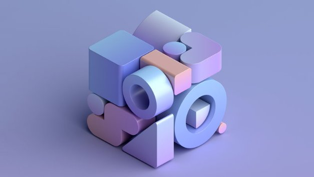

# Xây dựng token gốc trên Cardano để mang lại niềm vui và lợi nhuận

### **Các tính năng mới trên Cardano sẽ cho phép người dùng chọn các công cụ đơn giản và mạnh mẽ để đưa tài sản của họ vào thực tế cuộc sống**

 18 tháng 2 năm 2021  [Tim Harrison](tmp//en/blog/authors/tim-harrison/page-1/)  9 phút đọc

### [**Tim Harrison**](tmp//en/blog/authors/tim-harrison/page-1/)

VP of Community &amp; Ecosystem

Communications

- 
- 
- 
- 

Với việc nâng cấp giao thức "Mary", sẽ được triển khai bằng công nghệ [tổ hợp hard fork](https://docs.cardano.org/en/latest/explore-cardano/what-is-a-hard-fork-combinator.html) của chúng tôi, Cardano sẽ sở hữu các token gốc và khả năng hỗ trợ đa tài sản.

Vào ngày 3 tháng 2, chúng tôi đã nâng cấp mạng testnet [công khai Cardano](https://iohk.io/en/blog/posts/2021/02/04/native-tokens-to-bring-new-utility-to-life-on-cardano/) thành "Mary" để chạy thử lần cuối. Chúng tôi dự định triển khai đề xuất cập nhật Cardano cho mainnet vào ngày 24 tháng 2, do đó sẽ triển khai trước thời điểm của epoch 250 và có hiệu lực vào ngày 1 tháng 3. Nếu cần thêm một vài ngày thử nghiệm, chúng tôi sẽ triển khai "Mary" ở epoch sau, thay vào đó, sẽ mất khoảng 5 ngày để cập nhật có hiệu lực. "Mary" đã chạy thành công trên môi trường testnet của chúng tôi trong vài tuần, vì vậy sự tin cậy vẫn ở mức độ cao. Tuy nhiên, như mọi khi, chúng tôi sẽ tuân theo một quy trình nghiêm ngặt (được phát triển và điều chỉnh qua các sự kiện Shelley và Allegra HFC trước đó) khi thực hiện quá trình này.

Sau khi code được triển khai thành công trên mainnet, chúng tôi sẽ phát hành phiên bản ví [Daedalus Flight](https://iohk.io/en/blog/posts/2020/04/01/we-need-you-for-the-daedalus-flight-testing-program/) mới để người dùng có thể thử nghiệm, đây sẽ là ví Cardano đầu tiên được tích hợp khả năng hỗ trợ đa tài sản. Nếu hài lòng với hiệu suất và khả năng sử dụng của ví, chúng tôi sẽ phát hành trên mainnet để Daedalus mang lại trải nghiệm đầy đủ của token gốc cho người dùng Cardano.

## **Tại sao cần có token gốc?**

Các token gốc sẽ mang lại khả năng hỗ trợ đa tài sản cho Cardano, cho phép người dùng tạo các token được xác định duy nhất (tùy chỉnh) và thực hiện các giao dịch với chúng trực tiếp trên blockchain Cardano.

Việc sử dụng token trong các hoạt động tài chính đang trở nên phổ biến hơn bao giờ hết. Nó giúp cắt giảm chi phí đồng thời với việc cải thiện tính minh bạch, tăng cường thanh khoản và tất nhiên, độc lập với các thực thể tập trung như các ngân hàng lớn. Token hóa là quá trình đại diện cho tài sản thực (ví dụ: tiền tệ fiat, cổ phiếu, kim loại quý và tài sản) ở dạng kỹ thuật số, có thể được sử dụng để tạo công cụ tài chính cho các hoạt động thương mại.

Cardano sẽ cung cấp nhiều [tùy chọn mã hóa](https://iohk.io/en/blog/posts/2020/12/08/native-tokens-on-cardano/) . Với nâng cấp "Mary", cơ sở hạ tầng của sổ cái sẽ xử lý không chỉ các giao dịch ADA mà còn các giao dịch đồng thời mang nhiều loại tài sản. Hỗ trợ này mang lại lợi thế khác biệt cho các nhà phát triển vì không cần tạo hợp đồng thông minh để xử lý việc tạo hoặc giao dịch token tùy chỉnh. Điều này có nghĩa là sổ cái kế toán sẽ theo dõi quyền sở hữu và chuyển giao tài sản thay thế, loại bỏ sự phức tạp và khả năng xảy ra sai sót thủ công, đồng thời đảm bảo hiệu quả kinh phí.

**Tương lai và tiện ích**

Các nhà phát triển, doanh nghiệp và ứng dụng có thể tạo token mục đích chung (có thể thay thế) hoặc chuyên biệt (không thể thay thế) để sử dụng trong hoạt động thương mại hoặc kinh doanh. Chúng có thể bao gồm việc tạo token thanh toán tùy chỉnh hoặc phần thưởng cho các ứng dụng phi tập trung; stablecoin được chốt với các loại tiền tệ khác; hoặc các tài sản duy nhất đại diện cho tài sản trí tuệ. Tất cả những tài sản này sau đó có thể được mua bán, trao đổi hoặc được sử dụng để thanh toán cho các sản phẩm hoặc dịch vụ.

Không giống như token ERC-20 dựa trên các hợp đồng thông minh của Ethereum, việc theo dõi và hạch toán token tùy chỉnh trên Cardano được hỗ trợ bởi sổ cái. Vì token gốc không yêu cầu hợp đồng thông minh chuyển giá trị của chúng nên người dùng có thể gửi, nhận và ghi token của họ mà không phải trả phí giao dịch cần thiết cho hợp đồng thông minh hoặc thêm logic xử lý sự kiện để theo dõi giao dịch.

## **Làm việc với token gốc trên Cardano**

Trong việc tạo ra một [môi trường cho các token gốc](https://iohk.io/en/blog/posts/2020/12/09/native-tokens-on-cardano-core-principles-and-points-of-difference/) , chúng tôi đã tập trung vào sự đơn giản trong cách làm việc, khả năng chi trả và tất nhiên là cả vấn đề bảo mật.

Tùy thuộc vào sở thích và chuyên môn kỹ thuật, người dùng sẽ có thể chọn trong số ba cách để tạo, phân phối, trao đổi và lưu trữ token:

- **Giao diện dòng lệnh Cardano (Cardano command-line interface - CLI)**. Người dùng với tính nâng cao hiện có thể truy cập CLI thông qua môi trường thử nghiệm chuyên dụng. Chúng tôi sẽ triển khai CLI trên mainnet khi hard fork diễn ra.
- **Giao diện người dùng đồ họa "token builder" (Graphical user interface - GUI)**. Điều này sẽ theo sau việc khởi chạy token gốc CLI, cung cấp cách tạo token dễ dàng hơn.
- **Ví Daedalus**. Ví Daedalus sẽ cung cấp hỗ trợ để gửi và nhận các token tùy chỉnh được tạo. Daedalus Flight sẽ thử nghiệm chức năng token gốc vào tháng 3, ngay sau đó là bản phát hành mainnet.

Hãy cùng tìm hiểu một chút về từng tùy chọn.

**Làm việc với Cardano CLI**

Các nhà phát triển nâng cao có thể sử dụng môi trường thử nghiệm token gốc để tạo tài sản (đúc) và gửi các giao dịch thử nghiệm đến các địa chỉ khác nhau.

Bản chất của làm việc với CLI giả định rằng một người nào đó quen thuộc với việc thiết lập và vận hành node trên Cardano và có kinh nghiệm làm việc với các giao dịch và quản lý địa chỉ và giá trị. Để tạo token gốc [bằng cách sử dụng Cardano CLI](https://docs.cardano.org/en/latest/native-tokens/getting-started-with-native-tokens.html) , bạn cần phải:

- Thiết lập và khởi động node trên Cardano
- Định cấu hình node chuyển tiếp để kết nối với môi trường thử nghiệm token gốc
- Bắt đầu tương tác với mạng (liên quan tới Cardano CLI)
- Xây dựng tập lệnh chính sách tiền tệ.
- Tạo token bằng cách sử dụng tập lệnh chính sách tiền tệ
- Cuối cùng, gửi và ký các giao dịch để chuyển token giữa các địa chỉ.

Các hướng dẫn và bài tập về token gốc có sẵn trên [trang web tài liệu Cardano](https://docs.cardano.org/en/latest/native-tokens/learn-about-native-tokens.html) của chúng tôi có thể giúp các nhà phát triển đúc token, tạo chính sách tiền tệ và tìm hiểu cách thực hiện các giao dịch đa tài sản.

Chúng tôi đã nhận thấy sự quan tâm đặc biệt từ các nhà vận hành pool cổ phần cho việc này. Cho đến nay, hàng trăm token thử nghiệm đã được tạo và chúng tôi tiếp tục cải thiện CLI dựa trên các phản hồi. Chúng tôi hoan nghênh ý kiến của bạn và khuyến khích việc thử nghiệm cộng đồng.

**Trình tạo token: một GUI thân thiện giúp ích cho người dùng trong việc tạo token**

CLI yêu cầu một trình độ nhất định. Vì vậy, chúng tôi đã nghĩ ra các cách khác cho người ít thành thạo về kỹ thuật cũng có thể tạo ra token. Để đạt được điều này, chúng tôi dự định khởi chạy trình tạo token sau khi đã khởi chạy mainnet CLI.

Trình tạo token là một giao diện đồ họa giúp tạo token dễ dàng hơn. Nếu bạn quan tâm đến việc tạo token cho ứng dụng phi tập trung của mình, muốn mã hóa tài sản của bạn, tạo nên một bộ sưu tập NFT được đại diện như tài sản chuyên dụng hoặc bạn muốn tạo một stablecoin được gắn với giá trị của các loại tiền tệ khác, trình tạo token có thể giúp bạn làm điều đó .

Để tạo token, bạn chỉ cần điền vào:

- Tên của token (ví dụ: Hello World)
- Tên viết tắt của token (ví dụ: HEW)
- Icon của token (được tạo tự động)
- Tổng số token cần tạo (ví dụ: 1.000)
- Địa chỉ ví Cardano (dùng để lưu trữ các token mới được tạo).

Việc tự động tạo token cũng sẽ tự động tạo ra chính sách tiền tệ - bạn sẽ không cần phải tự mình xác định chính sách đó. Điều này hợp lý hóa việc tạo token và đơn giản hóa nó cho người dùng không chuyên về kỹ thuật.

Hình 1. Trang tổng quan của trình tạo token nguyên mẫu

Ban đầu, trình tạo token sẽ chỉ hỗ trợ tạo token có thể thay thế (trong khi các token không thể thay thế (NFT) có thể được tạo bằng cách sử dụng Cardano CLI). Theo thời gian, chúng tôi sẽ mở rộng chức năng để cho phép tạo các NFT và thay đổi chính sách tiền tệ theo ý muốn. Điều này có nghĩa là người dùng sẽ có thể đặt các điều kiện mà theo đó token được đúc (hay được đốt) hoặc đặt điều kiện để ai đó có quyền kiểm soát nguồn cung tài sản.

Cuối cùng, có thể đúc token nhiều hơn bằng cách nhấp vào nút "Mint more". Điều này có thể được thực hiện dựa trên cùng một chính sách để tạo ra nhiều token cùng loại hoặc bạn có thể tạo các token đại diện cho các giá trị khác nhau dựa trên một chính sách khác. Ví dụ: bạn có thể tạo thêm token Hello World hoặc bắt đầu lại từ đầu, bạn có thể tạo 500 token "test" sẽ được sử dụng cho các mục đích khác (chúng sẽ có cách đúc riêng).

Trình tạo token nhằm mục đích giảm sự phức tạp của việc tạo token và cũng tập trung vào việc nâng cao và trình bày trực quan các quy trình chức năng. Kết quả là, chúng tôi mong muốn cung cấp khả năng hiển thị xung quanh tất cả các token được tạo, giá trị, số lượng và địa chỉ của chúng mà chúng đang được chuyển - tất cả ở cùng một nơi.

**Ví Daedalus**

Những người dùng không muốn tạo token của riêng mình nhưng muốn sử dụng token hiện có để thanh toán, mua hàng hoặc trao đổi, sẽ có thể sử dụng các ví như Daedalus và sau này là Yoroi.

Đội nhóm Daedalus tiếp tục làm việc để tích hợp phần phụ trợ của ví với giao diện người dùng để hỗ trợ chức năng token gốc. Sau đó, người dùng sẽ có thể giữ các token gốc trong ví của họ, gửi và nhận chúng như cách họ làm với ada.

Token gốc được xác định duy nhất bằng hai số thập lục phân được lưu trữ trên chuỗi - Policy ID và Tên nội dung. Những con số này không phải là 'thân thiện với người dùng', mà chúng tôi đã tạo dấu vân tay để người dùng nhận dạng dễ dàng hơn các token gốc. Dấu vân tay là chuỗi chữ và số có độ dài 44 ký tự bắt đầu bằng từ 'token'.

Dữ liệu của token bổ sung được hiển thị trong giao diện người dùng của ví (tên, mô tả và từ viết tắt) sẽ được cung cấp bởi cơ quan đăng ký token Cardano, do Cardano Foundation quản lý từ đầu.

Hình 2. Giao diện người dùng token gốc Daedalus

**Vòng đời của token gốc**

Khi tất cả các thành phần cần thiết được triển khai, vòng đời của token gốc sẽ hoàn tất. Nó bao gồm năm giai đoạn:

- Đúc token
- Phát hành
- Sử dụng
- Đổi trả
- Đốt token

Hình 3. Các giai đoạn vòng đời của token gốc

Trong các giai đoạn này, người kiểm soát tài sản sẽ có thể xác định chính sách cho loại tài sản và ủy quyền cho các tổ chức phát hành token có thể đúc hoặc đốt token. Các nhà phát hành token sau đó có thể đúc token (ví dụ: cho các ứng dụng), duy trì lưu thông của chúng và phát hành chúng cho chủ sở hữu token. Cuối cùng, chủ sở hữu token (ví dụ: người dùng cá nhân hoặc sàn giao dịch) sẽ có thể gửi token cho người khác, sử dụng chúng để thanh toán hoặc đổi trả khi họ đã sử dụng xong.

## **Tiếp theo là gì?**

Chúng tôi đã khởi chạy môi trường thử nghiệm vào tháng 12 năm 2020, đặt nền tảng cho sự phát triển của token gốc. Chúng tôi cũng đã tạo thêm môi trường để cho phép thử nghiệm ban đầu bởi các sàn giao dịch và các nhà điều hành pool cổ phần. Nó cho phép xây dựng một mạng lưới các node trong khi kết nối với các token khác.

Hãy theo dõi [cập nhật trạng thái Cardano](https://roadmap.cardano.org/en/status-updates/) của chúng tôi để nắm được tiến trình hàng tuần. Khi chúng tôi mở rộng khả năng của các token gốc, thêm các công cụ và giao diện, chúng tôi sẽ cung cấp tài liệu và hướng dẫn để khuyến khích mọi người tham gia. Đương nhiên, với cơ sở là mã nguồn mở và chúng tôi đã thấy một số dự án thú vị xuất hiện mang tính cộng đồng (ví dụ: xung quanh [các bộ sưu tập kỹ thuật số](https://www.cnft.io/) ).

Vì vậy, rất nhiều điều sẽ xảy ra vào cuối tháng 2 và đầu tháng 3, từ thử nghiệm cuối cùng và sự kiện HFC, đến các token gốc trên Cardano trong trải nghiệm ví Daedalus hoàn toàn mới. Quãng thời gian thú vị đang chờ chúng ta ở phía trước!

*Tìm hiểu thêm bằng cách tham gia cùng các thành viên cộng đồng khác để thảo luận về token gốc trong [phần dành riêng cho token](https://forum.cardano.org/c/developers/cardano-tokens/150) của Diễn đàn Cardano. Và đừng quên đăng ký [chương trình devnets](https://input-output.typeform.com/c/OJsf0XcD) của chúng tôi.*

Bài viết có bổ sung yếu tố kỹ thuật của Olga Hryniuk.

Bài này được dịch bởi Max Long, Review bởi Quang Pham, biên tập bởi Nguyễn Hiệu.

 Bài viết nguồn [tại đây](https://iohk.io/en/blog/posts/2021/02/18/building-native-tokens-on-cardano-for-pleasure-and-profit/) 
 
 *Dự án này được tài trợ bởi Catalyst*
