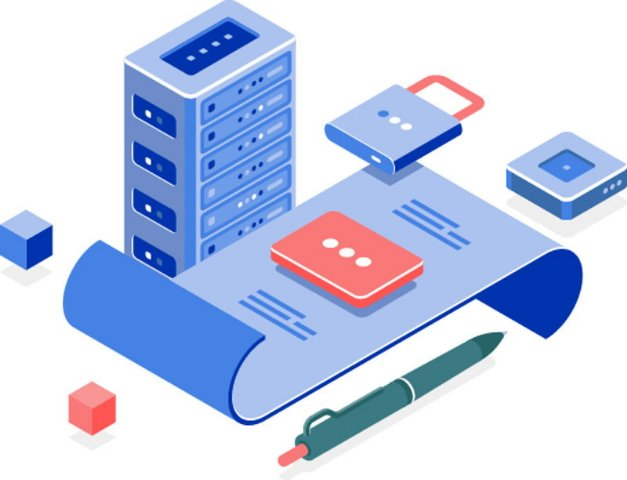
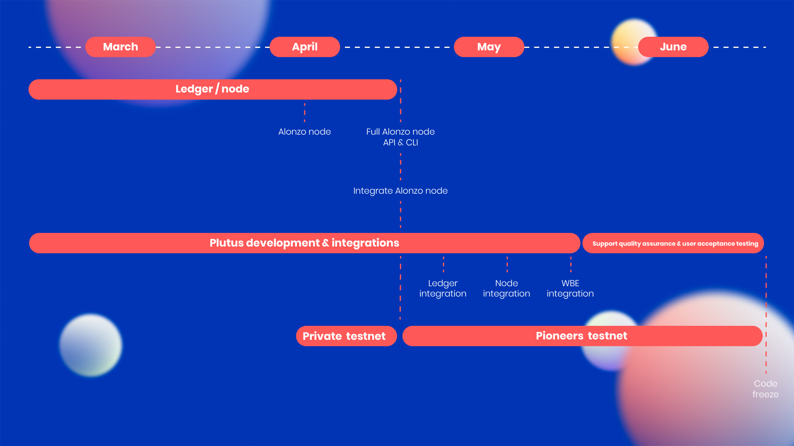

# Tiến đến cập nhật hợp đồng thông minh

### **Alonzo sẽ xây dựng dựa trên các nâng cấp token của Cardano để cung cấp cho các nhà lập trình công cụ để tạo các ứng dụng kinh doanh**

 Ngày 8 tháng 4 năm 2021[ Olga Hryniuk](tmp//en/blog/authors/olga-hryniuk/page-1/) bài đọc 6 phút

### [**Olga Hryniuk**](tmp//en/blog/authors/olga-hryniuk/page-1/)

Technical Writer

Marketing &amp; Communications

- 
- 

Vào đầu tháng 3, chúng tôi đã triển khai Mary - một bản nâng cấp giao thức đa tài sản cho phép người dùng tạo token duy nhất cho các giao dịch trên Cardano. Với việc giới thiệu [siêu dữ liệu giao dịch](https://iohk.io/en/blog/posts/2020/10/29/bringing-new-value-and-utility-to-the-cardano-blockchain/), sau đó là [khóa token](https://iohk.io/en/blog/posts/2020/12/02/goguen-brings-token-locking-to-cardano/) với Allegra vào tháng 12 và [tạo token gốc](https://iohk.io/en/blog/posts/2021/02/18/building-native-tokens-on-cardano-for-pleasure-and-profit/), chúng tôi đang tạo nền tảng để thiết lập Cardano trở thành nền tảng hợp đồng thông minh hàng đầu.

Alonzo, bản nâng cấp giao thức tiếp theo của chúng tôi, sẽ xây dựng dựa trên những khả năng này. Được triển khai bằng cách sử dụng công nghệ tổ hợp hard fork, Alonzo sẽ bổ sung hỗ trợ cho các hợp đồng thông minh - thỏa thuận kỹ thuật số - cho Cardano trong khoảng bốn tháng kể từ bây giờ. Nó sẽ mở ra cơ hội cho các doanh nghiệp và nhà lập trình, bằng cách cho phép tạo ra các hợp đồng thông minh và các ứng dụng phi tập trung (DApps) cho tài chính phi tập trung (DeFi).

Khi nói đến việc đặt tên cho những nâng cấp này, chúng tôi đã chọn Allegra (con gái của Lord Byron) để khóa token và Mary (tiểu thuyết gia và vợ của Shelley) để hỗ trợ đa tài sản. Alonzo đến từ một nhân vật đương đại hơn, Alonzo Church (1903-95). Church là một nhà toán học và logic học Hoa Kỳ, ông nghiên cứu về logic và nền tảng của lý thuyết khoa học máy tính. Ông cũng được biết đến với việc phát minh ra phép tính lambda - một hệ thống chính thức được sử dụng để chứng minh phép tính không thể giải được của Entscheidungsproblem. Sau đó, khi làm việc với nhà toán học Alan Turing, họ phát hiện ra rằng phép tính lambda và phép tính Turing có khả năng ngang nhau, thể hiện các quy trình cơ học khác nhau để tính toán. Một trong những lý do để đặt tên cho bản nâng cấp hợp đồng thông minh của chúng tôi theo tên Church là vì Plutus Core (ngôn ngữ hợp đồng thông minh Cardano) là một biến thể của phép tính lambda.

## **Tại sao lại là hợp đồng thông minh?**

Hợp đồng thông minh đánh dấu giai đoạn tiếp theo trong quá trình phát triển của Cardano với tư cách là một sổ cái phi tập trung trên toàn thế giới. Khi hỗ trợ hoạt động kinh doanh hàng ngày, blockchain phải đảm bảo rằng các cá nhân có thể chuyển tiền của họ và thanh toán cho các sản phẩm một cách an toàn.

Các hợp đồng thông minh có thể được sử dụng để giải quyết các giao dịch phức tạp, giữ tiền dưới dạng ký quỹ và bảo đảm sự di chuyển của tiền theo các điều kiện xác định trước. Cardano sẽ cho phép các DApp tương tác với sổ cái để ghi lại các hoạt động của chúng và thực hiện các hợp đồng thông minh. Các thỏa thuận kỹ thuật số này thể hiện trong một giao dịch, chỉ định tiền sẽ đi đâu và chúng sẽ được gửi theo những điều kiện nào, chỉ thực hiện giao dịch khi tất cả các điều kiện được đáp ứng. Alonzo sẽ giúp nền tảng Cardano hỗ trợ các ứng dụng như vậy.

## **Giải quyết nhu cầu kinh doanh với Alonzo**

Trong khi hỗ trợ đa tài sản cho phép người dùng tạo ra các loại tiền tệ duy nhất đáp ứng nhu cầu kinh doanh, Alonzo giới thiệu một nền tảng đa năng để xây dựng các hợp đồng thông minh. Ví dụ, bạn có thể làm việc với các hoạt động sưu tầm, huy động vốn từ cộng đồng hoặc đấu giá.

Các lĩnh vực thăm dò bao gồm việc triển khai các sàn giao dịch tiền mã hóa phi tập trung dựa trên ký quỹ (DEX) hoặc tạo ra các ứng dụng phức tạp hỗ trợ stablecoin tập trung (ví dụ: ứng dụng theo dõi và truy tìm nguồn gốc sản phẩm trong chuỗi cung ứng). Với chức năng khóa token, người dùng sẽ có thể phát hành token phù hợp với thời gian đến hạn, có nghĩa là một số token có thể bị khóa hoặc đóng băng để được phát hành sau một khoản thời gian cụ thể.

## **Sức mạnh tập lệnh Plutus Core**

Với Alonzo, chúng tôi đang bổ sung các công cụ cần thiết và cơ sở hạ tầng để cho phép phát triển ứng dụng bằng nền tảng Plutus.

Áp dụng một cách tiếp cận nghiêm ngặt dựa trên các phương pháp chính thức và xác minh, Alonzo mở rộng tập lệnh ngôn ngữ cơ bản đa chữ ký (multisig) được sử dụng trong Cardano Shelley. Multisig sẽ được nâng cấp lên ngôn ngữ Plutus Core để có các tùy chọn tập lệnh mạnh mẽ và an toàn hơn. Sổ cái Alonzo triển khai [mô hình EUTXO](https://iohk.io/en/blog/posts/2021/03/12/cardanos-extended-utxo-accounting-model-part-2/), sử dụng Plutus Core để cung cấp tập lệnh mạnh mẽ.

Một nền tảng hợp đồng thông minh phải vừa an toàn vừa đáng tin cậy. Đó là lý do tại sao chúng tôi chọn Haskell làm cơ sở để viết các hợp đồng thông minh Plutus Core. Haskell là một ngôn ngữ cấp cao mà các nhà lập trình sẽ sử dụng để viết các đoạn mã và sau đó [biên dịch nó sang Plutus Core](https://iohk.io/en/blog/posts/2021/02/02/plutus-tx-compiling-haskell-into-plutus-core/).

Haskell đã xuất hiện từ năm 1987, nổi bật so với các ngôn ngữ lập trình khác về mức độ tin cậy cao. Viết bằng Haskell đảm bảo rằng các hợp đồng thông minh được lập trình để thực hiện chính xác những gì chúng được mong đợi và có thể kiểm tra độ chính xác trước khi thực hiện. Có nghĩa là các hợp đồng thông minh được xây dựng trên Cardano sẽ đơn giản và có khả năng chống lại các lỗ hổng bảo mật, điều này rất quan trọng đối với các ứng dụng xử lý giao dịch tự động hoặc di chuyển các khoản tiền lớn.

**Công cụ và API**

Các nhà lập trình sẽ có các công cụ chức năng để thử nghiệm và tùy chỉnh xác thực giao dịch trên Cardano. Thư viện API sẽ được mở rộng để cho phép triển khai và vận hành mã Plutus Core trên Cardano trong khi tương thích với ví và sổ cái.

Triển khai Alonzo là một quá trình phức tạp. Khi các hợp đồng thông minh chức năng đang chạy trên mainnet, chúng tôi sẽ tiếp tục cải thiện cơ sở hạ tầng off-chain để cung cấp các bộ công cụ phát triển phần mềm.

## **Bây giờ chúng ta đang ở đâu?**

Hình 1. Lộ trình Alonzo. Bộ mã sẽ bị khóa trong bốn tuần trước khi phát hành

Trong tháng 3 và tháng 4, đội ngũ IO Global đã dần dần kết hợp các quy tắc Alonzo với node Cardano và bộ mã sổ cái. Khi quá trình tích hợp Alonzo với node hoàn tất, Cardano sẽ cung cấp các công cụ API hoạt động và hỗ trợ giao diện dòng lệnh (CLI).

Từ giữa tháng 4 đến đầu tháng 5, đội ngũ sẽ tiếp tục phát triển Plutus để khởi chạy testnet riêng. Trong giai đoạn này, các đối tác của chúng tôi (các nhà lập trình nâng cao) sẽ thử nghiệm nền tảng, tạo và triển khai các token không thể thay thế (NFT), các cửa hàng hoặc DApp chạy các hợp đồng thông minh trên Cardano. Quá trình này sẽ tập trung vào các cải tiến từng bước để đảm bảo rằng mọi thứ hoạt động hiệu quả.

Vào tháng 5, chúng tôi sẽ bắt đầu làm việc với các lập trình viên trong chương trình những người tiên phong học Plutus. Các lập trình viên đã được cấp chứng nhận của chương trình sẽ tiếp tục thử nghiệm nền tảng này bằng cách viết các ứng dụng Plutus và đưa chúng vào áp dụng cho DApps và DeFi. Trong giai đoạn này, đội ngũ của chúng tôi sẽ thực hiện tích hợp sổ cái, node và ví. Chúng tôi cũng sẽ chuẩn bị và phát hành tài liệu, bao gồm các ví dụ về đặc điểm kỹ thuật và hướng dẫn dành cho nhà lập trình.

Tháng 5 và tháng 6 sẽ là thời gian dành cho khâu đảm bảo chất lượng và thử nghiệm với người dùng, sau đó sẽ là đợt khóa tính năng kéo dài trong 4 tuần. Điều này sẽ cung cấp cho các sàn giao dịch và ví tiền mã hóa có thời gian để nâng cấp và chuẩn bị cho bản cập nhật giao thức Alonzo. Chúng tôi hy vọng nâng cấp Alonzo (hard fork) sẽ diễn ra vào cuối mùa hè và chúng tôi sẽ công bố một ngày chắc chắn trong chương trình Cardano360 vào tháng Tư.

Để biết lộ trình chi tiết hơn, hãy xem [bài thuyết trình Cardano360 tháng 3 của Charles Hoskinson](https://www.youtube.com/watch?v=ULBLgPgxtN8&t=5805s).

Đây là những thời điểm thú vị và chúng tôi khuyến khích bạn tiếp tục theo dõi. Bài blog tiếp theo sẽ đi sâu vào mối quan hệ giữa các khái niệm Plutus làm nền tảng cho sự phát triển của Alonzo. Trong thời gian này, [trang web dành cho các nhà lập trình](https://developers.cardano.org/en/programming-languages/plutus/overview/) sẽ có nhiều nội dung về lập trình Plutus, Marlowe và Glow hơn.

Bài này được dịch bởi Lê Nguyên, review bởi Brit Nguyễn, đăng bài bởi Nguyễn Hiệu.

Nguồn bài viết [tại đây](https://iohk.io/en/blog/posts/2021/04/08/smart-contracts-here-we-come)

*Dự án này được tài trợ bởi Catalyst*
